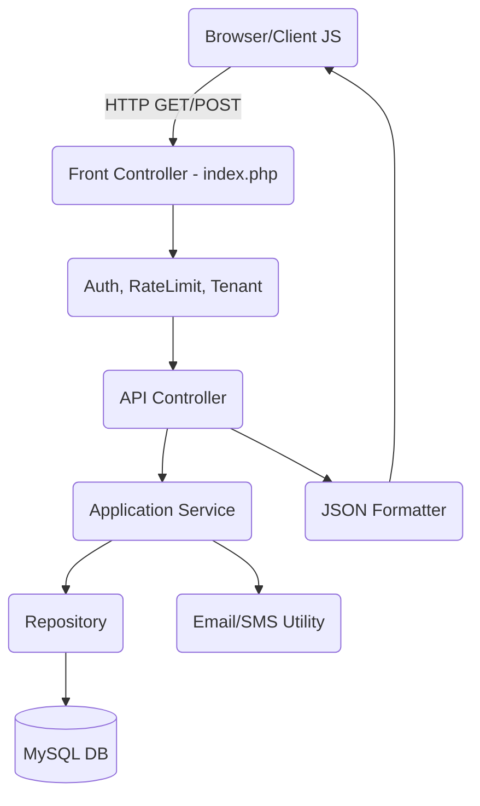

# Unified Architecture Blueprint - Pharma CRM

## 1. System Overview
The system is a unified monolith written in Core custom PHP with a Vanilla JS/CSS + AdminLTE frontend. It adheres strictly to REST principles, stateless APIs, and JWT OAuth 2.0 based authentication.

## 2. Layering & Request Flow
1. **Presentation Layer (Frontend):** 
   - AdminLTE HTML views rendered by simple PHP layout engines.
   - Heavy client-side vanilla JS for interactivity, making AJAX requests to the backend API.
2. **API Controllers Layer:**
   - Handles incoming HTTP requests.
   - Validates requests via dedicated Request/Validator classes.
   - Dispatches data to Application Services.
   - Formats responses using a standard JSON envelope.
3. **Application Services Layer:**
   - Encapsulates core business logic (e.g., placing an order, dispatching samples).
   - Coordinates between Repositories and external integrations.
4. **Domain / Model Layer:**
   - Plain Old PHP Objects (POPOs) representing business entities.
   - Includes state machines, status enums.
5. **Repository Layer:**
   - Abstracts data access logic using PDO (Prepared Statements).
6. **Database Layer:**
   - MySQL/MariaDB database.

## 3. Directory Structure
```
/app
  /Config            # Configuration files
  /Controllers       # API & Web controllers
    /Api             # REST endpoints
    /Web             # Web layout controllers
  /Domain            # Domain Models & Enums
  /Middleware        # Auth, RateLimiting, Logging
  /Repositories      # DB abstraction and queries
  /Services          # Business logic use-cases
  /Utils             # Helpers, Validators, JWT, Mail
  /ViewModels        # DTOs for web views
/database
  /migrations        # Raw SQL migration scripts
  /seeds             # Seed scripts
/docs                # Project documentation
/logs                # System and Audit logs
/public
  /assets            # Vendored AdminLTE, CSS, JS
    /css
    /js
    /plugins         # jQuery, DataTables, etc.
  /uploads           # User-uploaded content
  index.php          # Single entry point
/tests               # PHPUnit test cases
/views               # PHP layout/templates (AdminLTE)
  /components        # Reusable view components
  /layouts           # Main template files
  /pages             # Individual screen views
```

## 4. API Conventions
- **Base URL:** `/api/v1/`
- **Naming:** Plural nouns (e.g., `/api/v1/prescriptions`)
- **Verbs:** GET (read), POST (create), PUT/PATCH (update), DELETE (remove)
- **Standard Envelope:**
  ```json
  {
    "success": true,
    "data": { ... },
    "meta": { "total": 100, "page": 1, "limit": 10 },
    "errors": [],
    "trace_id": "req-12345"
  }
  ```
- **Pagination:** `?page=1&limit=20`
- **Filtering:** `?status=active&tenant_id=2`
- **Sorting:** `?sort=-created_at`

## 5. Authentication Flow
- **Protocol:** OAuth 2.0 (Resource Owner Password Credentials Grant for first-party UI).
- **Mechanism:** JWT (JSON Web Tokens).
- **Token Claims:** `sub` (user_id), `iss` (issuer), `aud` (audience), `exp` (expiration), `iat` (issued at), `jti` (unique token id), `roles` (array), `tenant` (tenant_id).
- **Storage:** Frontend stores token in `sessionStorage` or Secure Cookie.
- **Refresh:** Endpoint `/api/v1/auth/refresh` to exchange a valid refresh token for a new access token.

## 6. Multi-Tenancy Strategy
- **Strategy chosen:** Row-level `tenant_id`.
- **Reasoning:** Easier schema maintenance, simpler migrations, cost-effective scaling for a lightweight app.
- **Implementation:** 
  - Every table (except global master data) contains a `tenant_id`.
  - All Repository queries automatically append `WHERE tenant_id = ?` based on the JWT `tenant` claim.
  - Global middleware validates tenant context.

## 7. Naming Conventions
- **Database:** `snake_case` (e.g., `audit_logs`, `prescription_items`).
- **PHP Code:** PSR-12 standard (`StudlyCaps` for classes, `camelCase` for methods/properties).
- **JavaScript:** `camelCase`.
- **CSS:** BEM-lite scoped to AdminLTE (e.g., `.pharma-card__header`).

## 8. Diagram (Mermaid)

