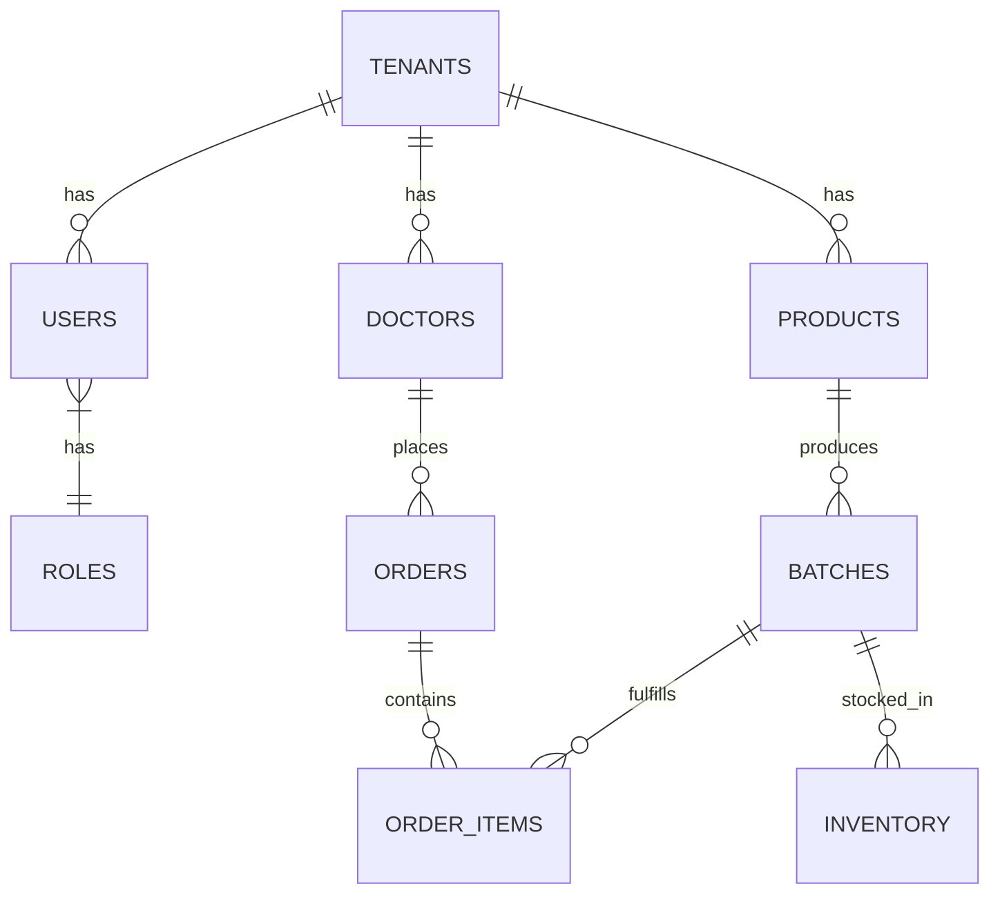

# Database Schema & Architecture

## 1. Tenancy
All multi-tenant tables include a `tenant_id` INT column referencing `tenants.id`.

## 2. Core Tables
### 2.1 `tenants`
- `id` (PK)
- `name` (VARCHAR)
- `domain` (VARCHAR, UNIQUE)
- `status` (ENUM: active, suspended)
- `created_at`, `updated_at`, `deleted_at`

### 2.2 `users`
- `id` (PK)
- `tenant_id` (FK -> tenants.id)
- `first_name`, `last_name` (VARCHAR)
- `email` (VARCHAR, UNIQUE scoped to tenant_id)
- `password_hash` (VARCHAR)
- `role_id` (FK -> roles.id)
- `status` (ENUM: active, inactive)
- `created_at`, `updated_at`, `deleted_at`

### 2.3 `roles` & `permissions`
- `roles` (id, tenant_id, name)
- `permissions` (id, name, module)
- `role_permissions` (role_id, permission_id)

### 2.4 `doctors` / `chemists` / `hospitals`
- `id` (PK)
- `tenant_id` (FK)
- `name`, `email`, `phone`, `address`
- `license_no` (VARCHAR)
- `territory_id` (FK)
- `status` (ENUM: verified, unverified)
- `created_at`, `updated_at`, `deleted_at`

### 2.5 `products` & `batches`
- `products`: `id`, `tenant_id`, `sku`, `name`, `price`, `formula`, `status`
- `batches`: `id`, `tenant_id`, `product_id`, `batch_no`, `mfg_date`, `expiry_date`, `status`

### 2.6 `inventory`
- `id`, `tenant_id`, `batch_id`, `qty_available`, `qty_reserved`, `location`

### 2.7 `orders` & `order_items`
- `orders`: `id`, `tenant_id`, `doctor_id` (or chemist_id), `total_amount`, `status` (draft, invoiced, paid, cancelled)
- `order_items`: `id`, `order_id`, `batch_id`, `qty`, `unit_price`, `subtotal`

### 2.8 `audit_logs`
- `id` (PK)
- `tenant_id` (FK)
- `user_id` (FK)
- `action` (VARCHAR, e.g. "order.created")
- `entity_type` (VARCHAR)
- `entity_id` (INT)
- `old_values` (JSON)
- `new_values` (JSON)
- `ip_address` (VARCHAR)
- `created_at` (TIMESTAMP)

## 3. ERD (Mermaid)

