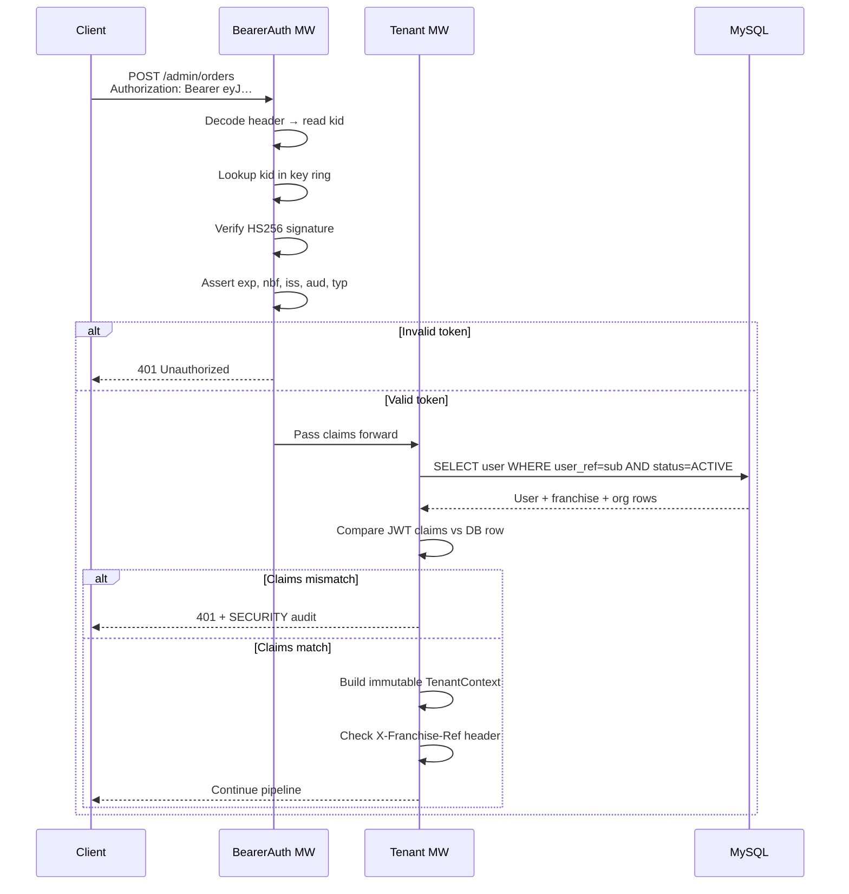
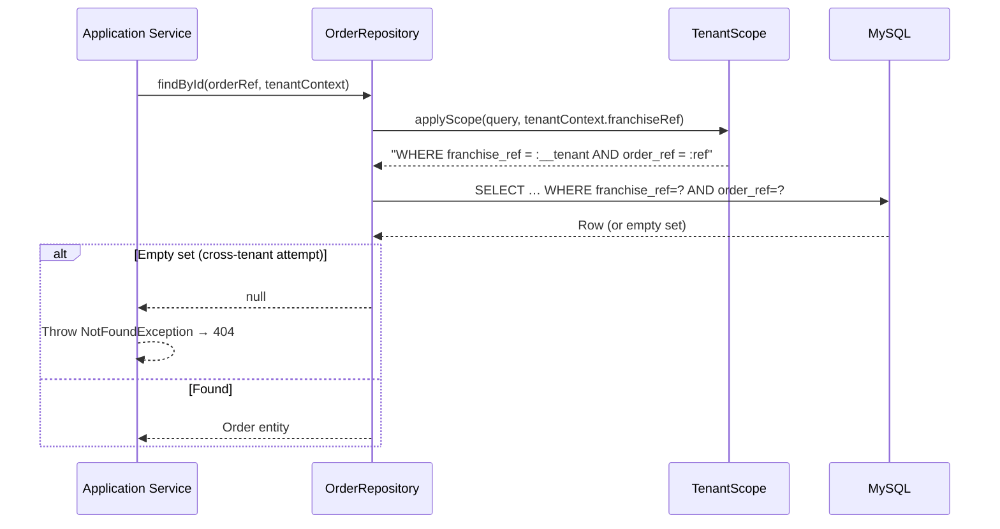
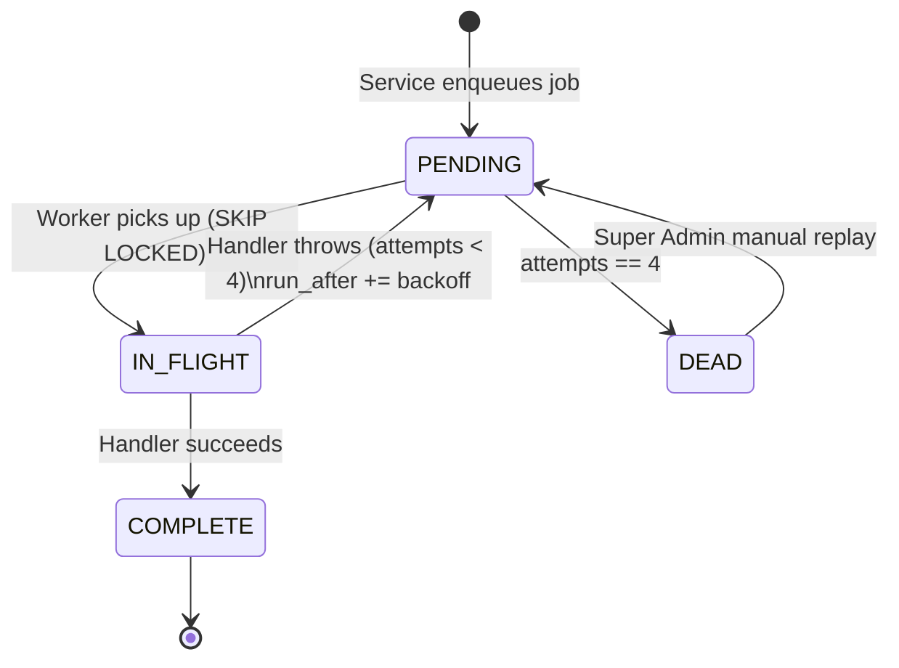
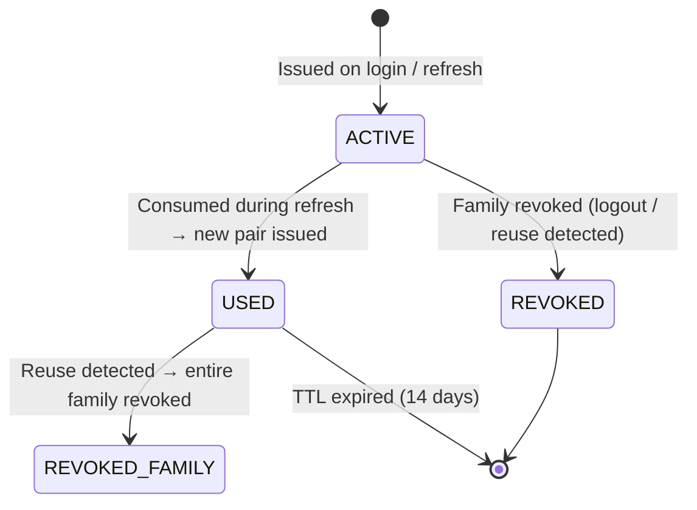
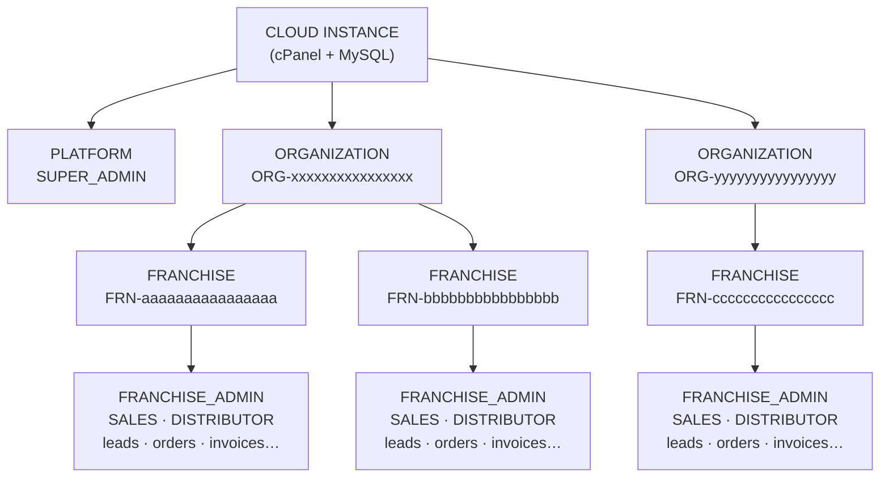
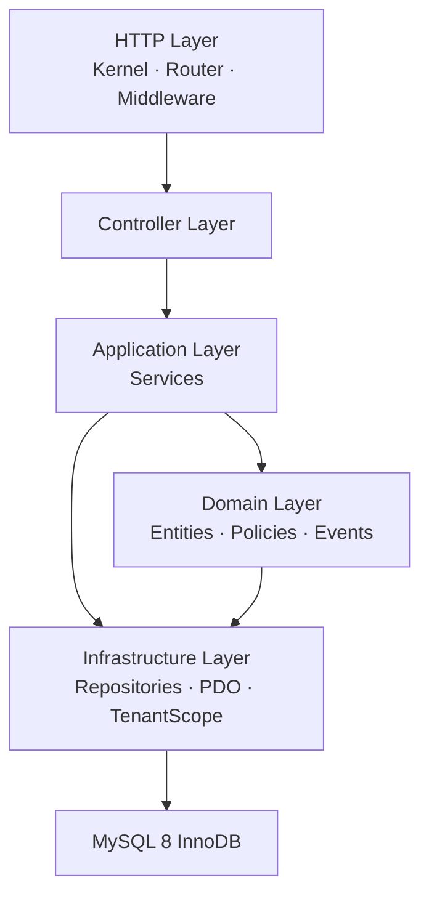
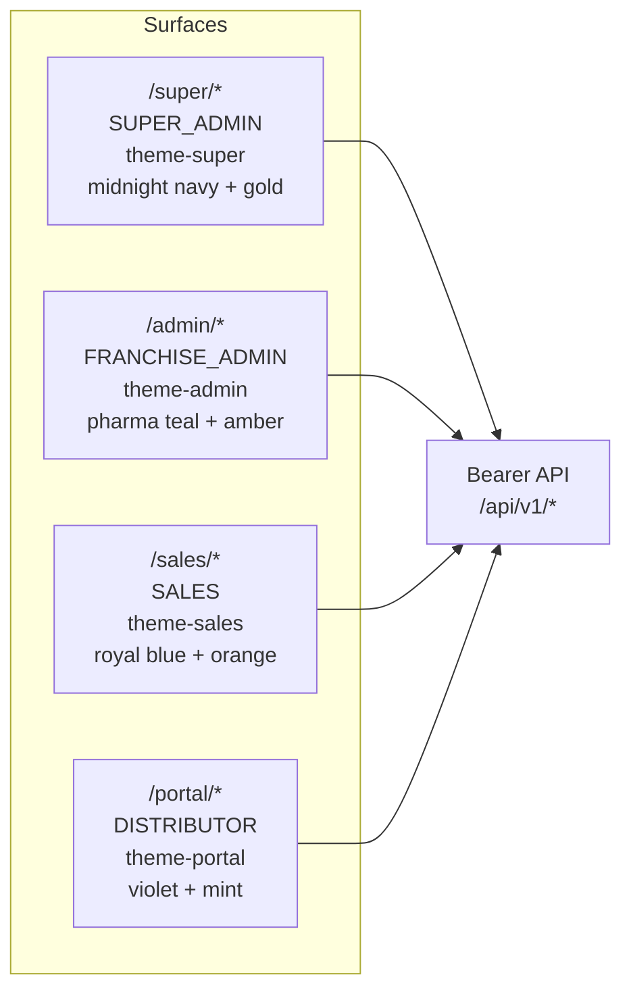

# Architecture — Pharma CRM & SFA Platform

> **Version:** 1.0 · **Stack:** PHP 8.1+ · MySQL 8 InnoDB · Vanilla HTML/CSS/JS  
> **Hosting:** cPanel Shared · **Last Updated:** 2026-09-20

---

## Table of Contents

1. [System Overview](#1-system-overview)
2. [Tenancy Model](#2-tenancy-model)
3. [Request Lifecycle](#3-request-lifecycle)
4. [Layer Architecture](#4-layer-architecture)
5. [Middleware Pipeline](#5-middleware-pipeline)
6. [Authentication & Authorization](#6-authentication--authorization)
7. [JWT Token Structure](#7-jwt-token-structure)
8. [UI System](#8-ui-system)
9. [Database Design](#9-database-design)
10. [Module Map](#10-module-map)
11. [Background Job System](#11-background-job-system)
12. [Security Architecture](#12-security-architecture)
13. [Test Strategy](#13-test-strategy)
14. [Component Interaction Diagrams](#14-component-interaction-diagrams)
15. [Related Documentation](#15-related-documentation)

---

## 1. System Overview

The Pharma CRM & SFA Platform is a **multi-tenant, row-level tenanted** Customer Relationship Management and Sales Force Automation system purpose-built for pharmaceutical distribution networks. It runs as a single cPanel application (one PHP process, one MySQL database) and supports an unlimited number of **Organizations → Franchises** without any schema-per-tenant or database-per-tenant overhead.

### Design Tenets

| Tenet | Decision |
|---|---|
| **Zero runtime dependencies** | No Composer packages at runtime; all logic is first-party |
| **No shared state** | No Redis, no Memcached, no APCu shared memory |
| **Bearer-only auth** | JWT access tokens + opaque refresh tokens; no cookies, no sessions, no CSRF |
| **Strict tenancy** | Every query receives `WHERE franchise_ref = :__tenant` from `TenantScope` |
| **Security-first headers** | CSP strict-self, HSTS, no inline scripts, no CDN dependencies |
| **cPanel-compatible** | Standard Apache + PHP-FPM or mod_php; `.htaccess` routing |

### High-Level ASCII Architecture

```
┌─────────────────────────────────────────────────────────────────────┐
│                        INTERNET (HTTPS)                             │
└───────────────────────────────┬─────────────────────────────────────┘
                                │ TLS termination at Apache
                                ▼
┌─────────────────────────────────────────────────────────────────────┐
│  Apache + .htaccess                                                  │
│  RewriteRule .* public/index.php [L,QSA]                            │
└───────────────────────────────┬─────────────────────────────────────┘
                                │
                                ▼
┌─────────────────────────────────────────────────────────────────────┐
│  public/index.php  (bootstrap + Kernel boot)                        │
└───────────────────────────────┬─────────────────────────────────────┘
                                │
                                ▼
┌─────────────────────────────────────────────────────────────────────┐
│  Kernel                                                              │
│  ┌─────────┐ ┌───────────────────────────────────────────────────┐  │
│  │ Router  │─▶  Middleware Pipeline                               │  │
│  └─────────┘ │  1. RequestId       → X-Request-ID header         │  │
│              │  2. SecurityHeaders → CSP/HSTS/…                  │  │
│              │  3. RateLimit       → DB sliding window            │  │
│              │  4. BearerAuth      → JWT validate + TenantContext │  │
│              │  5. Tenant          → DB re-validate + scope check │  │
│              │  6. Role/Policy     → RBAC + object-level perms    │  │
│              │  7. Idempotency     → POST/PUT/PATCH key mgmt      │  │
│              │  8. Controller      → business entry point         │  │
│              └───────────────────────────────────────────────────┘  │
└───────────────────────────────┬─────────────────────────────────────┘
                                │
             ┌──────────────────┴──────────────────┐
             ▼                                     ▼
┌────────────────────┐                 ┌──────────────────────────┐
│   Controllers       │                 │  Application Services    │
│  Super | Admin      │────────────────▶│  Transaction boundaries  │
│  Sales | Portal     │                 │  Orchestration only      │
│  Api\V1             │                 └──────────┬───────────────┘
└────────────────────┘                            │
                                   ┌──────────────┼──────────────┐
                                   ▼              ▼              ▼
                            ┌──────────┐  ┌──────────┐  ┌──────────────┐
                            │  Domain  │  │ Policies │  │  Validators  │
                            │ Services │  │          │  │              │
                            └────┬─────┘  └──────────┘  └──────────────┘
                                 │
                    ┌────────────┼──────────────┐
                    ▼            ▼               ▼
             ┌──────────┐ ┌──────────┐  ┌──────────────┐
             │  Events  │ │  Audit   │  │    Jobs      │
             └──────────┘ └──────────┘  └──────────────┘
                                │
                                ▼
┌─────────────────────────────────────────────────────────────────────┐
│  Tenant-Scoped Repositories (PDO prepared only, franchise_ref injected)│
└───────────────────────────────┬─────────────────────────────────────┘
                                │
                                ▼
┌─────────────────────────────────────────────────────────────────────┐
│  MySQL 8 InnoDB                                                      │
│  Row-level tenancy · Composite FKs · DECIMAL(18,2) money            │
└─────────────────────────────────────────────────────────────────────┘

─ ─ ─ ─ ─ ─ ─ ─ BACKGROUND PATH ─ ─ ─ ─ ─ ─ ─ ─ ─ ─ ─ ─ ─ ─ ─ ─ ─ ─

cPanel Cron ──▶ cli/scheduler.php ──▶ job_queue table
                                           │
                                           ▼
                              cli/worker.php (bounded loop)
                              SELECT … FOR UPDATE SKIP LOCKED
                              Exponential backoff: 30s→2m→10m→30m
```

---

## 2. Tenancy Model

### 2.1 Hierarchy

The platform uses a three-tier tenancy hierarchy within a single database:

```
CLOUD INSTANCE  (one cPanel account, one MySQL database)
 │
 ├── PLATFORM  (Super Admin surface — tenant_scope = PLATFORM)
 │     Operates across all organizations for onboarding and monitoring.
 │
 └── ORGANIZATION  (org_ref = ORG-xxxxxxxxxxxxxxxx)
       │  Represents a pharmaceutical company or distributor network.
       │
       └── FRANCHISE  (franchise_ref = FRN-xxxxxxxxxxxxxxxx)
             │  The leaf-level row-key tenant. All business data is
             │  scoped to a franchise_ref.
             │
             ├── FRANCHISE_ADMIN users
             ├── SALES users
             ├── DISTRIBUTOR users (each linked to a party record)
             │
             └── Business Data
                   leads · parties · products · prices · schemes
                   orders · inventory · batches · invoices
                   dispatches · payments · notifications
                   audit_logs · job_queue
```

> [!IMPORTANT]
> `franchise_ref` is the **universal row-level tenant key**. No business data record may exist without it (except PLATFORM-scope records such as organizations and global config).

### 2.2 Tenancy Enforcement Rules

| Rule | Description |
|---|---|
| **T01** | Every tenant repository query has `WHERE franchise_ref = :__tenant` injected by `TenantScope`. This is not optional and not overridable by calling code. |
| **T02** | `INSERT` statements set `org_ref` + `franchise_ref` from `TenantContext` only. Values supplied in the request body for these fields are silently discarded. |
| **T03** | `UPDATE` / `DELETE` statements include `AND franchise_ref = :__tenant` in their `WHERE` clause. Ledger table rows are **never deleted**; only status transitions are permitted. |
| **T04** | Child tables carry composite foreign keys `(franchise_ref, child_ref) → parent(franchise_ref, parent_ref)` to prevent cross-tenant parent linkage at the DB engine level. |
| **T05** | Super Admin cross-tenant reads must call `->withoutTenantScope('reason')` explicitly. Every such call writes an `audit_logs` entry with `action = TENANT_BYPASS`. |
| **T06** | Any cross-tenant attempt by a non-Super user returns **404** (not 403) to avoid leaking resource existence. A `SECURITY` audit event is recorded. |
| **T07** | Raw SQL outside repository classes is **forbidden** in all environments. |
| **T08** | Reports and CSV/Excel exports run through the same scoped query builder — they are not exempt from tenancy. |

### 2.3 `TenantContext` Class

`TenantContext` is an **immutable value object** built once per request by the `BearerAuth` + `Tenant` middleware pair. It is injected into every service and repository.

```php
final class TenantContext
{
    public function __construct(
        public readonly string  $orgRef,          // ORG-xxxxxxxxxxxxxxxx
        public readonly ?string $franchiseRef,     // FRN-xxxxxxxxxxxxxxxx | null on PLATFORM scope
        public readonly string  $userRef,          // USR-xxxxxxxxxxxxxxxx
        public readonly string  $role,             // SUPER_ADMIN | FRANCHISE_ADMIN | SALES | DISTRIBUTOR
        public readonly string  $scope,            // PLATFORM | FRANCHISE | DISTRIBUTOR
        public readonly ?string $partyRef,         // PTY-xxxxxxxxxxxxxxxx (DISTRIBUTOR only)
        public readonly string  $requestId,        // X-Request-ID value
        public readonly ?string $impersonatorRef = null, // set during Super Admin impersonation
    ) {}

    /** True only for SUPER_ADMIN role. */
    public function isSuper(): bool
    {
        return $this->role === 'SUPER_ADMIN';
    }

    /**
     * Returns franchise_ref or throws if not present.
     * Call inside FRANCHISE-scoped operations to assert scope is correct.
     */
    public function requireFranchise(): string
    {
        if ($this->franchiseRef === null) {
            throw new \LogicException('franchise_ref required but scope is PLATFORM');
        }
        return $this->franchiseRef;
    }
}
```

### 2.4 Tenant Resolution Order (Per Request)

The following sequence runs on every authenticated request:

```
Step 1 — Route surface determination
         /super/*   → expected scope: PLATFORM
         /admin/*   → expected scope: FRANCHISE (FRANCHISE_ADMIN)
         /sales/*   → expected scope: FRANCHISE (SALES)
         /portal/*  → expected scope: FRANCHISE (DISTRIBUTOR)

Step 2 — Verify Bearer JWT
         Check: signature (HS256 + kid lookup), exp, nbf, iss, aud,
                kid present in key ring, typ == "access"

Step 3 — Load user row from DB
         SELECT … WHERE user_ref = :sub AND status = 'ACTIVE'
         Also check: franchise.status = 'ACTIVE', org.status = 'ACTIVE'

Step 4 — Claims reconciliation
         Compare JWT claims (org_ref, franchise_ref, role) with live DB row.
         Any mismatch → 401 Unauthorized + SECURITY audit event

Step 5 — Build immutable TenantContext
         Populated from DB row (not from JWT claims) after reconciliation.

Step 6 — X-Franchise-Ref header check
         If header present → MUST equal context.franchiseRef
         Mismatch → 403 TENANT_MISMATCH audit event
```

---

## 3. Request Lifecycle

The following describes the complete path of an HTTP request from the internet to the JSON response.

```
[1] Client sends:
    POST /admin/orders HTTP/2
    Authorization: Bearer eyJ…
    Content-Type: application/json
    Idempotency-Key: idk_abc123

[2] Apache (.htaccess):
    RewriteEngine On
    RewriteCond %{REQUEST_FILENAME} !-f
    RewriteCond %{REQUEST_FILENAME} !-d
    RewriteRule ^ public/index.php [L,QSA]

[3] public/index.php:
    - Defines APP_ROOT constant
    - Bootstraps autoloader (spl_autoload_register)
    - Loads .env (outside web root)
    - Creates PDO connection (emulation OFF)
    - Instantiates Kernel and calls handle(ServerRequest)

[4] Kernel::handle():
    a) Router matches URI + method → RouteMatch{controller, action, params}
    b) Builds middleware pipeline (ordered stack)
    c) Executes pipeline; each middleware may short-circuit with a Response

[5] Middleware 1 — RequestId:
    Reads X-Request-ID header or generates UUID v4.
    Attaches to request object for downstream propagation.

[6] Middleware 2 — SecurityHeaders:
    Appends to every response:
      Content-Security-Policy, Strict-Transport-Security,
      X-Content-Type-Options: nosniff, Referrer-Policy,
      Permissions-Policy, Cache-Control: no-store

[7] Middleware 3 — RateLimit:
    Checks sliding-window counters (DB-backed) for:
      login-ip, login-user, api-user, webhook-source
    Exceeded → 429 Too Many Requests + Retry-After header

[8] Middleware 4 — BearerAuth:
    Parses Authorization: Bearer <token>
    Validates JWT (signature, exp, nbf, iss, aud, kid, typ)
    On failure → 401 Unauthorized

[9] Middleware 5 — Tenant:
    Loads user row from DB, reconciles JWT claims,
    enforces franchise_ref header, builds TenantContext.
    On mismatch → 401/403 + SECURITY audit

[10] Middleware 6 — Role/Policy:
    Checks user role against route requirements.
    Checks object-level permissions via Policy classes.
    On failure → 403 Forbidden (or 404 for existence leaks)

[11] Middleware 7 — Idempotency:
    For POST/PUT/PATCH with Idempotency-Key header:
      - Check idempotency_keys table for existing response
      - If found (status=COMPLETE) → replay stored response
      - If found (status=IN_FLIGHT) → 409 Conflict
      - If new → insert row, continue pipeline

[12] Controller:
    Validates input shape (required fields, types, ranges).
    Delegates 100% to Application Service(s).
    No SQL. No business rules. No HTML.

[13] Application Service:
    Opens DB transaction.
    Orchestrates: Validator → Policy → Domain Service → Repository.
    Dispatches Events (Audit, Notification, Job).
    Commits or rolls back.

[14] Repository:
    Executes PDO prepared statements only.
    TenantScope auto-injects franchise_ref into all queries.
    Returns domain objects or scalars.

[15] Response Assembly:
    Controller receives DTO/array from Service.
    Encodes: json_encode($data, JSON_HEX_TAG|JSON_HEX_AMP|JSON_HEX_APOS|JSON_HEX_QUOT)
    Sets Content-Type: application/json; charset=utf-8

[16] Idempotency (post-commit):
    Stores response body + status in idempotency_keys (status=COMPLETE).

[17] Apache sends HTTP/2 response to client.
```

---

## 4. Layer Architecture

The codebase is divided into strict horizontal layers. **Upward dependencies are forbidden.**

```
┌──────────────────────────────────────────────────────┐
│  HTTP Layer                                           │  (public/)
│  Kernel · Router · Middleware · Request · Response   │
├──────────────────────────────────────────────────────┤
│  Controller Layer                                     │  (src/Controller/)
│  Input validation · Service delegation · JSON output │
├──────────────────────────────────────────────────────┤
│  Application Layer                                    │  (src/Application/)
│  Transaction boundaries · Use-case orchestration     │
├──────────────────────────────────────────────────────┤
│  Domain Layer                                         │  (src/Domain/)
│  Business rules · Entities · Value Objects · Events  │
│  Policies · Validators · Domain Services             │
├──────────────────────────────────────────────────────┤
│  Infrastructure Layer                                 │  (src/Infrastructure/)
│  Repositories · PDO · TenantScope · JobQueue         │
├──────────────────────────────────────────────────────┤
│  MySQL 8 InnoDB                                       │
└──────────────────────────────────────────────────────┘
```

### 4.1 Layer Rules

#### View Layer
- **No business logic.** Pages are PHP shells: layout + navigation + empty DOM containers.
- Data arrives exclusively through Bearer API calls from the frontend JS.
- PHP in templates may only render static structure and pass a `data-theme` attribute.

#### ViewModel Layer
- Pure data-transfer objects (DTOs): typed readonly properties, no methods.
- No database access, no computation, no side-effects.

#### Controller Layer
- **May call:** Application Services only.
- **May not:** execute SQL, contain business rules, render HTML, or access repositories directly.
- Responsible for: parsing the request body, validating input shape (not business rules), returning JSON.
- Must honour HTTP semantics: 200/201/204 on success; 4xx on client error; 5xx on unexpected failure.

#### Application Service Layer
- **May call:** Domain Services, Policies, Validators, Repository contracts, Event dispatcher.
- Opens and manages database transactions (`BEGIN` / `COMMIT` / `ROLLBACK`).
- Orchestrates multi-step use cases and ensures atomicity.
- **May not:** contain SQL statements, render output, or access `$_SERVER`/`$_REQUEST`.

#### Domain Layer
- Pure PHP — no I/O, no PDO, no HTTP.
- **Domain Services:** stateless, operate on entities and value objects.
- **Policies:** answer yes/no authorization questions about domain objects.
- **Validators:** throw `ValidationException` with field-keyed error maps.
- **Events:** value objects dispatched after a domain action, consumed by Audit, Notification, and Job listeners.

#### Repository Layer
- Implements repository *contracts* (interfaces) defined in the Domain layer.
- Uses `PDO` prepared statements exclusively (`PDO::ATTR_EMULATE_PREPARES = false`).
- `TenantScope` decorates every query with `AND franchise_ref = :__tenant`.
- **May not:** contain business logic, dispatch events, or produce HTTP output.

### 4.2 Forbidden Patterns

| Pattern | Why Forbidden |
|---|---|
| Raw SQL in Controllers or Services | Bypasses TenantScope and audit trails |
| `$_GET` / `$_POST` in Services | Couples HTTP transport to business logic |
| `echo` / `print` in any non-View file | Breaks JSON response integrity |
| `PDO::ATTR_EMULATE_PREPARES = true` | Enables SQL injection via type coercion |
| `innerHTML` in JavaScript | XSS vector — use `textContent` / `createElement` |
| Hardcoded `franchise_ref` in queries | Tenancy bypass; use TenantScope |
| `DELETE` on ledger tables | Destroys audit trail; use status transitions |
| Inline `<script>` tags | Violates strict CSP; use `/assets/js/crm-ui.js` |
| `Access-Control-Allow-Origin: *` | CORS wildcard forbidden; same-origin only |

---

## 5. Middleware Pipeline

The pipeline runs in-order for every authenticated request. Each middleware receives a `Request` object and a `next` callable. It may modify the request, short-circuit with a `Response`, or pass control forward.

```
Request ──▶ [1] RequestId
             │
             ▼
           [2] SecurityHeaders
             │
             ▼
           [3] RateLimit
             │
             ▼
           [4] BearerAuth  ──(fail)──▶ 401 Unauthorized
             │
             ▼
           [5] Tenant      ──(fail)──▶ 401 / 403 / 404
             │
             ▼
           [6] Role/Policy ──(fail)──▶ 403 Forbidden (or 404)
             │
             ▼
           [7] Idempotency ──(hit)───▶ 200 Replayed Response
             │
             ▼
           [8] Controller ──────────▶ Application Service ──▶ Response
```

### MW-01 · RequestId

**Purpose:** Assign a unique correlation ID to every request for distributed tracing and log correlation.

- Reads `X-Request-ID` from the incoming request header.
- If absent or invalid, generates a UUID v4.
- Attaches the ID to the request object.
- Echoes `X-Request-ID` back in the response header.
- Stored in `TenantContext::$requestId` and written to every `audit_logs` row.

### MW-02 · SecurityHeaders

**Purpose:** Append security-related HTTP response headers unconditionally.

| Header | Value / Policy |
|---|---|
| `Content-Security-Policy` | `default-src 'self'; script-src 'self'; style-src 'self'; img-src 'self' data:; font-src 'self'; connect-src 'self'; frame-ancestors 'none'` |
| `Strict-Transport-Security` | `max-age=31536000; includeSubDomains` |
| `X-Content-Type-Options` | `nosniff` |
| `Referrer-Policy` | `strict-origin-when-cross-origin` |
| `Permissions-Policy` | `geolocation=(), camera=(), microphone=()` |
| `Cache-Control` | `no-store` |
| `X-Frame-Options` | `DENY` |

### MW-03 · RateLimit

**Purpose:** Enforce sliding-window request limits against brute-force and abuse.

Implemented entirely in MySQL (no Redis required):

```sql
-- rate_limits table
CREATE TABLE rate_limits (
    bucket      VARCHAR(191) NOT NULL,
    window_key  INT UNSIGNED NOT NULL,   -- floor(UNIX_TIMESTAMP() / window_seconds)
    hit_count   INT UNSIGNED NOT NULL DEFAULT 1,
    updated_at  DATETIME NOT NULL,
    PRIMARY KEY (bucket, window_key)
) ENGINE=InnoDB;
```

**Buckets:**

| Bucket | Key | Limit | Window |
|---|---|---|---|
| `login-ip` | `login:ip:{ip}` | 20 | 15 min |
| `login-user` | `login:user:{email}:{tenant_key}` | 5 | 15 min |
| `api-user` | `api:{user_ref}` | 300 | 1 min |
| `webhook-source` | `webhook:{source_ip}` | 60 | 1 min |

Exceeded limit → `429 Too Many Requests` + `Retry-After: {seconds}` header.

### MW-04 · BearerAuth

**Purpose:** Cryptographically validate the JWT access token.

```
1. Extract token from Authorization: Bearer <token>
2. Base64url-decode header → read "kid" (key ID)
3. Look up kid in key ring (in-memory config, loaded from .env-derived secret file)
4. Verify HMAC-SHA256 signature
5. Assert: exp > now, nbf <= now, iss matches config, aud matches surface, typ == "access"
6. Attach decoded claims to request for Tenant middleware
7. On any failure → 401 Unauthorized (no detail in body)
```

### MW-05 · Tenant

**Purpose:** Re-validate JWT claims against the live database and build `TenantContext`.

- Loads user row: `WHERE user_ref = ? AND status = 'ACTIVE'`
- Joins franchise + organization status checks.
- Compares `org_ref`, `franchise_ref`, `role` between JWT and DB row.
- Mismatch → `401` + `SECURITY` audit (the DB row is authoritative; JWT is just a fast-path).
- Builds immutable `TenantContext` and stores on the request.
- Checks `X-Franchise-Ref` header if present.

### MW-06 · Role/Policy

**Purpose:** Enforce role-based and object-level access control.

- Each route declares a `requiredRole` (e.g., `FRANCHISE_ADMIN`, `SALES`).
- Role check compares `TenantContext::$role` to route requirement.
- Object-level checks delegate to `Policy` classes (e.g., `OrderPolicy::canUpdate()`).
- Role failure → `403 Forbidden`.
- Cross-tenant object access → `404 Not Found` + `SECURITY` audit (T06).

### MW-07 · Idempotency

**Purpose:** Guarantee exactly-once semantics for non-idempotent HTTP methods.

- Applies to `POST`, `PUT`, `PATCH` requests carrying an `Idempotency-Key` header.
- Key is namespaced by `user_ref` to prevent cross-user key collisions.
- States: `PENDING` → `IN_FLIGHT` → `COMPLETE` / `FAILED`.

```
Request arrives with Idempotency-Key: <key>

┌─ Key not found ────────────────────────────────────────────────────┐
│  INSERT row (status=IN_FLIGHT)                                     │
│  Execute pipeline normally                                         │
│  UPDATE row (status=COMPLETE, response_body, response_status)      │
└────────────────────────────────────────────────────────────────────┘

┌─ Key found, status=COMPLETE ───────────────────────────────────────┐
│  Return stored response_body + response_status immediately         │
│  (HTTP 200 or original status code)                                │
└────────────────────────────────────────────────────────────────────┘

┌─ Key found, status=IN_FLIGHT ──────────────────────────────────────┐
│  Return 409 Conflict (concurrent duplicate request)                │
└────────────────────────────────────────────────────────────────────┘
```

### MW-08 · Controller

The controller is the final handler in the pipeline. It is responsible for:

1. Parsing and shape-validating the request body.
2. Delegating entirely to an Application Service.
3. Serialising the service result to JSON.
4. Returning the appropriate HTTP status code.

Controllers are grouped by surface: `Super\`, `Admin\`, `Sales\`, `Portal\`, `Api\V1\`.

---

## 6. Authentication & Authorization

### 6.1 OAuth 2.0 Grant Types

The platform implements a subset of OAuth 2.0:

| Grant | Endpoint | Description |
|---|---|---|
| `password` | `POST /auth/token` | Exchange email + password for access + refresh token |
| `refresh_token` | `POST /auth/refresh` | Exchange a valid refresh token for a new token pair |

No `authorization_code`, `client_credentials`, or `implicit` grants are implemented.

### 6.2 Token Architecture

```
┌────────────────────────────────────────────────────────────┐
│  ACCESS TOKEN (JWT HS256)                                   │
│  TTL: 900 seconds (15 minutes)                             │
│  Storage: JavaScript memory only (never persisted)         │
│  Signed with: HMAC-SHA256 using kid-keyed secret           │
└────────────────────────────────────────────────────────────┘

┌────────────────────────────────────────────────────────────┐
│  REFRESH TOKEN (Opaque)                                    │
│  Format: 48 random bytes encoded as base64url              │
│  Storage client: sessionStorage (cleared on tab close)     │
│  Storage server: SHA-256 hash in refresh_tokens table      │
│  TTL: 14 days (absolute)                                   │
│  Rotation: new pair issued on every use                    │
│  Revocation: USED token invalidates entire family tree     │
└────────────────────────────────────────────────────────────┘
```

### 6.3 Refresh Token Rotation & Reuse Detection

```
Client ──▶ POST /auth/refresh { refresh_token: "<opaque>" }
              │
              ▼
         Compute SHA-256 hash of submitted token
              │
              ├─ Hash found + status=ACTIVE?
              │    ├── Mark old token USED
              │    ├── Issue new access token (JWT)
              │    ├── Issue new refresh token (opaque, SHA-256 stored)
              │    └── Link to same family_ref
              │
              ├─ Hash found + status=USED?  ← REUSE DETECTED
              │    ├── Revoke entire family (UPDATE … WHERE family_ref = ?)
              │    ├── Log REFRESH_REUSE_DETECTED security event
              │    └── Return 401 Unauthorized
              │
              └─ Hash not found?
                   └── Return 401 Unauthorized
```

### 6.4 Login Security Rules

| Rule | Value |
|---|---|
| Max failed attempts per (email, tenant_key) | 5 per 15 minutes → 429 + Retry-After |
| Max failed attempts per IP | 20 per 15 minutes → 429 + Retry-After |
| Minimum password length | 10 characters |
| Password blocklist | Top-1000 common passwords |
| Password ≠ email | Enforced at registration and password change |
| Password hashing | Argon2id (preferred) · bcrypt cost 12 (fallback) |
| Error messages | Always generic: "Invalid credentials" (never field-specific) |

### 6.5 Multi-Tab Session Propagation

```javascript
// crm-ui.js — logout propagation across tabs
const bc = new BroadcastChannel('crm-auth');

// On logout:
bc.postMessage({ type: 'logout' });

// On any tab receiving logout:
bc.onmessage = (e) => {
    if (e.data.type === 'logout') {
        sessionStorage.removeItem('crm_refresh');
        window.location.href = '/login';
    }
};
```

### 6.6 Authorization — Role Hierarchy

```
SUPER_ADMIN
  └── Can access all surfaces; cross-tenant with TENANT_BYPASS audit
FRANCHISE_ADMIN
  └── Full access within own franchise
SALES
  └── Leads, parties, orders, follow-ups within own franchise
DISTRIBUTOR
  └── Own orders, invoices, payments; own party record only
```

Object-level permissions are checked via `Policy` classes. Example:

```php
final class OrderPolicy
{
    public function canUpdate(TenantContext $ctx, Order $order): bool
    {
        // Sales can only update their own orders
        if ($ctx->role === 'SALES') {
            return $order->assignedUserRef === $ctx->userRef
                && $order->status === OrderStatus::DRAFT;
        }
        // Franchise admin can update any draft/confirmed order
        return in_array($order->status, [OrderStatus::DRAFT, OrderStatus::CONFIRMED], true);
    }
}
```

---

## 7. JWT Token Structure

### 7.1 Header

```json
{
  "alg": "HS256",
  "typ": "JWT",
  "kid": "k1"
}
```

`kid` (Key ID) maps to a secret held in the server-side key ring. Multiple keys allow zero-downtime key rotation.

### 7.2 Payload Claims

```json
{
  "iss": "https://crm.example.com",
  "aud": "franchise-admin",
  "sub": "USR-xxxxxxxxxxxxxxxx",
  "org": "ORG-xxxxxxxxxxxxxxxx",
  "frn": "FRN-xxxxxxxxxxxxxxxx",
  "role": "FRANCHISE_ADMIN",
  "scp": ["orders:write", "reports:read"],
  "pty": null,
  "iat": 1758000000,
  "nbf": 1758000000,
  "exp": 1758000900,
  "jti": "a1b2c3d4-e5f6-…",
  "sid": "SES-xxxxxxxxxxxxxxxx",
  "typ": "access"
}
```

| Claim | Meaning |
|---|---|
| `iss` | Issuer — must match configured base URL |
| `aud` | Audience — surface slug (`super`, `franchise-admin`, `sales`, `distributor`) |
| `sub` | Subject — `user_ref` (USR- prefixed) |
| `org` | Organization ref (ORG- prefixed) |
| `frn` | Franchise ref (FRN- prefixed); null for SUPER_ADMIN |
| `role` | Exact role string |
| `scp` | Array of permission scopes |
| `pty` | Party ref (DISTRIBUTOR only) |
| `iat` | Issued-at (UNIX timestamp) |
| `nbf` | Not-before (same as iat) |
| `exp` | Expiry = iat + 900 |
| `jti` | JWT ID — unique per token, used for audit correlation |
| `sid` | Session ref (SES- prefixed) — ties refresh token family |
| `typ` | Must be literal string `"access"` |

### 7.3 Key Ring

The key ring is loaded from the `.env`-derived secret file (stored **outside** the web root):

```php
// config/jwt_keys.php  (not web-accessible)
return [
    'active_kid' => 'k2',
    'keys' => [
        'k1' => 'hex-encoded-256-bit-secret-retired-but-still-valid-for-verify',
        'k2' => 'hex-encoded-256-bit-secret-current-signing-key',
    ],
];
```

- **Signing** always uses `active_kid`.
- **Verification** accepts any `kid` present in the ring (enables rolling upgrades).
- Retired keys are removed only after all tokens signed with them have expired (≥15 min after retirement).

---

## 8. UI System

### 8.1 Design Philosophy

The UI is a **zero-dependency, custom design system** — no AdminLTE, Bootstrap, jQuery, or FontAwesome.

| Asset | Path | Purpose |
|---|---|---|
| `crm-ui.css` | `/assets/css/crm-ui.css` | All styles (grid, components, themes) via CSS custom properties |
| `crm-ui.js` | `/assets/js/crm-ui.js` | All interactivity (modal, toast, table sort, fetch wrapper) |
| `icons.svg` | `/assets/img/icons.svg` | Single inline SVG sprite; icons referenced with `<use>` |

### 8.2 Theme System

Each surface has a dedicated colour theme applied via the `data-theme` attribute on `:root`.

```html
<!-- Set by the PHP shell based on the authenticated surface -->
<html lang="en" data-theme="theme-admin">
```

```css
/* ── Super Admin ── midnight navy + gold ── */
:root[data-theme="theme-super"] {
    --sb:   #0B1437;  /* sidebar */
    --pri:  #3D5AFE;  /* primary action */
    --acc:  #F5B301;  /* accent / highlight */
    --bg:   #0F1B4C;  /* page background */
    --card: #16235F;  /* card background */
    --tx:   #FFFFFF;  /* primary text */
    --mut:  #9AA4C7;  /* muted text */
    --bd:   #26356F;  /* borders */
}

/* ── Franchise Admin ── pharma teal + amber ── */
:root[data-theme="theme-admin"] {
    --sb:   #0A5C4C;
    --pri:  #0E7C66;
    --acc:  #F2A93B;
    --bg:   #F4FBF8;
    --card: #FFFFFF;
    --tx:   #0B1F1A;
    --mut:  #5C7A72;
    --bd:   #D6EBE4;
}

/* ── Sales Team ── royal blue + orange ── */
:root[data-theme="theme-sales"] {
    --sb:   #12306B;
    --pri:  #1E5EFF;
    --acc:  #FF7A00;
    --bg:   #F5F8FF;
    --card: #FFFFFF;
    --tx:   #0B1730;
    --mut:  #5B6B8C;
    --bd:   #DCE4F7;
}

/* ── Distributor Portal ── violet + mint ── */
:root[data-theme="theme-portal"] {
    --sb:   #3B2378;
    --pri:  #6A3DE8;
    --acc:  #00C2A8;
    --bg:   #F7F5FF;
    --card: #FFFFFF;
    --tx:   #1A1030;
    --mut:  #6B5E8C;
    --bd:   #E4DDF7;
}
```

### 8.3 Shell Layout Pattern

Every page is a PHP **shell** — a thin PHP file that renders semantic HTML structure. No data is server-rendered; the JavaScript layer populates containers via API calls.

```php
<?php
// admin/orders/index.php  — typical shell
$theme    = 'theme-admin';
$pageTitle = 'Orders';
require_once __DIR__ . '/../../views/layout/head.php';    // <head>, CSS link
require_once __DIR__ . '/../../views/layout/sidebar.php'; // nav links
?>
<main id="main-content" data-page="orders-list">
    <!-- JS fills this container from GET /admin/orders API -->
    <div id="orders-container" aria-live="polite"></div>
</main>
<?php require_once __DIR__ . '/../../views/layout/scripts.php'; // single <script src> ?>
```

### 8.4 JavaScript DOM Rules

| Allowed | Forbidden |
|---|---|
| `element.textContent = value` | `element.innerHTML = value` |
| `document.createElement('td')` | Template literals with user data |
| `element.setAttribute('data-ref', value)` | `eval()` |
| `fetch('/admin/orders', { headers: { Authorization: 'Bearer ' + token } })` | Inline event handlers in HTML |

### 8.5 Icon Usage

```html
<!-- Reference an icon from the SVG sprite -->
<svg class="icon icon-sm" aria-hidden="true" focusable="false">
    <use href="/assets/img/icons.svg#icon-order"></use>
</svg>
<span class="sr-only">Orders</span>
```

### 8.6 Content Security Policy Compliance

The strict CSP (`script-src 'self'`) means:

- **No** `<script>` tags with inline content.
- **No** `onclick=` / `onload=` inline event attributes.
- **No** CDN script sources.
- All JavaScript lives in `/assets/js/crm-ui.js`.
- Nonces are not used — `'self'` is sufficient because all scripts are same-origin.

---

## 9. Database Design

### 9.1 Core Principles

| Principle | Implementation |
|---|---|
| **Single database** | All tenants in one schema; row-level isolation |
| **Row-level tenancy** | `franchise_ref` on every business table |
| **Composite foreign keys** | `(franchise_ref, child_ref) → parent(franchise_ref, parent_ref)` |
| **Unpredictable refs** | Crockford Base32 with prefix: `ORD-01ARZ3NDEKTSV4RRFFQ69G5FAV` |
| **Human numbers** | Sequential per-franchise order_no / invoice_no via atomic counter |
| **Money precision** | `DECIMAL(18,2)` — no floats |
| **Immutable ledgers** | Ledger tables never `DELETE`d; status changes only |
| **Prepared statements** | `PDO::ATTR_EMULATE_PREPARES = false` — always |

### 9.2 Reference (Ref) System

All primary business identifiers use a **PREFIX-CROCKFORDBASE32** format:

```
ORG-01ARZ3NDEKTSV4RRFFQ69G5FAV   ← Organization
FRN-01BX5ZZKBKACTAV9WEVGEMMVS0   ← Franchise
USR-01C3FBHZ77HQXWRDKM95JJVME1   ← User
ORD-01D4GCJA08CQVNG28PMHCM7X2P   ← Order
PTY-01E5HDKB19DRWOH39QNIDNZY3Q   ← Party (Customer/Distributor)
```

Properties:
- **Unpredictable:** based on random 128-bit values (not sequential integers).
- **URL-safe:** no special characters.
- **Sortable:** time-ordered (ULID-style Crockford encoding).
- **Prefix identifies entity type** — prevents accidental use of wrong ref type.

### 9.3 Human-Readable Sequence Numbers

Order numbers, invoice numbers, etc. are sequential **per franchise** and human-friendly:

```sql
-- Atomic counter with ON DUPLICATE KEY UPDATE
INSERT INTO franchise_sequences (franchise_ref, sequence_key, next_val)
VALUES (:franchise_ref, 'order_no', 1)
ON DUPLICATE KEY UPDATE next_val = next_val + 1;

SELECT next_val FROM franchise_sequences
WHERE franchise_ref = :franchise_ref AND sequence_key = 'order_no';
-- Returns: 1001, 1002, 1003 … (formatted as ORD/FRN-0001001)
```

### 9.4 Composite Foreign Key Pattern

Every child table references its parent using both `franchise_ref` **and** the parent's primary ref. This prevents cross-tenant parent linking at the engine level:

```sql
CREATE TABLE order_items (
    item_ref        VARCHAR(36)    NOT NULL,
    franchise_ref   VARCHAR(36)    NOT NULL,
    order_ref       VARCHAR(36)    NOT NULL,
    product_ref     VARCHAR(36)    NOT NULL,
    qty             INT UNSIGNED   NOT NULL,
    unit_price      DECIMAL(18,2)  NOT NULL,
    line_total      DECIMAL(18,2)  GENERATED ALWAYS AS (qty * unit_price) STORED,
    PRIMARY KEY (item_ref),
    CONSTRAINT fk_oi_order  FOREIGN KEY (franchise_ref, order_ref)
        REFERENCES orders(franchise_ref, order_ref)
        ON DELETE RESTRICT,
    CONSTRAINT fk_oi_product FOREIGN KEY (franchise_ref, product_ref)
        REFERENCES franchise_products(franchise_ref, product_ref)
        ON DELETE RESTRICT,
    INDEX idx_oi_tenant (franchise_ref, order_ref)
) ENGINE=InnoDB DEFAULT CHARSET=utf8mb4 COLLATE=utf8mb4_unicode_ci;
```

### 9.5 Money Handling

```sql
-- Always DECIMAL(18,2) — never FLOAT or DOUBLE
unit_price      DECIMAL(18,2) NOT NULL,
discount_amount DECIMAL(18,2) NOT NULL DEFAULT 0.00,
tax_amount      DECIMAL(18,2) NOT NULL DEFAULT 0.00,
total_amount    DECIMAL(18,2) NOT NULL,
```

In PHP, all arithmetic uses `bcmath` functions before writing to DB:

```php
$lineTotal = bcmul((string)$qty, (string)$unitPrice, 2);
$taxAmount  = bcmul($lineTotal, (string)$taxRate, 4); // extra precision before rounding
$taxAmount  = bcadd($taxAmount, '0.005', 2);           // half-up round
```

### 9.6 Ledger Table Policy

Tables that represent financial or legal records are **append-only**:

```
orders         → status: DRAFT → CONFIRMED → DISPATCHED → INVOICED → CLOSED | CANCELLED
invoices       → status: DRAFT → ISSUED → PARTIALLY_PAID → PAID | VOID
payments       → status: PENDING → CONFIRMED → FAILED | REVERSED
audit_logs     → immutable; no UPDATE or DELETE ever
```

Status transitions are enforced by Domain Service state machines, not just DB constraints.

---

## 10. Module Map

The system is composed of **23 business modules**:

| # | Module | Surface(s) | Key Responsibilities |
|---|---|---|---|
| 1 | **Tenancy** | Super | Org/franchise lifecycle, feature flags, plan limits |
| 2 | **Auth** | All | Login, logout, JWT issue, refresh rotation, device tracking |
| 3 | **Users** | Super, Admin | User CRUD, role assignment, activation, password policy |
| 4 | **Organizations** | Super | Org registration, plan management, billing config |
| 5 | **Franchises** | Super, Admin | Franchise setup, territory assignment, branding |
| 6 | **Leads** | Admin, Sales | Lead capture, status tracking, assignment |
| 7 | **FollowUps** | Sales | Follow-up scheduling, completion, reminders |
| 8 | **Parties** | Admin, Sales, Portal | Customer/distributor master data, credit limits |
| 9 | **Territories** | Admin | Geographic zones, beat planning, rep assignment |
| 10 | **Products** | Admin | Product catalogue, SKU management, HSN/GST codes |
| 11 | **Pricing** | Admin | Price lists, customer-specific pricing, effective dates |
| 12 | **Schemes** | Admin, Sales | Trade schemes, quantity discounts, offer periods |
| 13 | **Orders** | Admin, Sales, Portal | Order entry, approval, amendment, cancellation |
| 14 | **Inventory** | Admin | Stock ledger, batch tracking, FEFO/FIFO allocation |
| 15 | **Billing** | Admin | Invoice generation, credit/debit notes, e-invoice |
| 16 | **Dispatch** | Admin | Delivery scheduling, courier integration, POD |
| 17 | **Payments** | Admin, Portal | Payment recording, reconciliation, outstanding ageing |
| 18 | **Notifications** | All | In-app alerts, email, SMS dispatch via job queue |
| 19 | **Webhooks** | Super, Admin | Outbound webhook registry, delivery, retry, HMAC signing |
| 20 | **Reports** | Admin, Sales, Super | Tenant-scoped tabular + pivot reports, CSV export |
| 21 | **Audit** | Super, Admin | Immutable audit log viewer, security event search |
| 22 | **Onboarding** | Super | Guided franchise setup wizard, seed data provisioning |
| 23 | **Jobs** | Internal | Job queue management, retry dashboard, dead-letter |

### Module Directory Structure

```
src/
├── Application/
│   ├── Auth/
│   ├── Orders/
│   └── … (one folder per module)
├── Controller/
│   ├── Admin/
│   ├── Super/
│   ├── Sales/
│   ├── Portal/
│   └── Api/V1/
├── Domain/
│   ├── Auth/
│   │   ├── Entity/
│   │   ├── Event/
│   │   ├── Policy/
│   │   ├── Repository/   ← Interfaces
│   │   └── Service/
│   └── Orders/ … etc.
├── Infrastructure/
│   ├── Persistence/
│   │   ├── MySql/        ← Concrete repository implementations
│   │   └── TenantScope.php
│   ├── Http/
│   │   ├── Kernel.php
│   │   ├── Router.php
│   │   └── Middleware/
│   └── Job/
│       ├── JobQueue.php
│       └── Worker.php
└── Shared/
    ├── TenantContext.php
    ├── Ref.php           ← Crockford base32 generator
    ├── Money.php         ← bcmath wrapper
    └── Event/
        └── EventDispatcher.php
```

---

## 11. Background Job System

### 11.1 Architecture Overview

The platform runs on cPanel shared hosting with no queue daemon, no supervisor, and no Redis. Background work is handled by:

1. **`cli/scheduler.php`** — triggered by cPanel cron; dispatches `job_queue` rows.
2. **`job_queue` table** — durable job store in MySQL.
3. **`cli/worker.php`** — picks up and executes individual jobs using `SKIP LOCKED`.

### 11.2 cPanel Cron Schedule

```cron
# Every minute — main worker (50-second bounded loop)
* * * * *       /usr/local/bin/php /home/user/app/cli/scheduler.php minute

# Every 5 minutes — webhook retry + notification dispatch
*/5 * * * *     /usr/local/bin/php /home/user/app/cli/scheduler.php five-minute

# Hourly — follow-up reminders + expired reservation release
0 * * * *       /usr/local/bin/php /home/user/app/cli/scheduler.php hourly

# Daily at 01:30 — near-expiry scan, payment reminders, purge, backup
30 1 * * *      /usr/local/bin/php /home/user/app/cli/scheduler.php daily
```

### 11.3 Worker Execution Pattern

```php
// cli/worker.php  (simplified)
$deadline = time() + 50; // 50-second budget for the minute cron slot

while (time() < $deadline) {
    $pdo->beginTransaction();

    $job = $pdo->query(
        "SELECT * FROM job_queue
         WHERE status = 'PENDING'
           AND run_after <= NOW()
         ORDER BY priority DESC, run_after ASC
         LIMIT 1
         FOR UPDATE SKIP LOCKED"  // concurrent-safe; other workers skip locked row
    )->fetch();

    if (!$job) {
        $pdo->rollBack();
        break; // No work available
    }

    // Mark in-flight
    $pdo->prepare("UPDATE job_queue SET status='IN_FLIGHT', started_at=NOW() WHERE id=?")
        ->execute([$job['id']]);
    $pdo->commit();

    try {
        $handler = JobHandlerFactory::make($job['type']);
        $handler->handle(json_decode($job['payload'], true));

        $pdo->prepare("UPDATE job_queue SET status='COMPLETE', finished_at=NOW() WHERE id=?")
            ->execute([$job['id']]);
    } catch (\Throwable $e) {
        $attempts = $job['attempts'] + 1;
        $backoff   = exponentialBackoff($attempts); // 30s→2m→10m→30m
        $status    = $attempts >= 4 ? 'DEAD' : 'PENDING';

        $pdo->prepare(
            "UPDATE job_queue
             SET status=?, attempts=?, run_after=DATE_ADD(NOW(), INTERVAL ? SECOND),
                 last_error=?, finished_at=NOW()
             WHERE id=?"
        )->execute([$status, $attempts, $backoff, $e->getMessage(), $job['id']]);
    }
}
```

### 11.4 Exponential Backoff

| Attempt | Delay |
|---|---|
| 1 | 30 seconds |
| 2 | 2 minutes |
| 3 | 10 minutes |
| 4 | 30 minutes → status = `DEAD` (dead-letter) |

Dead-letter jobs appear in the Super Admin job dashboard for manual review or replay.

### 11.5 `job_queue` Table Schema

```sql
CREATE TABLE job_queue (
    id            BIGINT UNSIGNED  NOT NULL AUTO_INCREMENT,
    franchise_ref VARCHAR(36)      NOT NULL,
    type          VARCHAR(100)     NOT NULL,  -- e.g. 'SendInvoiceEmail'
    payload       JSON             NOT NULL,
    priority      TINYINT UNSIGNED NOT NULL DEFAULT 5,
    status        ENUM('PENDING','IN_FLIGHT','COMPLETE','FAILED','DEAD') NOT NULL DEFAULT 'PENDING',
    attempts      TINYINT UNSIGNED NOT NULL DEFAULT 0,
    run_after     DATETIME         NOT NULL DEFAULT CURRENT_TIMESTAMP,
    started_at    DATETIME             NULL,
    finished_at   DATETIME             NULL,
    last_error    TEXT                 NULL,
    created_at    DATETIME         NOT NULL DEFAULT CURRENT_TIMESTAMP,
    PRIMARY KEY (id),
    INDEX idx_jq_tenant_pending (franchise_ref, status, run_after)
) ENGINE=InnoDB;
```

> [!NOTE]
> The `SKIP LOCKED` clause requires MySQL 8+. If multiple `worker.php` processes start within the same cron minute, they safely pick different rows without contention.

---

## 12. Security Architecture

Security is applied at multiple independent layers ("defence in depth"). Compromising one layer should not be sufficient to breach the system.

### 12.1 Input Security

| Control | Implementation |
|---|---|
| **SQL injection** | `PDO::ATTR_EMULATE_PREPARES = false`; named parameters only; no raw SQL outside repositories |
| **Sort/filter injection** | Whitelisted column map; only allowed sort fields accepted |
| **Pagination abuse** | `per_page` capped at 100; `page` validated as positive integer |
| **Request body** | Decoded once in Controller; schema-validated before Service call |
| **File uploads** | Extension allowlist + `finfo_file()` MIME check; random filename; stored outside web root; ≤5 MB |

### 12.2 Output Security

| Control | Implementation |
|---|---|
| **JSON encoding** | `json_encode($data, JSON_HEX_TAG \| JSON_HEX_AMP \| JSON_HEX_APOS \| JSON_HEX_QUOT)` |
| **DOM XSS** | All DOM writes use `textContent` / `createElement`; `innerHTML` is banned |
| **Error leakage** | Stack traces suppressed in production; generic 500 response with `request_id` only |
| **Sensitive data** | Passwords never logged; tokens stored as hashes; webhook secrets AES-256-GCM encrypted at rest |

### 12.3 Secret Management

```
.env  (stored OUTSIDE web root, e.g. /home/user/.crm.env)
  APP_KEY=...         ← AES-256 key for at-rest encryption
  DB_PASSWORD=...
  JWT_KEY_K1=...
  JWT_KEY_K2=...      ← active signing key
  WEBHOOK_MASTER_KEY= ← wraps per-webhook AES-GCM keys
```

- `.env` is **never** inside `public/`.
- `config/` files import values via `getenv()`.
- No secrets in source code, version control, or logs.

### 12.4 Transport Security

- **HTTPS** enforced by Apache redirect + HSTS (`max-age=31536000; includeSubDomains`).
- **CORS:** Same-origin only. `Access-Control-Allow-Origin: *` is **never set**.
- **CSP:** `script-src 'self'` — no inline scripts, no CDN scripts.

### 12.5 Rate Limiting

See [MW-03 · RateLimit](#mw-03--ratelimit) for the full bucket specification.

### 12.6 Webhook Security

Outbound webhooks:

- **Signed** with `HMAC-SHA256` of the payload using a per-endpoint secret.
- Secret stored in DB as AES-256-GCM ciphertext (key from `WEBHOOK_MASTER_KEY`).
- Receiver must validate `X-CRM-Signature: sha256=<hex>` before processing.
- Inbound webhook sources rate-limited (bucket: `webhook-source`).

### 12.7 Security Event Catalogue

All events are written to `audit_logs` with `event_type = 'SECURITY'` and are queryable by Super Admin:

| Event | Trigger |
|---|---|
| `LOGIN_FAILED` | Failed password check |
| `LOGIN_LOCKED` | Account locked after rate-limit threshold |
| `REFRESH_REUSE_DETECTED` | Reuse of already-USED refresh token |
| `TOKEN_TAMPERED` | JWT signature verification failure |
| `TENANT_MISMATCH` | JWT claims do not match DB row |
| `CROSS_TENANT_ATTEMPT` | Non-Super user accessed other franchise's resource |
| `ROLE_ESCALATION_ATTEMPT` | Request to route requiring higher role |
| `WEBHOOK_SIGNATURE_INVALID` | Inbound webhook with bad HMAC |
| `RATE_LIMIT_HIT` | Sliding window exceeded for any bucket |
| `IMPERSONATION_START` | Super Admin begins impersonating a franchise user |
| `IMPERSONATION_END` | Impersonation session terminated |
| `TENANT_BYPASS` | `withoutTenantScope()` called by Super Admin |

### 12.8 Audit Log Schema

```sql
CREATE TABLE audit_logs (
    id            BIGINT UNSIGNED NOT NULL AUTO_INCREMENT,
    franchise_ref VARCHAR(36)         NULL,  -- NULL for PLATFORM scope events
    user_ref      VARCHAR(36)         NULL,
    impersonator  VARCHAR(36)         NULL,
    request_id    VARCHAR(36)     NOT NULL,
    event_type    ENUM('SECURITY','BUSINESS','TENANT_BYPASS','DATA') NOT NULL,
    action        VARCHAR(100)    NOT NULL,  -- e.g. 'ORDER_CREATED', 'LOGIN_FAILED'
    entity_type   VARCHAR(100)        NULL,  -- e.g. 'Order'
    entity_ref    VARCHAR(36)         NULL,
    old_values    JSON                NULL,
    new_values    JSON                NULL,
    ip_address    VARCHAR(45)         NULL,  -- IPv4 or IPv6
    user_agent    VARCHAR(500)        NULL,
    created_at    DATETIME        NOT NULL DEFAULT CURRENT_TIMESTAMP,
    PRIMARY KEY (id),
    INDEX idx_al_franchise (franchise_ref, created_at),
    INDEX idx_al_security  (event_type, created_at),
    INDEX idx_al_entity    (entity_type, entity_ref)
) ENGINE=InnoDB;
-- No UPDATE, no DELETE ever issued against this table.
```

---

## 13. Test Strategy

### 13.1 Philosophy

All tests are **in-process CLI agents** — standalone PHP scripts that:
- Boot the application kernel directly.
- Execute real PDO queries against a test database.
- Require **no PHPUnit**, **no HTTP server**, **no Docker**.
- Run as `php cli/agents/agent-{name}.php`.

This approach works on cPanel shared hosting where process spawning is limited, and enables fast CI without external infrastructure.

### 13.2 Agent Harness

```php
// cli/agents/support/AgentHarness.php
final class AgentHarness
{
    private int $passed = 0;
    private int $failed = 0;
    private array $failures = [];

    public function assert(string $label, bool $condition, string $detail = ''): void
    {
        if ($condition) {
            $this->passed++;
            echo "  ✓ {$label}\n";
        } else {
            $this->failed++;
            $this->failures[] = "{$label}: {$detail}";
            echo "  ✗ {$label}" . ($detail ? " — {$detail}" : '') . "\n";
        }
    }

    public function assertThrows(string $label, callable $fn, string $exceptionClass): void
    {
        try {
            $fn();
            $this->assert($label, false, "Expected {$exceptionClass}, got none");
        } catch (\Throwable $e) {
            $this->assert($label, $e instanceof $exceptionClass, get_class($e));
        }
    }

    public function summary(): never
    {
        $total = $this->passed + $this->failed;
        echo "\n── {$total} assertions: {$this->passed} passed, {$this->failed} failed ──\n";
        foreach ($this->failures as $f) {
            echo "  FAIL: {$f}\n";
        }
        exit($this->failed > 0 ? 1 : 0);
    }
}
```

### 13.3 Blocking Agents (CI Gate)

The following agents must pass before any merge to `main`:

| Agent | What It Tests |
|---|---|
| `agent-e2e` | Full request lifecycle from Controller to DB and back |
| `agent-tenancy` | T01–T08 enforcement; cross-tenant attempt returns 404; TENANT_BYPASS audit |
| `agent-duplicates` | Unique constraint enforcement; duplicate refs rejected |
| `agent-concurrency` | `SKIP LOCKED` worker correctness; idempotency key collision handling |
| `agent-security` | All security events generated correctly; token reuse detection |
| `agent-idor` | Insecure Direct Object Reference prevention; object-level policy checks |

### 13.4 Complete Agent Inventory (35 Agents)

| Agent | Category | Description |
|---|---|---|
| `agent-schema` | Infrastructure | Validates all table definitions match expected schema |
| `agent-lint` | Code Quality | Custom PHP lint rules (no raw SQL, no innerHTML, etc.) |
| `agent-openapi` | API | Validates controller responses match OpenAPI spec |
| `agent-auth` | Auth | JWT generation, validation, expiry, key rotation |
| `agent-tenancy` | Tenancy | Full T01–T08 rule verification (blocking) |
| `agent-composite-fk` | Database | Composite FK enforcement — cross-tenant parent linking rejected |
| `agent-theme` | UI | CSS custom property completeness for all four themes |
| `agent-duplicates` | Data Integrity | Unique key violations handled correctly (blocking) |
| `agent-idempotency` | API | Idempotency key replay, concurrent collision, TTL expiry |
| `agent-sequences` | Data | Per-franchise sequence atomicity under concurrent inserts |
| `agent-users` | Module | User CRUD, role assignment, password policy |
| `agent-leads` | Module | Lead capture, assignment, status transitions |
| `agent-followups` | Module | Follow-up scheduling, completion, reminder dispatch |
| `agent-parties` | Module | Party creation, credit limit enforcement |
| `agent-territory` | Module | Territory assignment, beat planning |
| `agent-pricing` | Module | Price list effective dates, customer-specific overrides |
| `agent-schemes` | Module | Scheme eligibility, discount calculation |
| `agent-orders` | Module | Order lifecycle: DRAFT → CONFIRMED → DISPATCHED → INVOICED |
| `agent-inventory` | Module | Stock ledger accuracy, FEFO allocation |
| `agent-fefo` | Module | First-Expiry-First-Out batch selection correctness |
| `agent-concurrency` | Concurrency | Worker SKIP LOCKED; idempotency under race conditions (blocking) |
| `agent-billing` | Module | Invoice generation, credit notes, tax calculation |
| `agent-dispatch` | Module | Dispatch scheduling, courier linkage, POD recording |
| `agent-payments` | Module | Payment recording, reconciliation, ageing |
| `agent-webhooks` | Module | Outbound delivery, HMAC signing, retry backoff |
| `agent-notifications` | Module | In-app + email + SMS dispatch via job queue |
| `agent-jobs` | Module | Job queue enqueue, worker pickup, dead-letter handling |
| `agent-onboarding` | Module | Franchise setup wizard end-to-end |
| `agent-super` | Surface | Super Admin cross-tenant operations, TENANT_BYPASS audit |
| `agent-security` | Security | All 11 security events generated and audited (blocking) |
| `agent-idor` | Security | Object-level permission enforcement (blocking) |
| `agent-audit` | Compliance | Audit log immutability, completeness, queryability |
| `agent-performance` | Performance | Query plan analysis; N+1 detection; pagination correctness |
| `agent-cli` | Infrastructure | Scheduler and worker correct invocation and error handling |
| `agent-e2e` | Integration | Full stack request → response including auth and tenancy (blocking) |

### 13.5 Running Agents

```bash
# Run a single agent
php cli/agents/agent-tenancy.php

# Run all blocking agents
php cli/agents/run-blocking.php

# Run all agents (CI)
php cli/agents/run-all.php

# Run agents matching a pattern
php cli/agents/run-all.php --filter=module
```

---

## 14. Component Interaction Diagrams

### 14.1 Request Authentication Flow



### 14.2 Tenancy Enforcement in Repository



### 14.3 Background Job Lifecycle



### 14.4 Refresh Token Rotation



### 14.5 Multi-Tenant Hierarchy



### 14.6 Layer Dependency Direction



### 14.7 Four UI Surfaces



---

## 15. Related Documentation

| Document | Path | Description |
|---|---|---|
| **API Reference** | `docs/api-reference.md` | OpenAPI 3.1 endpoint catalogue with request/response schemas |
| **Database Schema** | `docs/database-schema.md` | Full DDL for all tables, indexes, and constraints |
| **Module Specs** | `docs/modules/` | One file per module: business rules, state machines, edge cases |
| **Deployment Guide** | `docs/deployment.md` | cPanel setup, `.htaccess` config, cron registration, env config |
| **Security Runbook** | `docs/security-runbook.md` | Incident response for each security event; key rotation procedure |
| **Test Agent Guide** | `docs/testing.md` | How to write and run CLI test agents; fixture management |
| **Onboarding Guide** | `docs/onboarding.md` | Step-by-step franchise provisioning and first-login checklist |
| **UI Component Guide** | `docs/ui-components.md` | CSS class reference, icon list, component usage patterns |
| **Changelog** | `CHANGELOG.md` | Version history and breaking change notices |

---

*This document is the authoritative architectural reference for the Pharma CRM & SFA platform. All design decisions must be consistent with the rules and patterns described here. When in doubt, consult this document before introducing new patterns.*
