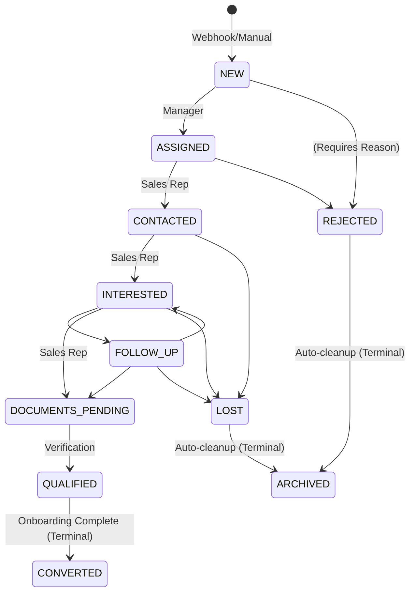

# CRM, Leads, and Territory Business Rules

This document outlines the business logic managing customer acquisition, lead tracking, onboarding workflows, and geographical territory enforcement within the Pharma CRM platform.

## 1. Lead Lifecycle Rules

Leads follow a strict lifecycle to ensure no prospective customer is forgotten. The system mandates proactive follow-ups for all active leads.

- **Mandatory Follow-Ups:** Any lead sitting in a non-terminal, active state (`ASSIGNED`, `CONTACTED`, `INTERESTED`, `FOLLOW_UP`, `DOCUMENTS_PENDING`, `QUALIFIED`) **MUST** have exactly one `PENDING` follow-up activity scheduled.
  - This activity must have `next_action` and `next_follow_up_at` populated.
  - If a sales rep completes an activity, the system forces them to schedule the next one before closing the dialogue, unless transitioning the lead to a terminal state (`LOST`, `REJECTED`, `ARCHIVED`).
- **Data Normalization:** Mobile numbers are cleaned upon intake.
  - Strip `+91` country code.
  - Strip leading `0`.
  - Keep only numeric digits (e.g., `9876543210`).
- **SLA Tracking:** The `first_response_at` timestamp on the lead record is automatically set the moment the first follow-up activity is completed. This is used for sales team performance metrics.
- **Conversion Post-Conditions:** When a lead successfully converts, the system:
  1. Creates a `parties` record (linked via `converted_from_lead_ref`).
  2. Creates a distributor user account.
  3. Grants partner portal access.
  4. The original lead history and activity log are preserved for audit purposes.

## 2. Lead Deduplication Strategy

To prevent sales reps from stepping on each other's toes and to handle messy webhook integrations, leads are heavily deduplicated per franchise.

**Generated Columns:**
To ensure atomicity, deduplication relies on MySQL generated virtual columns and unique constraints:
- `source_key` = `IFNULL(external_source_ref, 'MANUAL')`
- `ext_key` = `IF(external_lead_id IS NULL, CONCAT('~', lead_ref), external_lead_id)`

**Database Constraint:**
`UNIQUE (franchise_ref, source_key, ext_key)`

**Behaviors:**
- **Manual Leads:** Because `ext_key` defaults to the internal `lead_ref` prefixed with `~`, manual leads never collide at the database level.
- **Webhook Leads:** Always deduplicate precisely on `(source, external_lead_id)` per franchise.
- **Mobile App Policies:** Configured via `franchise.lead_dup_policy`:
  - `LINK`: Reject the new lead creation, but append the incoming request payload as a note/activity to the existing lead.
  - `CREATE_ANYWAY`: (Requires generating a new pseudo-external ID or treating as manual).
  - `REJECT`: Hard 409 Conflict.

## 3. Onboarding Invite Rules

When a lead reaches `QUALIFIED` status, an automated onboarding invite can be sent to allow the prospect to self-register their business details.

1. **Security:** Invites are strictly single-use. The `token_hash` is marked with `used_at` upon the first successful POST to the registration endpoint.
2. **Expiry:** Tokens expire automatically after 72 hours.
3. **Storage:** Tokens are stored as SHA-256 hashes in the database. The plaintext token is generated, displayed/emailed exactly once, and then discarded from memory.
4. **Resolution:** Upon successful registration via the token:
   - A Party is created.
   - A Distributor User is created.
   - The Lead status moves to `CONVERTED`.

## 4. Territory Rules

Territory management maps geographical areas (Pincode -> State hierarchy) to specific sales representatives or distributor parties.

### Resolution Hierarchy
1. System receives a pincode (e.g., `400001`).
2. Looks up in global `locations` table.
3. Resolves to `City (Mumbai)` -> `District (Mumbai City)` -> `State (Maharashtra)`.
4. If the pincode is completely unknown to the system database, the transaction is rejected with `422 TERRITORY_PINCODE_UNKNOWN` to force master data updates before transacting.

### Assignment Rules
- Territories are assigned with a status (`ACTIVE`, `INACTIVE`) and effective dates (`effective_from`, `effective_to`).
- Only rows where `status=ACTIVE` and the current date falls within the effective window are considered.
- Assignments can be made at the `PINCODE` level (micro) or the `DISTRICT` level (macro). 

### Exclusivity Policy
A franchise can grant an `EXCLUSIVE` tag to a territory assignment.
- If Party A has an exclusive lock on District X.
- Party B attempts to ship to Pincode Y (which is inside District X).
- System throws `BLOCKED_EXCLUSIVE`.

If the territory is completely unassigned for the franchise, the `territory_unassigned_policy` takes over (`BLOCK`, `ADMIN_REVIEW`, or `ALLOW`).

## 5. Lead State Machine

