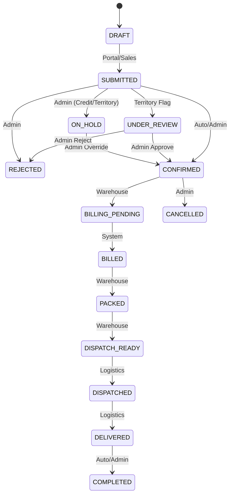

# Order-to-Cash Business Rules

This document details the critical business rules for the Order-to-Cash (O2C) pipeline, which encompasses pricing, stock reservation, order placement, billing, and payment allocation.

## 1. Price Resolution Algorithm

When an order is submitted, the exact price for each product must be determined dynamically. The `PriceResolver` service processes rules in strict priority order (lowest priority value wins).

**Priority Order:**
1. **Party-Specific Price** (`rate_source = PARTY`): A special rate negotiated directly with the specific distributor/retailer.
2. **Tier Price** (`rate_source = TIER`): The rate assigned to the party's tier (e.g., "Gold Distributors", "Hospital Pharmacies").
3. **Franchise Default Price** (`rate_source = DEFAULT`): The standard base price for the product within the franchise.
4. **Manual Admin Override** (`rate_source = OVERRIDE`): An explicitly forced price. Requires an audit reason and is heavily tracked.

**Resolution Rules:**
- The resolver only considers `ACTIVE` price rows where `effective_from <= CURRENT_DATE <= (effective_to OR NULL)`.
- If no active price is found across any priority level, the order is blocked with `422 PRICE_NOT_FOUND`.
- Once resolved, the `rate`, `rate_source`, and `price_ref` are **FROZEN** into the `order_items` table. Future updates to the master pricing tables do not affect historical orders.

## 2. Scheme Calculation (Free Goods)

Pharma CRM supports complex promotional schemes (e.g., "Buy 10 get 1 free"). The `SchemeCalculator` evaluates eligible schemes during order line item processing.

**Algorithm:**
1. Find matching `scheme_rules`:
   - Scheme is active on the order date.
   - Scheme tier matches the party's tier (or `scheme.tier_ref` is `NULL` for all-tiers).
   - Scheme product matches the ordered product.
   - `min_qty <= ordered_qty <= max_qty`.
2. For each matching rule, calculate the available free goods:
   - `sets = FLOOR(ordered_qty / min_qty)`
   - `free_qty = sets * rule_free_qty`
3. Resolve collisions based on stacking policy:
   - **`stacking_allowed = 0` (Exclusive):** Pick the single rule that yields the highest `free_qty`. Tie-breaker: lowest `scheme.priority` value, then lowest `scheme.id`.
   - **`stacking_allowed = 1` (Stackable):** Apply ALL matching rules based on the *original* `ordered_qty`. Sum the `free_qty`. Cap the total free goods at `max_free_ratio` (default is 100% of `ordered_qty`).
4. Output payload: Returns `{ paid_qty, free_qty, total_fulfil: paid_qty + free_qty, scheme_ref[] }`.

## 3. Territory Validation

Before an order is confirmed, the system ensures the party is authorized to operate in the shipping destination.

**Validation Steps:**
1. Resolve the destination: `pincode -> city -> district -> state`. Unknown pincodes throw `422 TERRITORY_PINCODE_UNKNOWN`.
2. Load active territory rows for the ordering party.
3. Check `PINCODE` level matching: If any assigned row matches the exact pincode → **ALLOWED**.
4. Check `DISTRICT` level matching: If any assigned row matches the resolved district → **ALLOWED**.
5. Check exclusive conflicts: If *another* party in the same franchise holds an `EXCLUSIVE` territory mapping for this area → **BLOCKED_EXCLUSIVE**.
6. Fallback to `franchise.territory_unassigned_policy`:
   - `BLOCK`: Order rejected (`422 TERRITORY_NOT_ALLOWED`).
   - `ADMIN_REVIEW`: Order placed in `UNDER_REVIEW` state.
   - `ALLOW`: Order proceeds.
7. **Overrides:** Admins can force validation via an override. Requires >10 char reason. Generates an audit log and sets `order.territory_status = OVERRIDDEN`.
8. Territory validation is executed at order submission AND re-executed during billing (unless `OVERRIDDEN`).

## 4. FEFO Stock Reservation (First Expired, First Out)

Critical to pharma compliance, stock is picked based on expiry dates rather than insertion order (FIFO).

**Algorithm (Requires open database transaction):**
1. Select batches `FOR UPDATE`. Ordering is deterministic: `expiry_date ASC, manufacturing_date ASC, id ASC`.
   - Filter criteria: `SALEABLE` status, `(on_hand_qty - reserved_qty) > 0`, and `expiry_date >= TODAY + min_shelf_days`.
2. Iterate through ordered batches (FEFO):
   - `take = MIN(on_hand_qty - reserved_qty, remaining_qty_needed)`
   - Execute: `UPDATE inventory_batches SET reserved_qty = reserved_qty + :take, version = version + 1 WHERE franchise_ref = :f AND batch_ref = :b AND (on_hand_qty - reserved_qty) >= :take` (Optimistic concurrency guard).
   - If affected rows != 1, rollback with `STOCK_RESERVATION_CONFLICT`.
   - `INSERT` into `stock_reservations` (`status=ACTIVE`).
   - `INSERT` into `inventory_movements` (`type=RESERVE`).
3. If `remaining_qty_needed > 0` after exhausting batches, throw `422 NO_ELIGIBLE_FEFO_BATCH` (entire transaction rolls back).
4. **Deadlock Prevention:** For multi-product orders, line items MUST be sorted by `product_ref` ASC before requesting reservations to ensure consistent database row locking order.

## 5. Order Creation Algorithm

1. `Idempotency-Key` check (via Middleware).
2. Resolve party based on auth context (Distributor = self only, Sales = assigned only, Admin = any).
3. Validate party is `ACTIVE` and agreement window is valid.
4. `BEGIN TRANSACTION`.
5. `INSERT` into `orders` (`client_order_ref`). If unique constraint fails, `ROLLBACK` -> `409 Duplicate`.
6. `order_no = SequenceService.next(ORDER)`.
7. Iterate line items: 
   - `PriceResolver.resolve()`
   - `SchemeCalculator.calculate()`
   - `lineTotal = price * paid_qty`
   - `INSERT order_items`.
8. Territory Check (blocks or flags).
9. Credit Check (blocks or holds).
10. Set status -> `SUBMITTED` (or `CONFIRMED` if channel is admin / auto-confirm enabled).
11. If `CONFIRMED`: Execute FEFO Stock Reservation inside the *same* transaction.
12. `INSERT order_status_history`, write audit logs. Enqueue notification jobs.
13. `COMMIT`.
14. Mark idempotency row as `COMPLETED`.

## 6. Billing Transaction Algorithm

Converts a confirmed order into a tax invoice, consuming the reserved stock permanently.

```sql
BEGIN;
  -- Lock the order
  SELECT * FROM orders WHERE id = ? FOR UPDATE;
  -- Abort if status not CONFIRMED or BILLING_PENDING
  
  -- Re-validate territory & credit
  
  -- Gapless invoice sequence generation inside the lock
  SET @invoice_no = SequenceService.next(INVOICE);
  
  -- Snapshot billing info
  INSERT INTO invoices (bill_to_json, ship_to_json, ...);
  
  -- Process reservations
  FOR EACH active stock_reservation:
    INSERT INTO invoice_items (product_name, sku, hsn, batch_no, expiry);
    
    -- Consume stock permanently
    UPDATE inventory_batches 
    SET on_hand_qty = on_hand_qty - qty, reserved_qty = reserved_qty - qty;
    
    UPDATE stock_reservations SET status = 'CONSUMED';
    INSERT INTO inventory_movements (type = 'SALE');
  END FOR;

  UPDATE orders SET status = 'BILLED';
  INSERT INTO order_status_history (...);
COMMIT;
```

## 7. Payment & Allocation

**Recording:** `INSERT payments (amount, mode, reference_no, status=RECORDED)`. Uses `SequenceService.next(PAYMENT)`.

**Allocation Transaction:**
```sql
BEGIN;
  SELECT * FROM payments WHERE id = ? FOR UPDATE;
  -- Order by invoice_ref ASC for stable lock order to prevent deadlocks
  SELECT * FROM invoices WHERE id IN (...) ORDER BY invoice_ref ASC FOR UPDATE;
  
  FOR EACH allocation:
    IF amount > (invoice.grand_total - invoice.paid_total) THEN ROLLBACK;
    IF SUM(amounts) > (payment.amount - payment.allocated_amount) THEN ROLLBACK;
    
    INSERT INTO payment_allocations (...);
    UPDATE invoices SET paid_total = paid_total + amount;
    UPDATE payments SET allocated_amount = allocated_amount + amount;
  END FOR;
COMMIT;
```

## 8. Order State Machine


