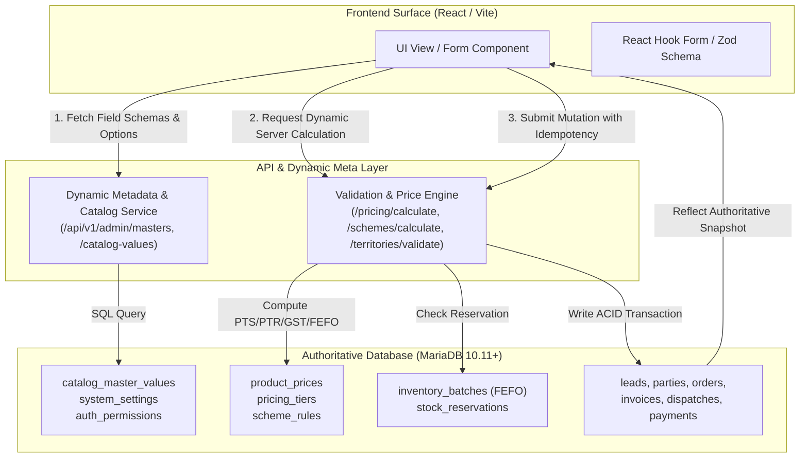

# Zero-Local-Data Architecture & Database-Driven State Paradigm

## 1. Executive Principle: "Zero Local Data Fields"

In this Pharma CRM & Sales Force Automation architecture, **no business data, field options, validation rules, tax calculations, scheme calculations, pricing lookups, or status workflows may ever reside in hardcoded, client-side, or volatile local page variables**.

Every field rendered in any form, modal, filter, table, card, or report is strictly projected from the **authoritative relational database state**.

---

## 2. Core Pillars of the Zero-Local-Data Paradigm

### Pillar 1: Dynamic Master & Field Options
* **Anti-Pattern:** Hardcoded select dropdowns in React components (e.g. `const SOURCES = ['IndiaMART', 'Direct', 'Referral'];` or `const PAYMENT_MODES = ['NEFT', 'RTGS', 'CHEQUE'];`).
* **Database Truth:** All lookup types, category taxonomies, payment modes, packaging units, and business statuses are fetched directly from:
  1. `catalog_master_values` (table: `entity_type`, `field_name`, `code`, `label`, `sort_order`, `is_active`)
  2. `product_categories`
  3. `pricing_tiers`
  4. `transporters`
  5. `states`, `districts`, `cities`, `pincodes`

### Pillar 2: Dynamic Server-Side Validations
* **Anti-Pattern:** Client-only min/max order limits, client-only territory approval logic, or client-only GST state determination.
* **Database Truth:** The database tables and API controllers define the exact column lengths, regex constraints, and foreign key boundaries. Client validation schemas are runtime reflections of database constraints:
  - Phone: `users.mobile` / `leads.mobile` (varchar(20), E.164 compliant)
  - GSTIN: 15 alphanumeric characters matching state code lookup
  - PAN: 10 alphanumeric characters
  - Drug License: format verified against franchise state drug licensing authority requirements stored in `franchises.drug_license_no`.

### Pillar 3: Centralized Database-Driven Calculations
* **Anti-Pattern:** JavaScript calculating `item_total = rate * qty`, `tax = total * 0.18`, or schemes `if (qty >= 10) free_qty = 1`.
* **Database Truth:** All commercial math is performed exclusively by backend calculation services querying the database:
  - **Pricing Resolution:** `POST /api/v1/admin/pricing/calculate` queries `product_prices` (Priority: Party-specific > Pricing Tier > Base Product PTS).
  - **Scheme Application:** `POST /api/v1/admin/schemes/calculate` evaluates `scheme_rules` (e.g. `min_qty`, `free_qty`, `stacking_allowed`).
  - **Tax & GST Breakdown:** Server determines whether `party.state_ref === franchise.state_ref` (CGST 9% + SGST 9%) or inter-state (IGST 18%).
  - **Inventory FEFO Allocation:** Server queries `inventory_batches` ordered by `expiry_date ASC` and `created_at ASC` to reserve gapless batch stock.

### Pillar 4: Gapless Deterministic Numbering
* Invoices, Orders, Dispatches, and Receipts never generate sequential IDs on the client.
* Numbers are atomically incremented using `sequence_counters` with row-level locks (`SELECT ... FOR UPDATE`), guaranteeing zero gaps in compliance with Indian GST regulations.
