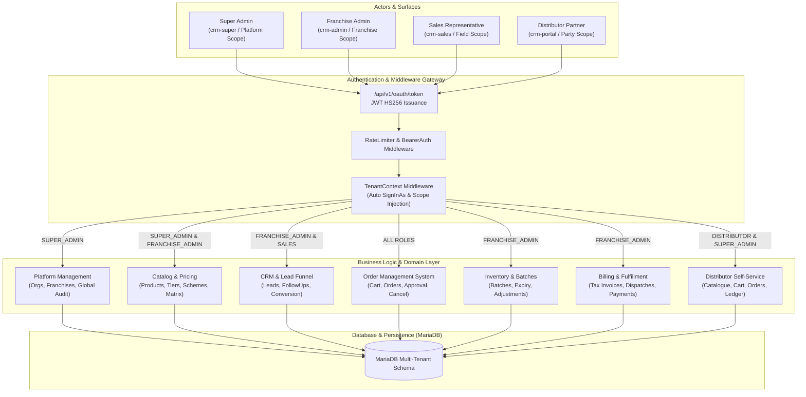

# Pharma CRM - End-to-End System Architecture & Workflows

## 1. System Overview & Core Actors

---

## 2. Global Role-Based Access Control (RBAC) Matrix

| Module / Resource | Super Admin | Franchise Admin | Sales Rep | Distributor Partner |
| :--- | :---: | :---: | :---: | :---: |
| **Organizations & Global Franchises** | Full (CRUD) | None (403) | None (403) | None (403) |
| **Global Security Audit Logs** | Full (Read) | None (403) | None (403) | None (403) |
| **Franchise User Management** | Read / SignInAs | Full (CRUD) | None (403) | None (403) |
| **Products & Categories Master** | Full / SignInAs | Full (CRUD) | Read Only | Read Only (Portal) |
| **Pricing Tiers & Custom Schemes** | Full / SignInAs | Full (CRUD) | Read Only | Read (Resolved Price) |
| **Sales Leads & Conversions** | Full / SignInAs | Full (All Leads) | Scoped (Assigned Only) | None (403) |
| **Follow-Ups & Call Logs** | Full / SignInAs | Full (All Reps) | Scoped (Self Only) | None (403) |
| **Distributor Parties Master** | Full / SignInAs | Full (CRUD) | Scoped (Territory) | Read Own Profile |
| **Territory Rules & Overrides** | Full / SignInAs | Full (CRUD) | Validate Only | None (403) |
| **Inventory & Batch Tracking** | Full / SignInAs | Full (Receive/Adjust) | Read Near-Expiry | None (403) |
| **Order Placement & Management** | Full / SignInAs | Full (Approve/Cancel) | Field Booking | Self-Service Order |
| **Tax Invoices & Billing** | Full / SignInAs | Full (Post/Cancel) | View Invoices | View & Download Own |
| **Dispatches & LR Tracking** | Full / SignInAs | Full (Create/Deliver) | View Dispatches | Track Own Shipments |
| **Payment Collection & Allocation** | Full / SignInAs | Full (Record/Allocate) | View Collections | View Ledger Balance |
| **BI Reports & CSV Exports** | Full / SignInAs | Full (Franchise Level) | Scoped Performance | None (403) |

---

## 3. End-to-End Enterprise Workflows Directory

1. [Super Admin Workflow Graph](file:///e:/Projects/PHP/crm/docs/workflows/01_super_admin_workflow.md)
2. [Franchise Admin Workflow Graph](file:///e:/Projects/PHP/crm/docs/workflows/02_franchise_admin_workflow.md)
3. [Sales Representative Workflow Graph](file:///e:/Projects/PHP/crm/docs/workflows/03_sales_rep_workflow.md)
4. [Distributor Partner Portal Workflow Graph](file:///e:/Projects/PHP/crm/docs/workflows/04_distributor_portal_workflow.md)
5. [Complete Order-to-Cash & Fulfillment Lifecycle Graph](file:///e:/Projects/PHP/crm/docs/workflows/05_order_to_cash_lifecycle.md)
