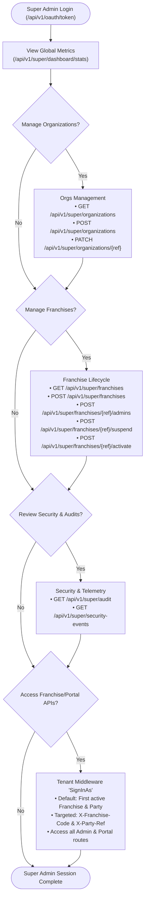
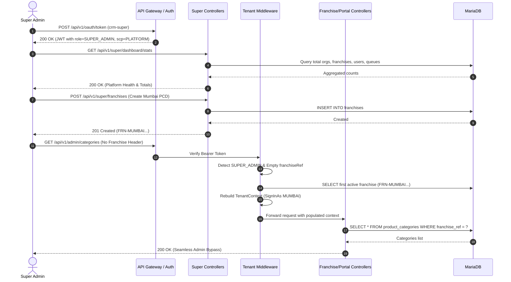

# Super Admin - Platform Operations & Governance Workflow

## 1. Actor Profile
* **Client Surface**: `crm-super`
* **OAuth Role**: `SUPER_ADMIN`
* **Access Scope**: `PLATFORM` (Global unconstrained platform authority)
* **Key Feature**: Native **Auto "SignInAs" Impersonation** (allows executing Franchise and Portal APIs seamlessly)

---

## 2. Platform Operations Flow Graph

---

## 3. Detailed Use Cases & Sequence

---

## 4. API Endpoints Reference

| Operation | Method | Endpoint | Description |
| :--- | :---: | :--- | :--- |
| **Login** | `POST` | `/api/v1/oauth/token` | Authenticate with `crm-super` client ID |
| **Metrics** | `GET` | `/api/v1/super/dashboard/stats` | Global tenant count, queue health, system time |
| **Audit** | `GET` | `/api/v1/super/audit` | Platform immutable security & action audit logs |
| **Security** | `GET` | `/api/v1/super/security-events` | Token rejections, IP anomalies, auth violations |
| **Orgs List** | `GET` | `/api/v1/super/organizations` | List all pharmaceutical tenant groups |
| **Org Create** | `POST` | `/api/v1/super/organizations` | Create tenant organization |
| **Franchises** | `GET` | `/api/v1/super/franchises` | List PCD franchise divisions |
| **Franchise Create**| `POST` | `/api/v1/super/franchises` | Provision new PCD franchise |
| **Suspend** | `POST` | `/api/v1/super/franchises/{ref}/suspend` | Lock franchise access |
| **Activate** | `POST` | `/api/v1/super/franchises/{ref}/activate` | Re-enable suspended franchise |
