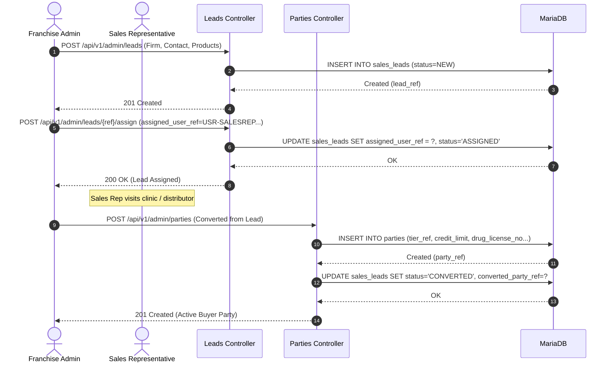

# Franchise Admin - Complete Operations & Fulfillment Workflow

## 1. Actor Profile
* **Client Surface**: `crm-admin`
* **OAuth Role**: `FRANCHISE_ADMIN`
* **Access Scope**: `FRANCHISE` (Strict multi-tenant boundary bounded to their franchise)
* **Core Responsibilities**: Master data configuration, lead management, user administration, order approvals, invoicing, batch inventory, and fulfillment.

---

## 2. Franchise Operations Flow Graph

```mermaid
flowchart TD
    LoginAdmin(["Franchise Admin Login<br/>(/api/v1/oauth/token with franchise_code)"]) --> SetupMasters{"Setup Franchise Masters?"}

    SetupMasters -->|Yes| MastersModule["Master Data Configuration<br/>• Categories: GET/POST /api/v1/admin/categories<br/>• Tiers: GET/POST /api/v1/admin/tiers<br/>• Products: GET/POST/PATCH /api/v1/admin/products<br/>• Pricing Matrix: POST /api/v1/admin/prices<br/>• Schemes: POST /api/v1/admin/schemes<br/>• Transporters: GET/POST /api/v1/admin/transporters"]
    SetupMasters -->|No| TeamMgmt{"Manage Sales Team & Users?"}

    MastersModule --> TeamMgmt

    TeamMgmt -->|Yes| UserOps["User & Staff Control<br/>• List Team: GET /api/v1/admin/users<br/>• Add Sales Rep: POST /api/v1/admin/users<br/>• Lock / Unlock / Reset Password"]
    TeamMgmt -->|No| CRMModule{"Manage Leads & Onboarding?"}

    UserOps --> CRMModule

    CRMModule -->|Yes| LeadPipeline["Lead-to-Party Conversion Funnel<br/>• Ingest Leads: Manual or Webhooks<br/>• Assign to Sales Rep: POST .../assign<br/>• Track Follow-Ups: GET/POST .../follow-ups<br/>• Convert to Party: POST .../parties<br/>• Define Territory: POST .../territories"]
    CRMModule -->|No| CommerceModule{"Order & Fulfillment Pipeline?"}

    LeadPipeline --> CommerceModule

    CommerceModule -->|Yes| OrderFulfillment["Order-to-Cash (P4 Core)<br/>1. Receive Inward Stock: POST .../inventory/receive<br/>2. Review Orders: GET .../admin/orders<br/>3. Confirm Order: POST .../orders/{ref}/confirm<br/>4. Generate Tax Invoice: POST .../invoices/generate<br/>5. Create Dispatch & LR: POST .../dispatches<br/>6. Record Payment: POST .../payments"]
    CommerceModule -->|No| ReportsModule["Reports & Analytics<br/>• GET /api/v1/admin/reports/{type}<br/>• CSV Export: GET .../export"]

    OrderFulfillment --> ReportsModule
    ReportsModule --> AdminComplete([Franchise Admin Operations Complete])
```

---

## 3. Lead Conversion to Active Distributor Party

---

## 4. Master Endpoints Reference

| Category | Method | Endpoint | Purpose |
| :--- | :---: | :--- | :--- |
| **Categories** | `GET / POST` | `/api/v1/admin/categories` | Manage therapeutic product categories |
| **Tiers** | `GET / POST` | `/api/v1/admin/tiers` | Pricing tiers (Stockist, Distributor, Chemist) |
| **Products** | `GET / POST / PATCH` | `/api/v1/admin/products` | Manage formulations, MRP, PTS, packaging |
| **Pricing** | `POST` | `/api/v1/admin/pricing/resolve` | Dynamic price calculation engine |
| **Schemes** | `POST` | `/api/v1/admin/schemes/calculate` | Volume schemes (e.g. 10+1 free, slab discounts) |
| **Leads** | `GET / POST / PATCH` | `/api/v1/admin/leads` | Field inquiry & prospect pipeline |
| **Follow-Ups** | `GET / POST` | `/api/v1/admin/follow-ups` | Schedule & log client calls/meetings |
| **Parties** | `GET / POST / PATCH` | `/api/v1/admin/parties` | Distributor accounts, drug license, GSTIN |
| **Territories**| `GET / POST` | `/api/v1/admin/territories` | Pincode & district boundary rules |
| **Inventory** | `POST` | `/api/v1/admin/inventory/receive` | GRN entry for batch no, manufacturing & expiry |
| **Orders** | `GET / POST` | `/api/v1/admin/orders` | Franchise orders list & creation |
| **Confirm** | `POST` | `/api/v1/admin/orders/{ref}/confirm` | Reserve stock & approve order |
| **Invoices** | `POST` | `/api/v1/admin/invoices/generate` | Generate GST compliant tax invoice |
| **Dispatches**| `POST` | `/api/v1/admin/dispatches` | Generate LR number, assign transporter |
| **Payments** | `POST` | `/api/v1/admin/payments` | Record NEFT/Cheque/Cash & allocate to invoices |
