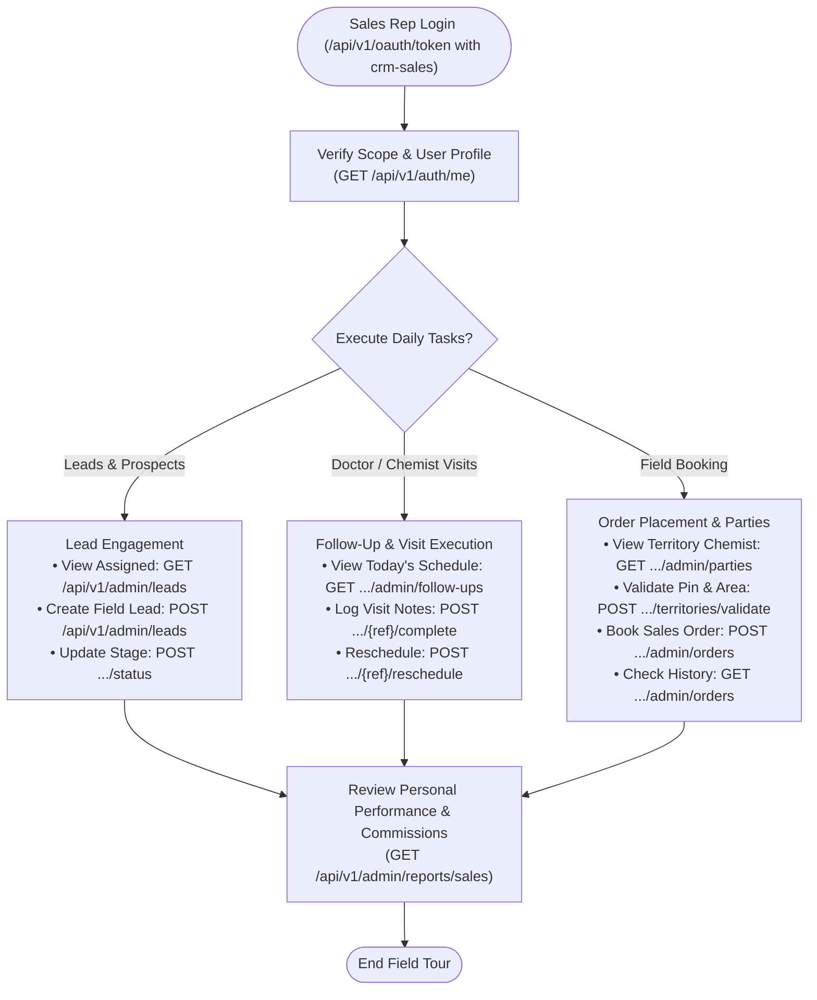
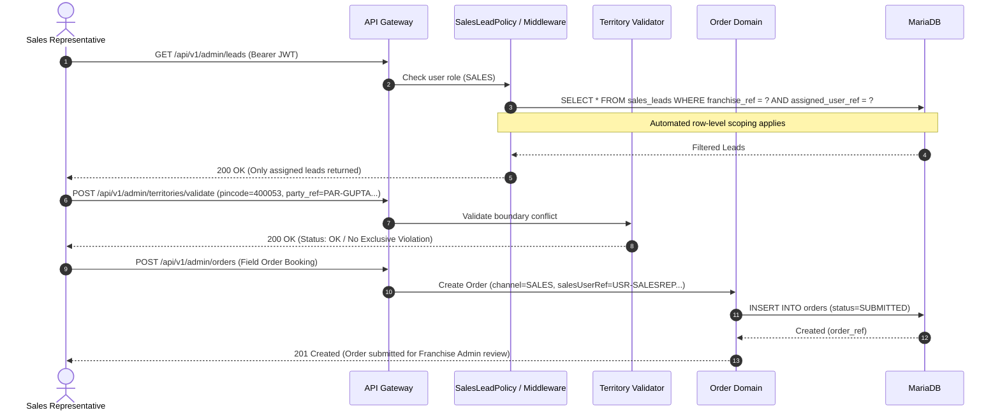

# Sales Representative - Field Operations & Scoped Workflows

## 1. Actor Profile
* **Client Surface**: `crm-sales`
* **OAuth Role**: `SALES`
* **Access Scope**: `FRANCHISE` (Strictly scoped to their **own assigned records** via SQL policy isolation)
* **Core Responsibilities**: Lead acquisition, doctor/chemist visits, follow-up scheduling, field order booking, and territory compliance.

---

## 2. Sales Rep Operations Flow Graph

---

## 3. Territory Enforcement & Field Booking Sequence

---

## 4. Sales Rep Endpoints Reference

| Operation | Method | Endpoint | Scoping Constraint |
| :--- | :---: | :--- | :--- |
| **Profile** | `GET` | `/api/v1/auth/me` | Returns role `SALES` and franchise identifier |
| **List Leads** | `GET` | `/api/v1/admin/leads` | Automatically scoped to `assigned_user_ref` |
| **Create Lead** | `POST` | `/api/v1/admin/leads` | Auto-stamped with creator and assigned to self |
| **Follow-Ups** | `GET` | `/api/v1/admin/follow-ups` | Only returns visits assigned to the sales rep |
| **Complete Visit** | `POST` | `/api/v1/admin/follow-ups/{ref}/complete` | Records call notes, doctor samples handed over |
| **Parties** | `GET` | `/api/v1/admin/parties` | Displays assigned doctors, stockists, chemists |
| **Territory Check**| `POST` | `/api/v1/admin/territories/validate` | Pre-checks pincode availability before booking |
| **Book Order** | `POST` | `/api/v1/admin/orders` | Books order with `channel=SALES` |
| **View Orders** | `GET` | `/api/v1/admin/orders` | Scoped to orders booked by the sales rep |
