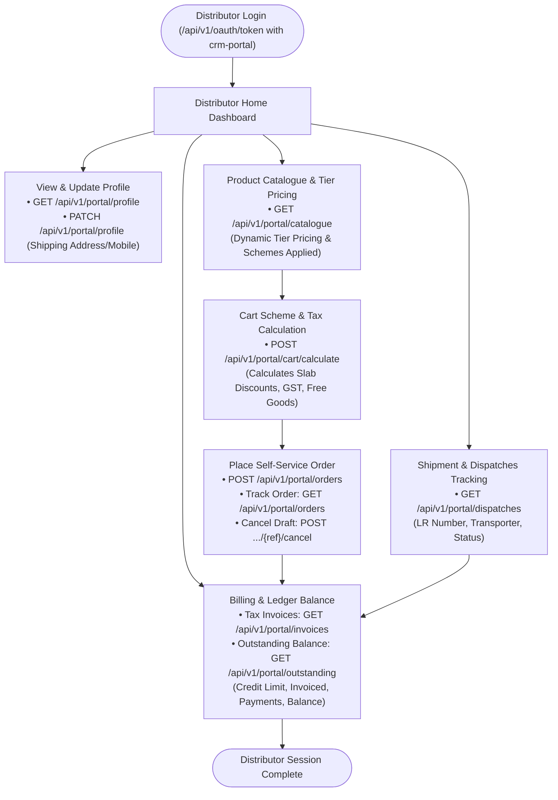
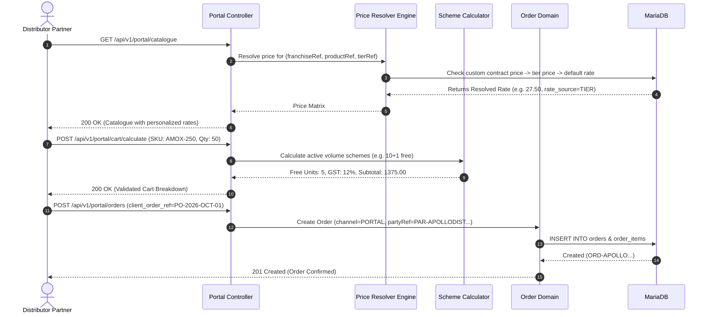

# Distributor Partner - Portal Self-Service Workflow

## 1. Actor Profile
* **Client Surface**: `crm-portal`
* **OAuth Role**: `DISTRIBUTOR`
* **Access Scope**: `DISTRIBUTOR` / `PARTY` (Strict isolation to the specific partner account `party_ref`)
* **Core Responsibilities**: Browse real-time catalogue, tier-specific pricing, placing restocking orders, tracking shipments, reviewing invoices, and monitoring credit limit and outstanding ledger.

---

## 2. Distributor Portal Operations Flow Graph

---

## 3. Dynamic Pricing Resolution & Cart Sequence

---

## 4. Distributor Portal Endpoints Reference

| Purpose | Method | Endpoint | Description |
| :--- | :---: | :--- | :--- |
| **Profile** | `GET` | `/api/v1/portal/profile` | Firm details, GSTIN, drug license, credit limit |
| **Update Info** | `PATCH` | `/api/v1/portal/profile` | Update delivery address, contact person, mobile |
| **Catalogue** | `GET` | `/api/v1/portal/catalogue` | Products with active tier pricing and GST rates |
| **Cart Calc** | `POST` | `/api/v1/portal/cart/calculate` | Real-time scheme and tax breakdown before booking |
| **List Orders**| `GET` | `/api/v1/portal/orders` | Historical orders and current fulfillment stages |
| **Place Order**| `POST` | `/api/v1/portal/orders` | Place restocking purchase order directly |
| **Order Details**| `GET` | `/api/v1/portal/orders/{ref}` | View ordered items, free units, and totals |
| **Cancel Draft**| `POST` | `/api/v1/portal/orders/{ref}/cancel` | Cancel order before confirmation by franchise |
| **Invoices** | `GET` | `/api/v1/portal/invoices` | Download and inspect official tax invoices |
| **Dispatches**| `GET` | `/api/v1/portal/dispatches` | Track LR number, vehicle, courier, and delivery status |
| **Ledger** | `GET` | `/api/v1/portal/outstanding` | Real-time opening, invoiced, paid, and current balance |
