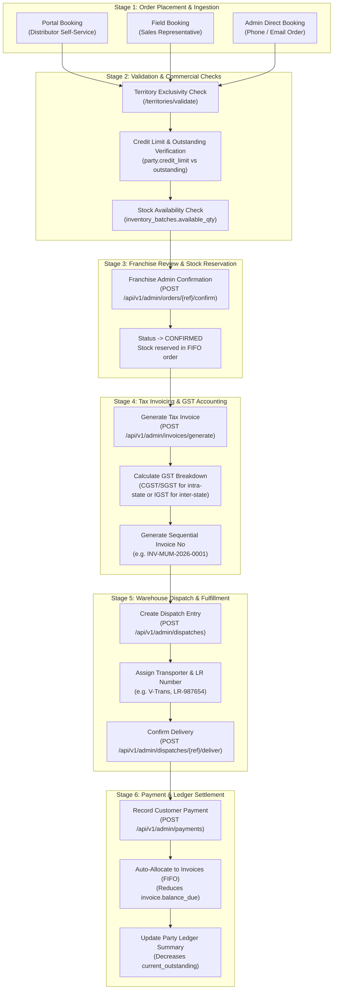
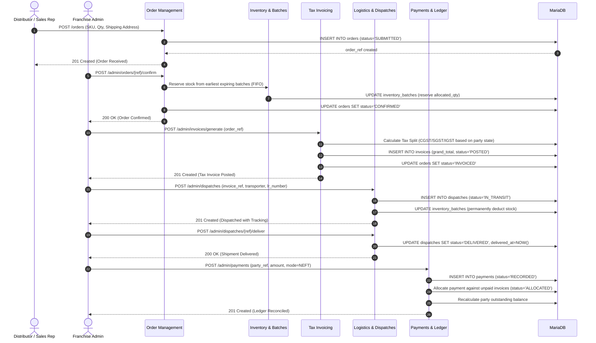
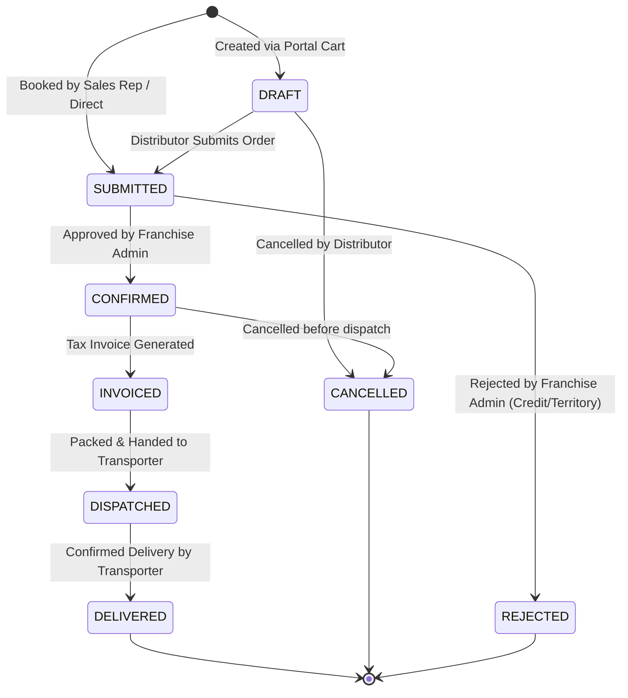

# Complete Order-to-Cash & Fulfillment Lifecycle

## 1. Lifecycle Overview

The commercial lifecycle in the Pharma PCD CRM bridges Sales, Orders, Batch Inventory, Tax Invoicing, Logistics Fulfillment, and Payment Reconciliation.

---

## 2. Detailed Multi-System Sequence Diagram

---

## 3. Order Status State Machine

