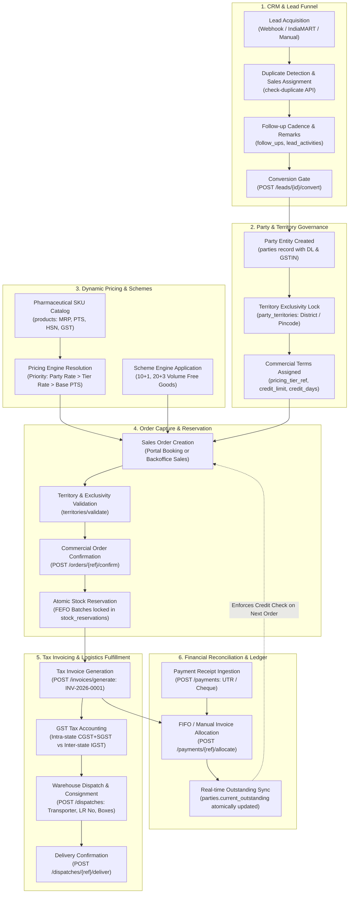

# Complete End-to-End System Workflows & Inter-Module Relations

This document details the cross-module workflows, state transitions, and database updates connecting Leads, Parties, Territories, Catalog, Pricing, Inventory, Invoicing, Dispatches, Payments, and Portals.

---

## 1. Master System Flow & Inter-Module Relations

---

## 2. Granular Module Workflows & Database State Transitions

### Workflow 1: Lead-to-Party Conversion & Territory Allocation
1. **Trigger:** User clicks "Convert to Party" on an active lead (`leads.status = 'QUALIFIED'`).
2. **Action:** Modal opens with pre-filled lead information. User specifies `dl_number_1`, `pricing_tier_ref`, `credit_limit`, and optional `territory_districts`.
3. **Database Transaction:**
   * Checks uniqueness of `mobile` and `dl_number_1` in `parties`.
   * Inserts row into `parties` with auto-generated gapless `party_code` from `sequence_counters`.
   * Inserts row into `users` with `role = 'DISTRIBUTOR'` and links `party_ref`.
   * Inserts rows into `party_territories` verifying no conflicting exclusive lock exists for any selected district/pincode.
   * Updates `leads.status = 'CONVERTED'` and writes log into `lead_activities`.

### Workflow 2: Sales Order Placement & Dynamic Server Pricing
1. **Trigger:** Order entry in Backoffice (`SCR-17`) or Distributor Portal (`SCR-P04`).
2. **Dynamic Computation (Zero Local Data):**
   * As items are added or quantities modified, client makes non-blocking requests to:
     * `POST /api/v1/admin/pricing/calculate` with `{ party_ref, items }`. Resolves rate hierarchy.
     * `POST /api/v1/admin/schemes/calculate`. Resolves applicable free quantities.
     * `POST /api/v1/admin/territories/validate`. Verifies the customer's delivery pincode matches assigned party territory.
3. **Submission:** Order is submitted in `DRAFT` or `SUBMITTED` status. Total value and tax snapshots are written to `orders` and `order_items`.

### Workflow 3: Order Confirmation, FEFO Batch Allocation & Reservation
1. **Trigger:** Franchise Admin clicks "Confirm & Reserve Batches" (`SCR-18`).
2. **Database Engine Execution:**
   * Backend initiates an ACID transaction with row-level locks on `inventory_batches` (`SELECT ... FOR UPDATE`).
   * Iterates ordered items. For each product, identifies available batches ordered by `expiry_date ASC, created_at ASC` (FEFO).
   * Allocates required quantity. Increments `inventory_batches.reserved_qty` and decrements `inventory_batches.available_qty`.
   * Inserts row into `stock_reservations` linking `order_ref`, `product_ref`, `batch_ref`, and `reserved_qty`.
   * Transitions `orders.status` to `CONFIRMED`.

### Workflow 4: Tax Invoicing & Gapless Sequential Numbering
1. **Trigger:** Admin clicks "Generate Tax Invoice" from a confirmed order.
2. **Database Execution:**
   * Atomically increments `sequence_counters` for `INVOICE` within the franchise.
   * Creates `invoices` record with gapless legal invoice number (e.g. `INV-2026-0001`).
   * Copies price, rate, and party snapshots (preserving historical accounting integrity even if future catalogue prices change).
   * Calculates GST: checks if party `state_ref` equals franchise `state_ref`. Computes intra-state (CGST 9% + SGST 9%) or inter-state (IGST 18%).
   * Sets `invoices.balance_due = invoices.total_amount`.
   * Increments `parties.current_outstanding` by `total_amount`.

### Workflow 5: Warehouse Dispatch & Fulfillment Tracking
1. **Trigger:** Admin assigns logistics transporter and Lorry Receipt (`SCR-22`).
2. **Database Execution:**
   * Inserts row into `dispatches` with `transporter_ref`, `lr_number`, `lr_date`, `boxes_count`.
   * Converts stock reservations into permanent stock consumption: decrements `inventory_batches.reserved_qty`, records outbound entry in `inventory_movements`, and deletes `stock_reservations` record.
   * Transitions `orders.status = 'DISPATCHED'`.
   * Emits notification event (WhatsApp & in-app) to the distributor with transporter name and LR tracking number.
3. **Delivery Confirmation:** When destination receipt is acknowledged, dispatch status moves to `DELIVERED` and `orders.status = 'DELIVERED'`.

### Workflow 6: Payment Recording, Multi-Invoice Allocation & Ledger Sync
1. **Trigger:** Bank credit received via NEFT/Cheque/UPI. Admin inputs payment details (`SCR-28`).
2. **Database Execution:**
   * Atomically generates payment receipt number (`PAY-2026-0001`) from `sequence_counters`.
   * Inserts record into `payments`.
   * For each selected invoice allocation, inserts record into `payment_allocations`.
   * Atomically decrements `invoices.balance_due` by allocated amount.
   * If `balance_due == 0`, marks invoice status as `PAID`, else `PARTIALLY_PAID`.
   * Atomically decrements `parties.current_outstanding` by total cleared amount.
