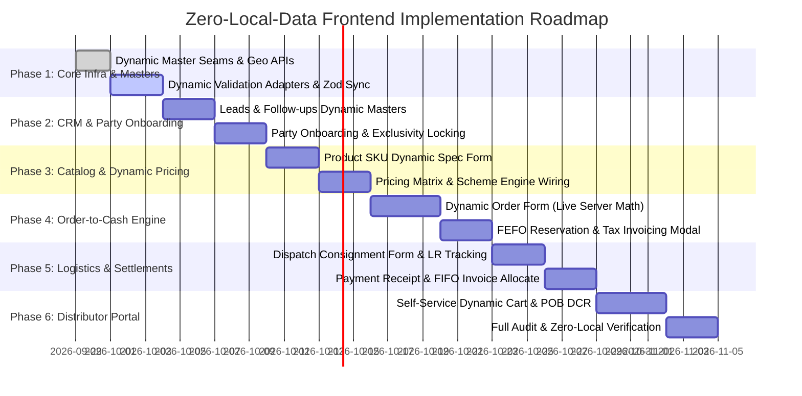

# Unified Implementation Master Plan: Zero-Local-Data Architecture

This document provides the consolidated, unified master implementation roadmap to migrate all frontend components, forms, modals, tables, and workflows to the **Zero-Local-Data Architecture**, backed exclusively by database records and server calculations.

---

## 1. Core Architecture Tenets

1. **Zero Hardcoded Master Selects:** Replace any local array definitions (e.g. `const SOURCES = [...]`, `const UNITS = [...]`, `const PAYMENT_MODES = [...]`) with dynamic queries to `/api/v1/admin/masters/catalog-values` and `/api/v1/geo/*`.
2. **Server-Side Commercial Math:** Eliminate client-side price, scheme, and GST calculations. Use backend calculation services:
   - Pricing: `POST /api/v1/admin/pricing/calculate`
   - Schemes: `POST /api/v1/admin/schemes/calculate`
   - Territory Exclusivity: `POST /api/v1/admin/territories/validate`
3. **Strict Form-to-DB Alignment:** Every form input validates against actual database column constraints and remote uniqueness checks.
4. **Deterministic Sequential Identifiers:** All document numbers (Orders, Invoices, Dispatches, Receipts) originate from atomic server counters (`sequence_counters`).

---

## 2. Phased Implementation Roadmap

---

## 3. Deep Dive Phase Tasks & Deliverables

### Phase 1: Foundations & Dynamic Metadata Seam
* [x] **Audit & Documentation:** Produce complete field-to-ER mappings, screen specifications, and Swagger API directory.
* [x] **Dynamic Masters Provider:** Create a centralized React Query context (`useCatalogMasterValues`) to cache and supply all lookup types from `catalog_master_values`.
* [x] **Live Pricing Resolution Hook:** Create `useLivePricing` to resolve rates and rate sources directly via backend `PriceResolver`.
* [ ] **Geo-Location Cascade Hook:** Implement `useGeoHierarchy(stateRef, districtRef)` for dynamic dropdowns without hardcoded lists.

### Phase 2: CRM Funnel & Party Governance
* [x] **Lead Form Migration:** Update `LeadFormPage.tsx` to read sources and statuses from dynamic master endpoints (`useCatalogMasterValues`).
* [x] **Duplicate Mobile Check:** Wire async blur validation on mobile field calling live search query when available.
* [x] **Party Form Dynamic Masters:** Update `PartyFormPage.tsx` to hydrate party types from `useCatalogMasterValues('business_type')`.
* [x] **Product Form Dynamic Masters:** Update `ProductFormPage.tsx` to hydrate dosage forms from `useCatalogMasterValues('dosage_form')`.
* [ ] **Lead-to-Party Conversion Modal:** Implement `ConvertLeadModal` requiring statutory DL and pricing tier.
* [ ] **Territory Lock Enforcement:** Wire territory selector in `PartyFormPage.tsx` to query existing locks from `party_territories`.

### Phase 3: Catalog, Commercial Pricing & Schemes
* [ ] **Product SKU Form:** Convert packing units, categories, and GST options in `ProductFormPage.tsx` to dynamic master lookups.
* [ ] **Pricing Engine Integration:** Replace manual rate entries with live hook `usePricingCalculation(partyRef, items)` querying `POST /api/v1/admin/pricing/calculate`.
* [ ] **Scheme Engine Integration:** Wire `useSchemeCalculation(partyRef, items)` to dynamically compute free goods without client formulas.

### Phase 4: Commercial Orders & Order-to-Cash Execution
* [ ] **Order Creation Grid:** Migrate `OrderFormPage.tsx` line items to reactively trigger server price and scheme endpoints on quantity debounce.
* [ ] **FEFO Batch Reservation Modal:** In `OrderDetailsPage.tsx`, wire "Confirm Order" to display batch allocation preview from server FEFO service.
* [ ] **Tax Invoicing Action:** Wire "Generate Tax Invoice" to call `POST /api/v1/admin/invoices/generate`, rendering gapless sequential invoice numbers.

### Phase 5: Logistics Fulfillment & Financial Ledger
* [ ] **Dispatch Modal:** Wire `DispatchFormPage.tsx` to populate transporters from `GET /api/v1/admin/transporters?status=ACTIVE`.
* [ ] **Payment Receipt Form:** Migrate `PaymentFormPage.tsx` payment modes to dynamic catalog lookup.
* [ ] **Interactive FIFO Allocation:** Implement `PaymentAllocationPage.tsx` with dynamic unpaid invoice balances from `invoices.balance_due`.

### Phase 6: Distributor Self-Service Portal & Verification
* [ ] **Distributor Cart:** Connect `PortalCartPage.tsx` to `/distributor/cart/calculate` for server-authoritative GST splits.
* [ ] **Daily Call Report (DCR):** Implement field customer and visit logging forms linked to dynamic portal APIs.
* [ ] **Codebase Audit:** Run `grep_search` across `react-front-end/src` to guarantee 0 instances of hardcoded select arrays or client-side pricing/tax formulas.
