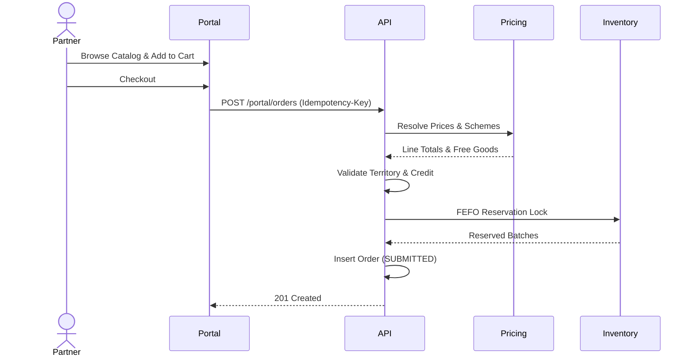
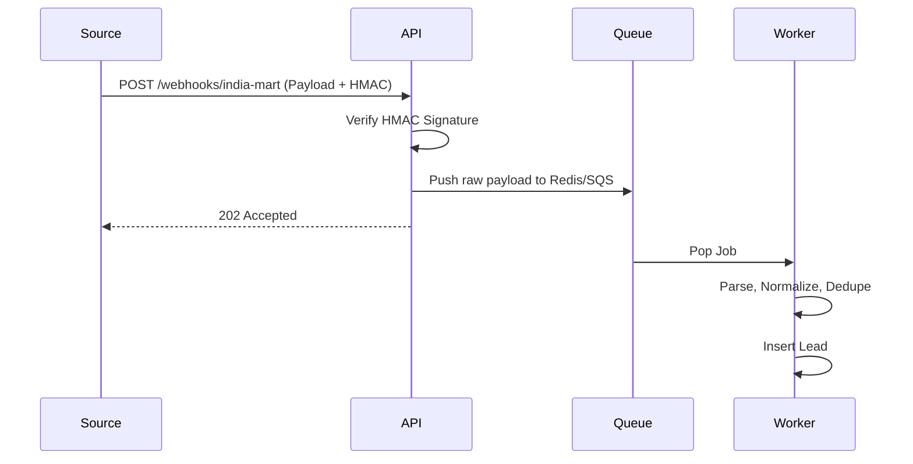

# Pharma CRM Workflows

This document maps out the end-to-end workflows of the Pharma CRM platform. It provides sequence outlines for critical business operations.

## 1. Platform Bootstrap (First-time setup)
Used by the infrastructure team when deploying a fresh database.
- **Pre-conditions:** Empty database.
- **Steps:**
  1. Run database migrations.
  2. Run master seeders (Locations, States, standard HSN codes).
  3. Create the Root Super Admin user via CLI command.
- **Post-conditions:** System ready to accept tenant creation.

## 2. Tenant Creation
- **Pre-conditions:** Super Admin logged in.
- **Steps:**
  1. Super Admin creates an Organization (`orgs` table).
  2. Under the Org, creates a Franchise (`franchises` table).
  3. Configures franchise settings (GST state, credit policies).
  4. Creates the first Admin user for the franchise.
  5. System emails temporary credentials to the new Admin.

## 3. Lead Generation (Webhook or Manual)
- **Steps:**
  1. External source (e.g., Facebook Ads, IndiaMART) hits Webhook, OR Admin fills manual form.
  2. System normalizes mobile number.
  3. Calculates `source_key` and `ext_key`.
  4. Deduplication logic fires (resolves conflicts based on franchise policy).
  5. Lead inserted with status `NEW`.
  6. Notification dispatched to Sales Manager.

## 4. Sales Team Lead Follow-Up Workflow
- **Steps:**
  1. Manager views `NEW` leads and assigns to Sales Rep (`ASSIGNED`).
  2. Rep calls lead, logs activity, sets status to `CONTACTED`.
  3. Rep MUST schedule a future activity (`PENDING` follow-up).
  4. Lead moves back and forth between `FOLLOW_UP` and `INTERESTED`.
  5. Rep collects GST and Drug License, moves to `DOCUMENTS_PENDING`.
  6. Admin verifies documents, moves to `QUALIFIED`.

## 5. Onboarding: Lead Converts to Franchise Partner
- **Steps:**
  1. Admin triggers invite for a `QUALIFIED` lead.
  2. System generates secure SHA-256 token and emails/SMS link.
  3. Prospect clicks link (valid 72h), fills registration form.
  4. System validates token, marks `used_at`.
  5. Creates `parties` record. Creates distributor user.
  6. Lead status changes to `CONVERTED`.

## 6. Partner Portal Order Placement

## 7. Order Processing (Admin Side)
- **Steps:**
  1. Admin reviews `SUBMITTED` or `ON_HOLD` order.
  2. Approves credit/territory overrides if necessary.
  3. Clicks Confirm -> Status `CONFIRMED`.
  4. Warehouse staff views `CONFIRMED` orders.
  5. Clicks Bill -> Billing Transaction fires (Stock consumed, Invoice generated). Status `BILLED`.
  6. Warehouse physical packing -> Status `PACKED`.
  7. Handover to logistics -> Status `DISPATCHED` (Dispatch notes created).
  8. Proof of Delivery received -> Status `DELIVERED`.

## 8. Payment Tracking
- **Steps:**
  1. Accounts receives bank transfer.
  2. Admin enters payment details. System creates `payments` record (`RECORDED`).
  3. Admin selects unpaid invoices and allocates payment.
  4. Allocation transaction runs (locks payment and invoices, deducts balances).
  5. Invoice marked as fully or partially paid. Party outstanding updates automatically.

## 9. Login Flow (Multi-Surface)
- **Context:** The system supports 4 surfaces (Super Admin, Franchise Admin, Sales Rep, Distributor Portal).
- **Steps:**
  1. User POSTs email/password + Surface ID.
  2. API validates credentials and confirms role matches Surface ID.
  3. Generates short-lived JWT (access token) and opaque Refresh Token (stored in DB).
  4. Client stores tokens.
  5. On page load, client attempts API call. If 401, uses refresh token to get new JWT.

## 10. Webhook Lead Ingestion Flow

## 11. Notification Flow
- **Steps:**
  1. Domain event fired (e.g., `OrderConfirmedEvent`).
  2. Event listener pushes generic notification job to queue.
  3. Background worker picks up job.
  4. `NotificationService` formats message.
  5. Dispatches via configured Adapter (Email, SMS, Push).
  6. Idempotency mechanism ensures same notification isn't sent twice on worker retry.
