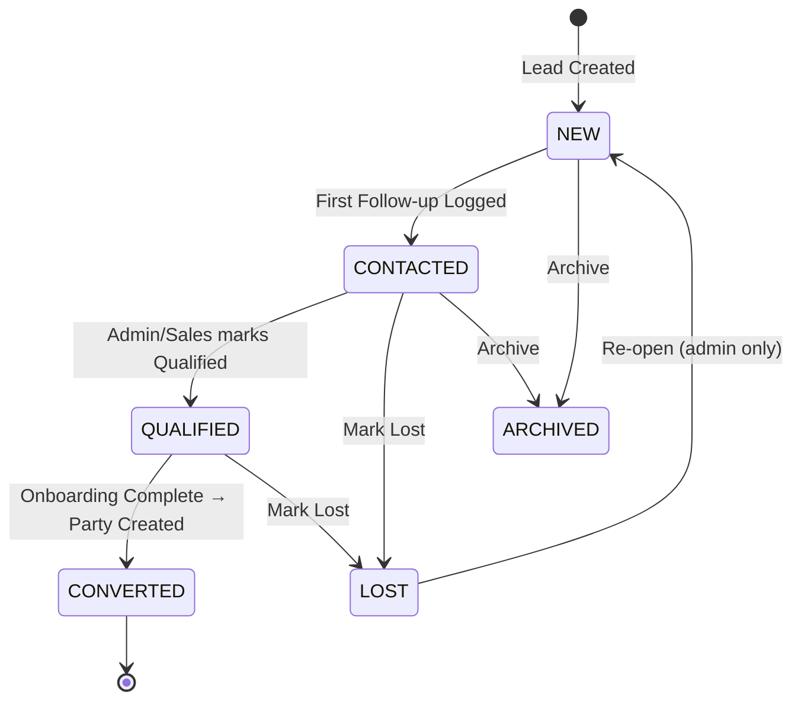
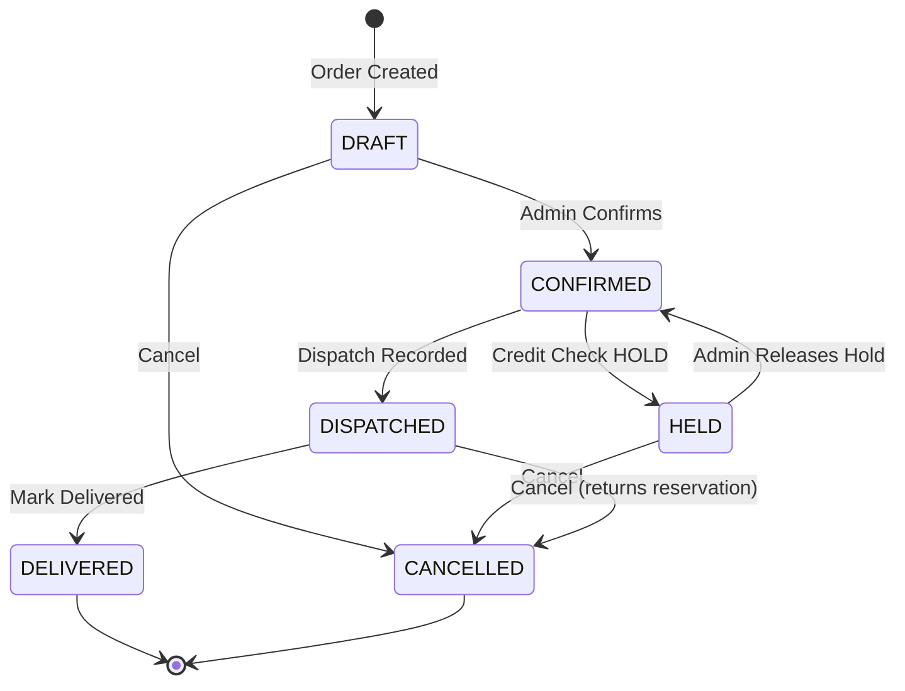

# Pharma CRM & SFA — Implementation Plan
**Version:** v3.0 (CR-Roadmap v3)  
**Date:** 2026-09-20  
**Status:** Active  

---

## Table of Contents

1. [Executive Summary](#1-executive-summary)
2. [AI Agent Directory Structure](#2-ai-agent-directory-structure)
3. [Technology Stack & Decisions](#3-technology-stack--decisions)
4. [Authorization Matrix](#4-authorization-matrix)
5. [Cross-Cutting Concerns](#5-cross-cutting-concerns)
6. [Phase 0 — Foundation](#6-phase-0--foundation)
7. [Phase 1 — Auth + Tenancy + Themes + Shells](#7-phase-1--auth--tenancy--themes--shells)
8. [Phase 2 — Masters](#8-phase-2--masters)
9. [Phase 3 — CRM](#9-phase-3--crm)
10. [Phase 4 — Order-to-Cash](#10-phase-4--order-to-cash)
11. [Phase 5 — Notifications & Workers](#11-phase-5--notifications--workers)
12. [Phase 6 — Distributor Portal](#12-phase-6--distributor-portal)
13. [Phase 7 — Super Admin + Reports + Hardening](#13-phase-7--super-admin--reports--hardening)
14. [Phase 8 — cPanel Production](#14-phase-8--cpanel-production)
15. [Open Decisions](#15-open-decisions)
16. [Definition of Done](#16-definition-of-done)
17. [Change Control Process](#17-change-control-process)

---

## 1. Executive Summary

**Pharma CRM & SFA** is a multi-tenant, cloud-hosted Customer Relationship Management and Sales Force Automation platform purpose-built for PCD (Propaganda Cum Distribution) and Franchise pharmaceutical companies. The system serves four distinct user surfaces — Super Admin, Franchise Admin, Sales Representative, and Distributor/Stockist Portal — each with its own authentication, theming, and capability set.

### Goals

| Goal | Description |
|---|---|
| Multi-tenancy | Full data isolation per franchise/organization via tenant-scoped queries |
| Order-to-Cash | End-to-end flow from lead capture through invoicing and payment |
| Zero Runtime Deps | Core PHP only; no Composer autoload in production |
| cPanel Compatibility | Runs on shared hosting; cron-driven workers; no Supervisor |
| Mobile-First Sales UI | Sales rep interface optimized for field use on Android WebView |
| Audit & Compliance | Tamper-evident audit trail for all financial and security events |

### Scope Summary

```
9 Phases (P0–P8) · ~100 Sprint Tasks · ~60-80 developer days
4 User Surfaces · 12+ Report types · DB-backed job queue
Zero third-party runtime dependencies · cPanel shared hosting
```

### Key Architectural Decisions (Locked)

- **No framework, no ORM.** Raw PDO with repository pattern. PSR-4 autoloader hand-rolled.
- **Server-rendered HTML shells** with progressive vanilla JS enhancement. No SPA, no bundler.
- **JWT + opaque rotating refresh tokens** per surface (4 client IDs).
- **Integer-paise money arithmetic** in PHP; `DECIMAL(18,2)` stored in MySQL.
- **UTC storage**, application-timezone display.
- **BIGINT UNSIGNED** primary keys internally; `VARCHAR(24)` Crockford base32 refs in all URLs.
- **DB-backed job queue** driven by cron tick every minute.

---

## 2. AI Agent Directory Structure

The `.ai/` directory contains autonomous lint/test/validation agents that run against the codebase during each phase gate. Each agent is a standalone PHP CLI script.

```
.ai/
├── agents/
│   ├── agent-lint.php          # Bans innerHTML assignment, CDN scripts, localStorage token storage
│   ├── agent-auth.php          # Validates auth flow: token issuance, refresh rotation, revoke
│   ├── agent-tenancy.php       # Asserts all queries carry tenant_id scope; no cross-tenant leaks
│   ├── agent-security.php      # CSP headers, HTTPS enforcement, secret redaction in logs
│   ├── agent-idor.php          # Detects missing ownership checks on resource endpoints
│   ├── agent-theme.php         # WCAG 2.1 AA contrast ratio check on all CSS theme variables
│   ├── agent-performance.php   # EXPLAIN plan checks on 50k/20k/5k row datasets
│   ├── agent-openapi.php       # Validates every route has an OpenAPI 3.1 spec entry
│   └── agent-e2e.php           # End-to-end flow: admin path + portal path
├── prompts/
│   ├── p0-scaffold.md
│   ├── p1-auth.md
│   ├── p2-masters.md
│   ├── p3-crm.md
│   ├── p4-o2c.md
│   ├── p5-notifications.md
│   ├── p6-portal.md
│   └── p7-hardening.md
├── fixtures/
│   ├── seed-geo.sql
│   ├── seed-tenants.sql
│   ├── seed-products.sql
│   └── seed-orders.sql
└── rules/
    ├── lint-rules.json
    ├── security-rules.json
    └── openapi-rules.json
```

### Agent Execution

```bash
# Run a single agent
php cli/test-agents.php --agent=agent-lint

# Run all agents (Phase gate check)
php cli/test-agents.php --all

# Run agents matching a phase
php cli/test-agents.php --phase=p3
```

Each agent exits with code `0` on pass or `1` on failure and writes structured JSON results to `storage/logs/agents/`.

---

## 3. Technology Stack & Decisions

### 3.1 Locked Decisions

| Concern | Decision | Rationale |
|---|---|---|
| Language | PHP 8.1+ | Named args, fibers, enums, intersection types. cPanel compatibility. |
| Framework | Custom Core PHP | Zero vendor attack surface. Full control. cPanel shared hosting. |
| Database | MySQL 8 InnoDB (utf8mb4, strict mode) | Transactions, row-level locking, JSON column support. |
| Auth | Bearer JWT + opaque rotating refresh tokens | Short-lived access (15 min), long-lived refresh (30 days), family-based reuse detection. |
| Money | `DECIMAL(18,2)` in DB; integer paise in PHP | Eliminates floating-point rounding errors. |
| Date/Time | UTC stored, app timezone displayed | Consistent across multi-region tenants. |
| Primary Keys | `BIGINT UNSIGNED AUTO_INCREMENT` | Efficient B-tree index. Refs exposed in URLs use `VARCHAR(24)` Crockford base32. |
| API Prefix | `/api/v1/` | Versioned for future non-breaking iteration. |
| Logging | Structured JSON lines to file | Machine-parseable, searchable, redacts secrets. |
| Jobs | DB-backed queue, cron-driven runner | Works on cPanel; no Supervisor required. |
| Autoloader | Hand-rolled PSR-4 via `spl_autoload_register` | No Composer in production. |
| UI | Server-rendered HTML shells + vanilla JS | No SPA. No build step. Works in low-bandwidth field conditions. |
| HTTP Client | None (curl_* where needed) | Minimizes deps. |
| Cache | File-based with `flock` + atomic rename | cPanel compatible; no Redis/Memcached required. |
| Session | Stateless JWT (no PHP sessions) | API-first; multi-surface compatible. |
| CSS | Single `crm-ui.css` with CSS custom properties | Four theme blocks via `data-theme` attribute. |

### 3.2 Directory Tree

```
crm/
├── .ai/                            # AI agents (see §2)
├── app/
│   ├── Config/
│   │   ├── app.php
│   │   ├── database.php
│   │   └── services.php
│   ├── Support/
│   │   ├── env.php
│   │   ├── Config.php
│   │   ├── Container.php
│   │   ├── Pipeline.php
│   │   ├── RefGenerator.php
│   │   ├── SequenceService.php
│   │   ├── Money.php
│   │   └── FileCache.php
│   ├── Http/
│   │   ├── Request.php
│   │   ├── Response.php
│   │   └── Router.php
│   ├── Middleware/
│   │   ├── RequestId.php
│   │   ├── SecurityHeaders.php
│   │   ├── BearerAuth.php
│   │   ├── TenantScope.php
│   │   ├── RoleMiddleware.php
│   │   └── IdempotencyMiddleware.php
│   ├── Exceptions/
│   │   ├── AppException.php
│   │   ├── AuthException.php
│   │   ├── ValidationException.php
│   │   ├── NotFoundException.php
│   │   ├── ForbiddenException.php
│   │   └── ConflictException.php
│   ├── Database/
│   │   ├── Connection.php
│   │   └── Repository.php
│   ├── Validation/
│   │   └── Validator.php
│   ├── Logging/
│   │   └── JsonLogger.php
│   ├── Auth/
│   │   ├── JwtService.php
│   │   ├── TokenService.php
│   │   ├── PasswordHasher.php
│   │   └── RateLimiter.php
│   ├── Tenancy/
│   │   ├── TenantContext.php
│   │   ├── TenantScope.php
│   │   └── TenantRepository.php
│   ├── Modules/
│   │   ├── Geo/
│   │   ├── Users/
│   │   ├── Organizations/
│   │   ├── Products/
│   │   ├── Pricing/
│   │   ├── Schemes/
│   │   ├── Leads/
│   │   ├── Parties/
│   │   ├── Territories/
│   │   ├── Orders/
│   │   ├── Inventory/
│   │   ├── Invoices/
│   │   ├── Payments/
│   │   ├── Notifications/
│   │   ├── Webhooks/
│   │   ├── Jobs/
│   │   └── Reports/
│   └── Policies/
│       ├── Policy.php
│       ├── OrderPolicy.php
│       └── PartyPolicy.php
├── bootstrap/
│   ├── autoload.php
│   └── app.php
├── cli/
│   ├── test-agents.php
│   ├── worker.php
│   └── install.php
├── database/
│   ├── schema/
│   │   ├── part1-tenancy-core.sql
│   │   ├── part2-auth-geo.sql
│   │   ├── part3-masters.sql
│   │   ├── part4-crm.sql
│   │   ├── part5-o2c.sql
│   │   └── part6-jobs-notifications.sql
│   └── seeds/
│       ├── GeoSeeder.php
│       └── DemoSeeder.php
├── docs/
│   ├── api/
│   │   └── openapi.yaml
│   ├── architecture.md
│   ├── deployment.md
│   ├── security.md
│   └── implementation_plan.md   ← this file
├── public/
│   ├── index.php
│   ├── assets/
│   │   ├── css/
│   │   │   └── crm-ui.css
│   │   ├── js/
│   │   │   └── crm-ui.js
│   │   ├── icons/
│   │   │   └── icons.svg
│   │   └── tenant/
│   │       └── {ref}.css        # generated per-tenant branding
│   └── surfaces/
│       ├── super/
│       ├── admin/
│       ├── sales/
│       └── portal/
├── routes/
│   ├── api.php
│   ├── super.php
│   └── web.php
├── storage/
│   ├── cache/
│   ├── exports/
│   ├── logs/
│   │   └── agents/
│   └── tmp/
├── tests/
│   ├── Harness.php
│   ├── Http.php
│   ├── Assert.php
│   └── Seed.php
├── .env.example
├── .gitignore
└── implementation_plan.md
```

### 3.3 Database Schema Strategy

The schema is delivered in six SQL parts, one per phase, applied in order:

| Part | File | Contents |
|---|---|---|
| 1 | `part1-tenancy-core.sql` | `organizations`, `tenants`, `sequences`, `idempotency_keys`, `system_settings` |
| 2 | `part2-auth-geo.sql` | `users`, `oauth_clients`, `oauth_sessions`, `refresh_tokens`, `rate_limits`, `audit_logs`, geo tables |
| 3 | `part3-masters.sql` | `product_categories`, `products`, `pricing_tiers`, `product_prices`, `schemes`, `scheme_rules`, `transporters`, `warehouses`, `notification_templates`, `webhook_sources`, `sequence_counters` |
| 4 | `part4-crm.sql` | `parties`, `party_territories`, `territory_overrides`, `onboarding_invites`, `leads`, `follow_ups`, `lead_activities` |
| 5 | `part5-o2c.sql` | `inventory_batches`, `inventory_movements`, `stock_reservations`, `orders`, `order_items`, `order_status_history`, `invoices`, `invoice_items`, `dispatches`, `payments`, `payment_allocations` |
| 6 | `part6-jobs-notifications.sql` | `notifications`, `webhook_events`, `job_queue`, `job_attempts`, `failed_jobs`, `integration_logs` |

---

## 4. Authorization Matrix

> [!IMPORTANT]
> All resource access is scoped by `tenant_id` enforced at the repository layer. Cross-tenant access is impossible by design — the `TenantScope` middleware injects tenant context into every request, and the `Repository` base class appends `AND tenant_id = ?` to every query.

### 4.1 Surface → Client ID Mapping

| Surface | `client_id` | Auth URL | Default Theme |
|---|---|---|---|
| Super Admin | `super` | `/surfaces/super/login.php` | `data-theme="super"` (slate/amber) |
| Franchise Admin | `admin` | `/surfaces/admin/login.php` | `data-theme="admin"` (indigo/sky) |
| Sales Representative | `sales` | `/surfaces/sales/login.php` | `data-theme="sales"` (teal/lime) |
| Distributor Portal | `portal` | `/surfaces/portal/login.php` | `data-theme="portal"` (violet/mint) |

### 4.2 Role Permission Matrix

| Resource / Action | Super | Franchise Admin | Sales Rep | Distributor |
|---|:---:|:---:|:---:|:---:|
| Manage Organizations | ✅ | ❌ | ❌ | ❌ |
| Suspend Tenant | ✅ | ❌ | ❌ | ❌ |
| Impersonate User | ✅ | ❌ | ❌ | ❌ |
| Create/Edit Users | ✅ | ✅ | ❌ | ❌ |
| View All Users | ✅ | ✅ (own tenant) | ❌ | ❌ |
| Manage Products | ✅ | ✅ | ❌ | ❌ |
| Manage Pricing Tiers | ✅ | ✅ | ❌ | ❌ |
| View Pricing | ✅ | ✅ | ✅ (assigned) | ✅ (own) |
| Create Lead | ✅ | ✅ | ✅ | ❌ |
| View All Leads | ✅ | ✅ | ✅ (ASSIGNED) | ❌ |
| Assign Lead | ✅ | ✅ | ❌ | ❌ |
| Create Party | ✅ | ✅ | ✅ (territory) | ❌ |
| View All Parties | ✅ | ✅ | ✅ (own scope) | ❌ |
| Create Order | ✅ | ✅ | ✅ (own parties) | ✅ (self) |
| Approve Order | ✅ | ✅ | ❌ | ❌ |
| Cancel Order | ✅ | ✅ | ✅ (pre-confirm) | ✅ (pre-confirm) |
| View Invoice | ✅ | ✅ | ✅ (own) | ✅ (own) |
| Record Payment | ✅ | ✅ | ❌ | ❌ |
| View Reports | ✅ | ✅ | ✅ (limited) | ✅ (self only) |
| Export CSV | ✅ | ✅ | ✅ (limited) | ❌ |
| Manage Webhooks | ✅ | ✅ | ❌ | ❌ |
| View Audit Logs | ✅ | ✅ (own) | ❌ | ❌ |
| System Settings | ✅ | ✅ (own) | ❌ | ❌ |
| Manage Territories | ✅ | ✅ | ❌ | ❌ |

### 4.3 Scoping Policies

- **ASSIGNED policy (Sales Rep — Leads):** A sales rep sees only leads where `assigned_to = current_user_id`.
- **OWN policy (Sales Rep — Parties):** A sales rep sees only parties in territories assigned to them.
- **Party-owned policy (Distributor):** A distributor sees only resources associated with their own `party_id`.

---

## 5. Cross-Cutting Concerns

### 5.1 Security (Every Sprint)

- All user-supplied input passes through `Validator` before any DB write.
- `SecurityHeaders` middleware emits: `Content-Security-Policy`, `X-Content-Type-Options: nosniff`, `X-Frame-Options: DENY`, `Referrer-Policy: strict-origin-when-cross-origin`.
- Secrets (passwords, JWT keys, webhook secrets) are **never** logged; `JsonLogger` has a redact list.
- SQL is **always** parameterized PDO; string interpolation in queries is a hard lint ban.
- `agent-lint` bans: `innerHTML =` (XSS vector), CDN `<script>` tags, `localStorage` token storage.
- `agent-idor` asserts every route with `{ref}` loads the resource and checks `tenant_id` ownership.
- `agent-security` checks CSP compliance and HTTPS enforcement configuration.

### 5.2 Audit Logging (Every Financial/Security Event)

Every state-changing action on financial objects, user accounts, or security-sensitive settings writes a row to `audit_logs`:

```sql
CREATE TABLE audit_logs (
    id           BIGINT UNSIGNED AUTO_INCREMENT PRIMARY KEY,
    tenant_id    BIGINT UNSIGNED NOT NULL,
    actor_id     BIGINT UNSIGNED,               -- NULL for system jobs
    actor_role   VARCHAR(32),
    event        VARCHAR(128) NOT NULL,         -- e.g. ORDER_CONFIRMED
    entity_type  VARCHAR(64),
    entity_id    BIGINT UNSIGNED,
    before_state JSON,
    after_state  JSON,
    ip_address   VARCHAR(45),
    user_agent   TEXT,
    created_at   DATETIME NOT NULL DEFAULT CURRENT_TIMESTAMP,
    INDEX idx_tenant_event (tenant_id, event, created_at),
    INDEX idx_entity (tenant_id, entity_type, entity_id)
);
```

Mandatory audit events include:
`USER_LOGIN`, `USER_LOGOUT`, `TOKEN_REUSE_DETECTED`, `PASSWORD_CHANGED`, `USER_SUSPENDED`, `IMPERSONATION_START`, `IMPERSONATION_END`, `ORDER_CONFIRMED`, `ORDER_CANCELLED`, `INVOICE_ISSUED`, `PAYMENT_RECORDED`, `PAYMENT_REVERSED`, `TENANT_SUSPENDED`, `WEBHOOK_SECRET_ROTATED`, `SETTINGS_CHANGED`, `TERRITORY_OVERRIDE`.

### 5.3 Idempotency (Phase 4+)

All state-mutating API endpoints that can be retried (order creation, payment recording) accept an `Idempotency-Key` header (UUID v4). The `IdempotencyMiddleware` checks `idempotency_keys` table before processing and returns cached response on replay.

```
Idempotency-Key: 550e8400-e29b-41d4-a716-446655440000
```

Keys expire after 24 hours. Tenant-scoped.

### 5.4 Testing Strategy

Each phase includes a test task. Tests are PHP CLI scripts under `tests/` using the custom `Harness`:

```php
// tests/Harness.php
class Harness {
    public static function run(string $name, callable $fn): void { ... }
    public static function assert(bool $condition, string $msg): void { ... }
    public static function summary(): never { ... }
}
```

Test categories:
- **Unit** — Pure PHP logic (Money, Validator, RefGenerator, SchemeCalculator).
- **Integration** — Database operations with rollback after each test.
- **HTTP** — Real HTTP calls to the running app via `tests/Http.php`.
- **Agent** — `.ai/agents/*.php` gate checks.

### 5.5 Error Handling

All exceptions extend `AppException`. The global error handler catches throwables, maps them to HTTP status codes, and returns structured JSON:

```json
{
  "error": {
    "code": "VALIDATION_FAILED",
    "message": "The request contains invalid fields.",
    "fields": { "mobile": ["Must be a 10-digit Indian mobile number."] },
    "request_id": "01J9XKZM3QVRY4BPTDGWCNH7E2"
  }
}
```

Exception → HTTP Status mapping:
| Exception | HTTP Status |
|---|---|
| `ValidationException` | 422 |
| `AuthException` | 401 |
| `ForbiddenException` | 403 |
| `NotFoundException` | 404 |
| `ConflictException` | 409 |
| `AppException` (generic) | 400 |
| `\Throwable` (uncaught) | 500 |

---

## 6. Phase 0 — Foundation

**Duration:** 5–7 days  
**Tasks:** 18  
**Gate:** All P0 agents green · `git tag p0`

### 6.1 Objective

Establish the non-negotiable infrastructure layer on which all application logic is built. Nothing domain-specific exists at this phase — only the plumbing. Every subsequent phase depends on this phase being correct and complete.

### 6.2 Sprint Tasks

| Task | Component | Key Files | Notes |
|---|---|---|---|
| P0-S01 | Repo Scaffold | `.gitignore`, `README.md`, all directories | Create empty stub files for autoloader |
| P0-S02 | PSR-4 Autoloader | `bootstrap/autoload.php` | `spl_autoload_register`; namespace `App\` → `app/` |
| P0-S03 | Env + Config Loader | `app/Support/env.php`, `app/Support/Config.php`, `app/Config/app.php`, `.env.example` | `getenv()` with `.env` file parser; no `vlucas/phpdotenv` |
| P0-S04 | DI Container | `app/Support/Container.php` | `bind()`, `singleton()`, `make()`; Reflection-based auto-wiring |
| P0-S05 | Request/Response | `app/Http/Request.php`, `app/Http/Response.php` | Immutable value objects; `RequestId` Ulid header |
| P0-S06 | Router | `app/Http/Router.php` | Method + path matching; `{param}` capture; groups; 404/405 |
| P0-S07 | Middleware Pipeline | `app/Support/Pipeline.php`, `app/Middleware/RequestId.php`, `app/Middleware/SecurityHeaders.php`, `bootstrap/app.php` | Onion executor; kernel bootstraps middlewares |
| P0-S08 | Exception Hierarchy | `app/Exceptions/*.php` | `AppException` base + 401/403/404/405/409/422/500 subclasses |
| P0-S09 | JSON Logger | `app/Logging/JsonLogger.php` | JSONL output; levels DEBUG/INFO/WARNING/ERROR/CRITICAL; redact list |
| P0-S10 | Database Wrapper | `app/Database/Connection.php` | PDO; `PDO::ATTR_EMULATE_PREPARES = false`; transaction + savepoint helpers |
| P0-S11 | FileCache | `app/Support/FileCache.php` | Atomic write via `rename()`; TTL; `flock` for concurrency safety |
| P0-S12 | Validation Engine | `app/Validation/Validator.php` | Rules: `required`, `string`, `int`, `decimal`, `enum`, `regex`, `date`, `email`, `mobile`, `gstin`, `pincode` |
| P0-S13 | RefGenerator + SequenceService | `app/Support/RefGenerator.php`, `app/Support/SequenceService.php` | Crockford base32 24-char refs; atomic `SELECT ... FOR UPDATE` sequences |
| P0-S14 | TenantContext / TenantScope | `app/Tenancy/TenantContext.php`, `app/Tenancy/TenantScope.php`, `app/Tenancy/TenantRepository.php` | Context object; scope trait for repositories |
| P0-S15 | Schema Part 1 | `database/schema/part1-tenancy-core.sql` | `organizations`, `tenants`, `sequences`, `idempotency_keys`, `system_settings` |
| P0-S16 | Test Harness | `tests/Harness.php`, `tests/Http.php`, `tests/Assert.php`, `tests/Seed.php`, `cli/test-agents.php` | CLI test runner; HTTP wrapper; seed helpers |
| P0-S17 | Health Endpoints | Routes: `GET /health`, `GET /ready` | `/health` returns 200 always; `/ready` checks DB connection |
| P0-S18 | agent-lint v1 | `.ai/agents/agent-lint.php` | Bans: `innerHTML =`, CDN `<script>`, `localStorage.setItem.*token` |

### 6.3 Key Implementation Details

**PSR-4 Autoloader:**
```php
// bootstrap/autoload.php
spl_autoload_register(function (string $class): void {
    $prefix = 'App\\';
    $baseDir = __DIR__ . '/../app/';
    if (!str_starts_with($class, $prefix)) return;
    $relative = substr($class, strlen($prefix));
    $file = $baseDir . str_replace('\\', '/', $relative) . '.php';
    if (file_exists($file)) require $file;
});
```

**DI Container (key methods):**
```php
// app/Support/Container.php
public function bind(string $abstract, callable $factory): void
public function singleton(string $abstract, callable $factory): void
public function make(string $abstract): mixed   // auto-wires via ReflectionClass
```

**Validation Rules:**
```
required   — field must be present and non-empty
string     — must be string; optional min/max length
int        — must be integer; optional min/max
decimal    — must match /^\d+(\.\d{1,2})?$/
enum       — must be one of allowed values
regex      — must match custom pattern
date       — must be Y-m-d; optional range
email      — RFC 5321 basic validation
mobile     — Indian 10-digit: /^[6-9]\d{9}$/
gstin      — /^\d{2}[A-Z]{5}\d{4}[A-Z][1-9A-Z]Z[0-9A-Z]$/
pincode    — /^\d{6}$/
```

### 6.4 Phase 0 Deliverables

- [ ] Repository initialized with full directory structure
- [ ] Autoloader loading `App\` namespace correctly
- [ ] `.env` loading and `Config::get()` working
- [ ] DI Container binding and auto-wiring verified
- [ ] Router dispatching GET/POST/PUT/DELETE with params
- [ ] Middleware pipeline executing in correct onion order
- [ ] All 11 exception classes defined
- [ ] JSON logger writing redacted JSONL to `storage/logs/app.log`
- [ ] PDO connection with strict mode verified
- [ ] FileCache passing TTL and concurrency tests
- [ ] Validator passing all 12 rule types
- [ ] RefGenerator producing valid Crockford base32 24-char strings
- [ ] Schema Part 1 applied cleanly to fresh DB
- [ ] `GET /health` → 200; `GET /ready` → 200 (DB up) or 503
- [ ] `agent-lint` passing (no violations in initial scaffold)

---

## 7. Phase 1 — Auth + Tenancy + Themes + Shells

**Duration:** 7–10 days  
**Tasks:** 20  
**Gate:** 4 logins working · 4 themes correct · all agents green · `git tag p1`

### 7.1 Objective

Implement authentication, multi-tenancy enforcement, the CSS design system with four distinct themes, and the HTML shell pages for all four surfaces. After this phase, any authorized user can log in and see their dashboard.

### 7.2 Sprint Tasks

| Task | Component | Key Files | Notes |
|---|---|---|---|
| P1-S01 | Schema Part 2 | `database/schema/part2-auth-geo.sql` | `users`, `oauth_clients`, `oauth_sessions`, `refresh_tokens`, `rate_limits`, `audit_logs`, geo tables |
| P1-S02 | PasswordHasher | `app/Auth/PasswordHasher.php` | Argon2id primary; bcrypt fallback; rehash on login; policy: min 10 chars, 1 upper, 1 digit |
| P1-S03 | JWT Service | `app/Auth/JwtService.php` | HS256; key ring (current + previous key for rotation); `exp`, `iat`, `jti`, `sub`, `tid`, `role`, `surf` claims |
| P1-S04 | TokenService | `app/Auth/TokenService.php` | Issue access+refresh pair; `oauth_sessions` + `refresh_token_families` rows; refresh rotate; reuse detection → revoke family |
| P1-S05 | RateLimiter | `app/Auth/RateLimiter.php` | DB-backed sliding window; 5 attempts / 15 min per IP+client_id; 429 response |
| P1-S06 | OAuth Token Endpoint | `POST /oauth/token` | Password grant; validates `client_id` against surface; issues JWT pair |
| P1-S07 | BearerAuth + Tenant Middleware | `app/Middleware/BearerAuth.php`, `app/Middleware/TenantScope.php` | Extract JWT; validate; set TenantContext; reject expired/revoked |
| P1-S08 | Role Middleware + Policy Base | `app/Middleware/RoleMiddleware.php`, `app/Policies/Policy.php` | Role check; Policy interface with `before()` + `can()` |
| P1-S09 | Auth Utility Endpoints | `GET /auth/me`, `POST /oauth/revoke`, `POST /auth/change-password`, `POST /auth/forgot-password`, `POST /auth/reset-password` | Me endpoint returns user + tenant; revoke invalidates session |
| P1-S10 | Organizations + Franchise Endpoints | `POST /super/organizations`, `GET /super/organizations`, `PUT /super/organizations/{ref}/suspend` | Super-only; creates root tenant with default settings |
| P1-S11 | Franchise Defaults Service | `app/Modules/Organizations/FranchiseDefaultsService.php` | Populates counters, tiers, notification templates, system_settings on org creation |
| P1-S12 | Users Module | `app/Modules/Users/` | Super creates first admin; admin creates sales/distributor users; invites via email |
| P1-S13 | Audit Service | `app/Support/AuditService.php` | Writes to `audit_logs`; called from TokenService, UserService, OrderService, etc. |
| P1-S14 | crm-ui.css | `public/assets/css/crm-ui.css` | Reset; CSS grid layout; wrapper/header/sidebar/main; card; table; btn; badge; toast; 4 `[data-theme]` variable blocks |
| P1-S15 | icons.svg + crm-ui.js | `public/assets/icons/icons.svg`, `public/assets/js/crm-ui.js` | SVG sprite (≥40 icons); JS: boot, token manager, `api()` fetch wrapper, DOM helpers, toast, modal, sidebar toggle, BroadcastChannel logout sync |
| P1-S16 | 4 Login Pages + 4 Dashboard Shells | `public/surfaces/{super,admin,sales,portal}/` | PHP shells; `data-theme` by surface; sidebar nav per role |
| P1-S17 | Theme Contrast Check | `.ai/agents/agent-theme.php` | WCAG 2.1 AA: contrast ratio ≥ 4.5:1 (normal text), ≥ 3:1 (large text) |
| P1-S18 | Tenant Branding Override | `app/Modules/Organizations/BrandingService.php` | Reads accent hex from DB; generates `/public/assets/tenant/{ref}.css` on demand |
| P1-S19 | Impersonation | `POST /super/impersonate`, `POST /super/impersonate/end` | Super only; 15-min impersonation JWT; audited; UI shows banner with "Impersonating {name}" |
| P1-S20 | Agents | `.ai/agents/agent-auth.php`, `agent-tenancy.php` (partial), `agent-security.php` (auth part) | Auth agent verifies full token lifecycle |

### 7.3 JWT Payload Structure

```json
{
  "jti": "01J9XKZM3QVRY4BPTDGWCNH7E2",
  "sub": "usr_01j9xk2m0001",
  "tid": "org_01j9xk2m0001",
  "role": "admin",
  "surf": "admin",
  "iat": 1758416148,
  "exp": 1758417048
}
```

- `sub` — user ref
- `tid` — tenant/organization ref
- `role` — `super | admin | sales | distributor`
- `surf` — `super | admin | sales | portal`
- `exp` — 15 minutes from issuance
- Refresh token is opaque 64-char hex, stored hashed in `refresh_tokens`

### 7.4 Refresh Token Rotation

```
Client sends refresh_token → TokenService looks up family
  If token matches current → issue new pair, rotate family
  If token does not match current → REUSE DETECTED
    → Revoke entire family (all sessions)
    → Log SECURITY:TOKEN_REUSE_DETECTED audit event
    → Return 401
```

### 7.5 CSS Theme System

```css
/* crm-ui.css — theme blocks */
[data-theme="super"]  { --accent: #f59e0b; --surface: #1e293b; ... }
[data-theme="admin"]  { --accent: #0ea5e9; --surface: #f0f9ff; ... }
[data-theme="sales"]  { --accent: #84cc16; --surface: #f0fdf4; ... }
[data-theme="portal"] { --accent: #a78bfa; --surface: #fdf4ff; ... }
```

Tenant branding override injects `--accent` and `--accent-dark` only, preserving layout variables.

### 7.6 Phase 1 Deliverables

- [ ] `POST /oauth/token` issuing valid JWT + refresh for all 4 surfaces
- [ ] Token refresh rotation working with reuse detection
- [ ] Rate limiter blocking after 5 failed attempts / 15 min
- [ ] `GET /auth/me` returning correct user + tenant data
- [ ] Password reset flow (forgot → email link → reset) working
- [ ] Super can create organization; franchise defaults populated
- [ ] Admin can create sales and distributor users
- [ ] 4 login pages rendering with correct themes
- [ ] 4 dashboard shells loading with sidebar navigation
- [ ] Tenant branding override CSS generated correctly
- [ ] Impersonation working with 15-min timeout and audit trail
- [ ] `agent-auth` passing all assertions
- [ ] `agent-theme` passing WCAG contrast checks
- [ ] `agent-tenancy` passing (no cross-tenant data leaks)

---

## 8. Phase 2 — Masters

**Duration:** 5–7 days  
**Tasks:** 8  
**Gate:** Pricing, schemes, users, tenancy agents green · `git tag p2`

### 8.1 Objective

Implement all master data entities: product catalog, pricing tiers, scheme/discount rules, geo data, transporters, and warehouses. The `PriceResolver` and `SchemeCalculator` are core business logic components that will be used by the Order-to-Cash phase.

### 8.2 Sprint Tasks

| Task | Component | Key Files | Notes |
|---|---|---|---|
| P2-S01 | Schema Part 3 | `database/schema/part3-masters.sql` | All masters tables (see §3.3) |
| P2-S02 | Geo Seed + Endpoints | `database/seeds/GeoSeeder.php`, `GET /geo/states`, `GET /geo/districts?state_id=`, `GET /geo/pincodes?district_id=` | Static data; cached in FileCache; no auth required |
| P2-S03 | Categories, Tiers, Transporters, Settings, Templates CRUD | Multiple controllers | Admin-only; standard CRUD with soft-delete where applicable |
| P2-S04 | Products CRUD | `app/Modules/Products/` | `activate` / `deactivate` / `archive` states; delete forbidden once referenced in order_items |
| P2-S05 | Prices CRUD + PriceResolver | `app/Modules/Pricing/PriceResolver.php` | Priority: party-specific > tier > default; effective-dated |
| P2-S06 | Schemes + SchemeCalculator | `app/Modules/Schemes/SchemeCalculator.php` | 10+1 free goods; percentage discount; stacking rules; mutual exclusion |
| P2-S07 | Money Helper | `app/Support/Money.php` | Integer-paise arithmetic; half-up rounding; GST split: CGST+SGST (intra-state) / IGST (inter-state) |
| P2-S08 | UI Pages | `public/surfaces/admin/` | DataTable component (JS); FormBuilder component; Masters, Products, Pricing, Schemes pages |

### 8.3 PriceResolver Algorithm

```
function resolve(product_id, party_id, tenant_id, date):
  1. Look up party-specific price for (product_id, party_id) active on date
  2. If found → return party price
  3. Look up party's assigned pricing_tier_id
  4. Look up tier price for (product_id, tier_id) active on date
  5. If found → return tier price
  6. Look up default price for product_id active on date
  7. If found → return default price
  8. Throw PriceNotFoundException
```

### 8.4 SchemeCalculator (10+1 Example)

```
function calculate(order_items, schemes, tenant_id):
  For each applicable scheme (sorted by priority desc):
    If scheme.type = FREE_GOODS:
      qty_trigger = scheme.rule.buy_qty
      qty_free    = scheme.rule.free_qty
      groups      = floor(ordered_qty / qty_trigger)
      free_qty    = groups * qty_free
      Add free line to order_items (zero price)
    If scheme.type = PERCENTAGE_DISCOUNT:
      discount = line_total * (scheme.rule.percent / 100)
      Apply to line
    If scheme.stacking = false → break after first applied
```

### 8.5 Money Helper Rules

- All calculations in integer paise (1 INR = 100 paise).
- Half-up rounding: `intdiv($paise * 2 + 1, 2)` for `.5` cases.
- GST split:
  - Same state (intra): CGST = rate/2, SGST = rate/2
  - Different state (inter): IGST = rate
- Stored in DB as `DECIMAL(18,2)` — convert paise to rupees on write.

### 8.6 Phase 2 Deliverables

- [ ] Schema Part 3 applied; all master tables created
- [ ] Geo data seeded (all Indian states, districts, pincodes)
- [ ] Geo endpoints returning correct data with FileCache
- [ ] Product CRUD with state machine (draft → active → inactive → archived)
- [ ] PriceResolver returning correct price for all 3 priority levels
- [ ] SchemeCalculator handling 10+1 and percentage schemes
- [ ] Scheme stacking and mutual exclusion working
- [ ] Money helper passing all arithmetic and GST split tests
- [ ] Admin UI pages for all masters (DataTable + FormBuilder)

---

## 9. Phase 3 — CRM

**Duration:** 10–14 days  
**Tasks:** 15  
**Gate:** Leads, follow-ups, parties, territory, onboarding, webhooks, jobs, IDOR agents green · `git tag p3`

### 9.1 Objective

Implement the core CRM workflows: lead management with state machine, follow-up scheduling, party (customer) management, territory assignment, and the webhook ingestion pipeline. The job queue skeleton enables async processing.

### 9.2 Sprint Tasks

| Task | Component | Key Files | Notes |
|---|---|---|---|
| P3-S01 | Schema Part 4 | `database/schema/part4-crm.sql` | All CRM tables (see §3.3) |
| P3-S02 | Lead CRUD | `app/Modules/Leads/LeadService.php` | Create/list/view/edit/archive; mobile normalization (+91); duplicate policy |
| P3-S03 | Lead Assignment | `app/Modules/Leads/AssignmentService.php` | Assign/reassign; history log; round-robin pointer per tenant |
| P3-S04 | Lead State Machine | `app/Modules/Leads/LeadStateMachine.php` | States: NEW → CONTACTED → QUALIFIED → CONVERTED / LOST / ARCHIVED |
| P3-S05 | Follow-ups | `app/Modules/Leads/FollowUpService.php` | Must have `next_action` and `next_date` on every follow-up create; overdue detection |
| P3-S06 | Sales Scoping Policies | `app/Policies/LeadPolicy.php`, `app/Policies/PartyPolicy.php` | ASSIGNED policy for leads; OWN policy for parties |
| P3-S07 | Parties CRUD | `app/Modules/Parties/PartyService.php` | party_code sequence; GSTIN + Drug License validation; archive/restore |
| P3-S08 | Territories CRUD | `app/Modules/Territories/TerritoryService.php` | PINCODE/DISTRICT type; effective-dated; exclusive flag |
| P3-S09 | TerritoryValidator + Override | `app/Modules/Territories/TerritoryValidator.php` | Validates party is in sales rep's territory; override requires admin + audit |
| P3-S10 | Onboarding Invites + Conversion | `app/Modules/Leads/OnboardingService.php` | Convert lead → party; optionally create distributor user; invite email |
| P3-S11 | Webhook Sources CRUD | `app/Modules/Webhooks/WebhookSourceService.php` | Secret stored encrypted (AES-256-GCM); shown once at creation; rotate endpoint |
| P3-S12 | Webhook Endpoint + Event Store | `POST /webhooks/{source_ref}` | HMAC-SHA256 verify; store raw payload in `webhook_events`; idempotent by `event_id` |
| P3-S13 | Job Queue + Worker + Scheduler | `app/Modules/Jobs/`, `cli/worker.php` | `job_queue` table; cron-driven tick; claim-and-execute with advisory lock |
| P3-S14 | ProcessWebhookEvent Job | `app/Modules/Jobs/ProcessWebhookEventJob.php` | Normalize payload; dedupe; assign to lead/party; retry/backoff; DEAD after 3 attempts |
| P3-S15 | UI — Leads, Follow-up Queue, Parties, Territories, Sales Dashboard | `public/surfaces/` | Mobile-first cards for sales rep; data tables for admin |

### 9.3 Lead State Machine



### 9.4 Job Queue Schema

```sql
CREATE TABLE job_queue (
    id           BIGINT UNSIGNED AUTO_INCREMENT PRIMARY KEY,
    tenant_id    BIGINT UNSIGNED NOT NULL,
    job_class    VARCHAR(128) NOT NULL,
    payload      JSON NOT NULL,
    status       ENUM('PENDING','RUNNING','DONE','FAILED') DEFAULT 'PENDING',
    attempts     TINYINT UNSIGNED DEFAULT 0,
    max_attempts TINYINT UNSIGNED DEFAULT 3,
    available_at DATETIME NOT NULL DEFAULT CURRENT_TIMESTAMP,
    started_at   DATETIME,
    finished_at  DATETIME,
    INDEX idx_queue_pick (status, available_at)
);
```

Worker claim query uses `SELECT ... FOR UPDATE SKIP LOCKED` to prevent double-processing.

### 9.5 Webhook Secret Handling

```
Create source → generate 32-byte random secret → encrypt with AES-256-GCM
                → store encrypted_secret in DB
                → return plaintext secret ONCE to caller
Rotate → generate new secret → re-encrypt → return new plaintext ONCE
Verify → decrypt from DB → compute HMAC-SHA256(payload, secret) → compare constant-time
```

### 9.6 Phase 3 Deliverables

- [ ] Schema Part 4 applied
- [ ] Lead CRUD with duplicate detection (LINK default)
- [ ] Lead assignment with round-robin and history
- [ ] Lead state machine with all transitions validated
- [ ] Follow-up mandatory field enforcement
- [ ] Sales rep sees only ASSIGNED leads
- [ ] Party CRUD with GSTIN/DL validation and party_code sequences
- [ ] Territory CRUD with effective dates
- [ ] TerritoryValidator blocking out-of-territory parties
- [ ] Lead → Party conversion creating distributor user
- [ ] Webhook HMAC verification and event storage
- [ ] Job queue worker processing `ProcessWebhookEventJob` with retry/backoff
- [ ] `agent-idor` passing (no unscoped resource access)
- [ ] Mobile-first sales UI for leads and follow-ups

---

## 10. Phase 4 — Order-to-Cash

**Duration:** 14–21 days  
**Tasks:** 15  
**Gate:** All blocking agents green · `git tag p4`

> [!IMPORTANT]
> This is the most complex phase. **Open Decisions OD-01 through OD-05 must be resolved before starting this phase.** See §15 for defaults.

### 10.1 Objective

Implement the complete Order-to-Cash workflow: inventory management with FEFO batch allocation, order creation with pricing and scheme calculation, state machine-driven order lifecycle, billing with gapless invoice numbers, dispatch tracking, and payment recording with allocation.

### 10.2 Sprint Tasks

| Task | Component | Key Files | Notes |
|---|---|---|---|
| P4-S01 | Schema Part 5 | `database/schema/part5-o2c.sql` | All O2C tables (see §3.3) |
| P4-S02 | Idempotency Middleware | `app/Middleware/IdempotencyMiddleware.php`, `app/Modules/Idempotency/IdempotencyRepository.php` | Check → store → return cached on replay |
| P4-S03 | Inventory Receipts/Batches/Adjust | `app/Modules/Inventory/` | Receive batch; record movement; adjust; status transitions (AVAILABLE/QUARANTINE/EXPIRED) |
| P4-S04 | FEFO Allocator + Reservations | `app/Modules/Inventory/FefoAllocator.php` | First-Expiry-First-Out batch selection; `stock_reservations` with expiry |
| P4-S05 | Concurrency Test | `tests/ConcurrencyTest.php` | Two `proc_open` processes racing for same batch; asserts no over-allocation |
| P4-S06 | Order Service: Create/Validate/Totals | `app/Modules/Orders/OrderService.php` | 10-step validation; PriceResolver; SchemeCalculator; totals; tax split |
| P4-S07 | Order State Machine | `app/Modules/Orders/OrderStateMachine.php` | DRAFT→CONFIRMED→DISPATCHED→DELIVERED; also HELD, REJECTED, CANCELLED |
| P4-S08 | Credit Rule Service | `app/Modules/Orders/CreditRuleService.php` | Query outstanding; compare to credit limit; BLOCK (reject order) or HOLD (route to admin) |
| P4-S09 | Billing Service | `app/Modules/Invoices/BillingService.php` | Gapless `invoice_no` via `SELECT ... FOR UPDATE` on sequence; snapshot prices inside transaction |
| P4-S10 | Invoice Print Layout | `public/assets/css/crm-ui.css` (print section) | A4 @media print; `@page { size: A4; }` |
| P4-S11 | Dispatch Service | `app/Modules/Dispatches/DispatchService.php` | Record transporter; LR number; tracking URL; trigger stock movement commit |
| P4-S12 | Payments + Allocation | `app/Modules/Payments/PaymentService.php` | Record receipt; allocate against invoice(s); reversal with audit trail |
| P4-S13 | Near-Expiry Query + Daily Scan Job | `app/Modules/Inventory/NearExpiryScanner.php` | Scans batches expiring in ≤60 days; creates notification; runs via job queue |
| P4-S14 | Sales Order Entry + Admin Order Desk UI | `public/surfaces/` | Mobile-first order entry; admin order desk with approve/hold/reject |
| P4-S15 | agent-e2e (admin + sales path) | `.ai/agents/agent-e2e.php` | Full flow: create lead → party → order → invoice → dispatch → payment |

### 10.3 Order Creation — 10-Step Validation

```
Step 1:  Validate request fields (Validator)
Step 2:  Assert party is ACTIVE and belongs to tenant
Step 3:  Assert ordering user has access to this party (policy)
Step 4:  For each line: resolve product (ACTIVE check)
Step 5:  For each line: resolve price (PriceResolver)
Step 6:  Apply schemes (SchemeCalculator) → free goods lines
Step 7:  Calculate totals (Money helper: subtotal, discount, tax, grand total)
Step 8:  Check credit limit (CreditRuleService) → BLOCK/HOLD/PASS
Step 9:  Reserve stock (FefoAllocator) → reservation rows with expiry
Step 10: Insert order + order_items in single transaction; release lock
```

### 10.4 Order State Machine



### 10.5 FEFO Algorithm

```
function allocate(product_id, required_qty, tenant_id):
  batches = SELECT * FROM inventory_batches
            WHERE product_id = ? AND tenant_id = ? AND status = 'AVAILABLE'
              AND available_qty > 0
            ORDER BY expiry_date ASC, id ASC
            FOR UPDATE SKIP LOCKED

  allocations = []
  remaining = required_qty
  FOR batch IN batches:
    take = MIN(batch.available_qty, remaining)
    allocations[] = {batch_id: batch.id, qty: take}
    remaining -= take
    IF remaining = 0: BREAK

  IF remaining > 0:
    RAISE InsufficientStockException

  INSERT stock_reservations (one row per batch allocation)
  UPDATE inventory_batches SET available_qty -= take (per batch)
  RETURN allocations
```

### 10.6 Gapless Invoice Numbering

```sql
-- Inside a transaction:
SELECT counter_value FROM sequence_counters
WHERE tenant_id = ? AND sequence_key = 'invoice'
FOR UPDATE;                          -- row lock prevents gaps

-- Increment and compute invoice_no:
-- e.g. INV-FY2526-00001
UPDATE sequence_counters SET counter_value = counter_value + 1 ...;
INSERT INTO invoices (invoice_no = computed, ...) ...;
COMMIT;
```

Financial-year vs calendar-year is **OD-01** (default: FY starting April).

### 10.7 Phase 4 Deliverables

- [ ] Schema Part 5 applied
- [ ] Idempotency middleware rejecting duplicate keys with cached response
- [ ] Inventory batch receipt and movement working
- [ ] FEFO allocator selecting batches in correct expiry order
- [ ] Concurrency test: two simultaneous reservations never over-allocate
- [ ] Order creation 10-step validation passing
- [ ] Credit check BLOCK and HOLD behaviors verified
- [ ] Order state machine all transitions validated
- [ ] Gapless invoice numbers under concurrent load
- [ ] Invoice print CSS rendering correctly on A4
- [ ] Dispatch recording with LR number and transporter
- [ ] Payment recording and allocation against invoices
- [ ] Near-expiry daily scan job running via job queue
- [ ] `agent-e2e` full admin + sales path passing

---

## 11. Phase 5 — Notifications & Workers

**Duration:** 5–7 days  
**Tasks:** 7  
**Gate:** `git tag p5`

### 11.1 Objective

Implement the notification system with pluggable channel adapters, event-to-notification mapping, reminder scanners, and the in-app notification bell. Add operational jobs for backup, log rotation, and data purge.

### 11.2 Sprint Tasks

| Task | Component | Key Files | Notes |
|---|---|---|---|
| P5-S01 | Schema Part 6 | `database/schema/part6-jobs-notifications.sql` | `notifications`, `webhook_events`, `job_queue`, `job_attempts`, `failed_jobs`, `integration_logs` |
| P5-S02 | Notification Service | `app/Modules/Notifications/NotificationService.php` | Template-based; idempotency key per (event, entity_ref, channel); deduplication |
| P5-S03 | Adapter Contracts | `app/Modules/Notifications/Adapters/` | `NotificationAdapterInterface`; `WhatsAppAdapter` (stub); `EmailAdapter` (PHP `mail()` default); `LogAdapter` (default for dev) |
| P5-S04 | Event → Notification Mapping | `app/Modules/Notifications/EventNotificationMap.php` | Maps domain events to template IDs and channels |
| P5-S05 | Reminder Scanners | `app/Modules/Jobs/` | `FollowUpReminderJob`, `PaymentReminderJob`, `ReservationExpiryJob`; run via job queue |
| P5-S06 | In-App Notification Bell | `public/assets/js/crm-ui.js` + `GET /notifications`, `POST /notifications/{id}/read` | Poll every 30s; badge count; mark-read |
| P5-S07 | Operational Jobs | `app/Modules/Jobs/` | `BackupJob` (mysqldump to storage), `LogRotationJob`, `AuditLogPurgeJob` (configurable retention), `WebhookPayloadPurgeJob` |

### 11.3 Event → Notification Map (Partial)

| Domain Event | Channels | Template |
|---|---|---|
| `LEAD_ASSIGNED` | in-app | `lead_assigned` |
| `FOLLOW_UP_DUE` | in-app, WhatsApp | `followup_due` |
| `ORDER_CONFIRMED` | in-app, Email | `order_confirmed` |
| `INVOICE_ISSUED` | in-app, Email, WhatsApp | `invoice_issued` |
| `PAYMENT_RECEIVED` | in-app, Email | `payment_received` |
| `NEAR_EXPIRY_BATCH` | in-app, Email | `near_expiry` |
| `RESERVATION_EXPIRING` | in-app | `reservation_expiry` |
| `USER_INVITED` | Email | `user_invite` |

### 11.4 Notification Idempotency

```sql
-- Prevent duplicate notifications for same event
UNIQUE INDEX idx_notif_idem (tenant_id, idempotency_key)
-- idempotency_key = sha256(event_type + ':' + entity_ref + ':' + channel)
```

### 11.5 Phase 5 Deliverables

- [ ] Schema Part 6 applied
- [ ] Notification service creating records and dispatching via adapter
- [ ] LogAdapter used in dev; EmailAdapter sending via `mail()` in staging
- [ ] WhatsApp adapter stub (OD-06 resolution required for live credentials)
- [ ] All 3 reminder scanners running via job queue
- [ ] In-app bell showing unread count with 30s poll
- [ ] Backup job producing compressed mysqldump in `storage/exports/`
- [ ] Purge jobs respecting configured retention periods (OD-08)

---

## 12. Phase 6 — Distributor Portal

**Duration:** 5–7 days  
**Tasks:** 7  
**Gate:** `git tag p6`

### 12.1 Objective

Implement the distributor-facing self-service portal allowing distributors to browse the product catalogue, place orders, track delivery, view invoices, and check outstanding balances.

### 12.2 Sprint Tasks

| Task | Component | Key Files | Notes |
|---|---|---|---|
| P6-S01 | Portal Policies | `app/Policies/PortalPolicy.php` | Party-owned scoping; distributor sees only their party's data |
| P6-S02 | Catalogue + Price + Cart | `GET /api/v1/portal/catalogue`, `POST /api/v1/portal/cart/calculate` | Returns applicable products + resolved prices; server-side cart calculation (no client-side math) |
| P6-S03 | Portal Order Placement | `POST /api/v1/portal/orders` | `client_order_ref` = UUID (dedup); `Idempotency-Key` header required |
| P6-S04 | Orders List/Detail/Timeline + Cancel | `GET /api/v1/portal/orders`, `GET /api/v1/portal/orders/{ref}`, `DELETE /api/v1/portal/orders/{ref}` | Cancel allowed only pre-confirm |
| P6-S05 | Invoices + Dispatch + Payments | `GET /api/v1/portal/invoices`, `GET /api/v1/portal/dispatches/{ref}`, `GET /api/v1/portal/outstanding` | Read-only views for distributor |
| P6-S06 | Portal UI | `public/surfaces/portal/` | `data-theme="portal"` (violet/mint); mobile bottom-nav; cart drawer; offline-friendly |
| P6-S07 | agent-e2e (portal path) | `.ai/agents/agent-e2e.php` | Portal flow: browse → add to cart → place order → view invoice |

### 12.3 Cart Architecture

The cart is entirely server-side. No cart state is persisted between sessions — the `POST /api/v1/portal/cart/calculate` endpoint receives the full item list and returns calculated totals including applicable scheme discounts. This prevents price manipulation and ensures scheme logic is always current.

```
POST /api/v1/portal/cart/calculate
Body: { "items": [{"product_ref": "...", "qty": 10}, ...] }
Response: {
  "items": [...with resolved prices, scheme lines, tax...],
  "subtotal": "1000.00",
  "discount": "100.00",
  "tax": "162.00",
  "grand_total": "1062.00"
}
```

### 12.4 Phase 6 Deliverables

- [ ] Portal policies preventing cross-party data access
- [ ] Catalogue returning products with resolved prices for distributor's tier
- [ ] Server-side cart calculation with schemes applied
- [ ] Order placement with client_order_ref deduplication
- [ ] Order cancel working only pre-confirm
- [ ] Invoice, dispatch, and outstanding views accessible
- [ ] Portal UI with violet/mint theme and mobile bottom-nav
- [ ] Cart drawer UX functional on mobile
- [ ] `agent-e2e` portal path passing

---

## 13. Phase 7 — Super Admin + Reports + Hardening

**Duration:** 7–10 days  
**Tasks:** 7  
**Gate:** Full `--all` green on clean DB · `git tag p7-rc1`

### 13.1 Objective

Complete the super admin dashboard, implement all 12 report types with async CSV export, run the comprehensive security hardening pass, complete performance optimization with proper indexing, and finalize OpenAPI documentation.

### 13.2 Sprint Tasks

| Task | Component | Key Files | Notes |
|---|---|---|---|
| P7-S01 | Super Dashboard | `public/surfaces/super/dashboard.php` | Tenants overview; active users; jobs backlog gauge; failed webhooks; security events feed |
| P7-S02 | 12 Report Query Services | `app/Modules/Reports/` | All reports with cursor pagination + CSV streaming |
| P7-S03 | Async Export Job + Download | `app/Modules/Jobs/ExportJob.php`, `GET /api/v1/exports/{ref}/download` | Queued; writes to `storage/exports/`; signed download URL with expiry |
| P7-S04 | Security Hardening Pass | All layers | `agent-security` + `agent-idor` + `agent-lint` full pass; CSP verified in browser console; SQL injection tests |
| P7-S05 | Performance Pass | `docs/performance.md` | `agent-performance` with 50k parties / 20k orders / 5k invoices; EXPLAIN on all slow queries; add missing indexes |
| P7-S06 | OpenAPI Completion | `docs/api/openapi.yaml` | Every route documented; request/response schemas; examples; `agent-openapi` green |
| P7-S07 | Documentation Update | `docs/` | All docs updated: architecture, deployment, security, API |

### 13.3 Report Catalog

| # | Report | Filters | Export |
|---|---|---|---|
| R01 | Sales Summary by Period | date range, sales rep | CSV |
| R02 | Order Register | date range, party, status | CSV |
| R03 | Invoice Register | date range, party | CSV |
| R04 | Payment Register | date range, party | CSV |
| R05 | Outstanding Statement | party, as-of date | CSV |
| R06 | Party Ledger | party, date range | CSV |
| R07 | Inventory Status | warehouse, product, batch status | CSV |
| R08 | Near-Expiry Report | expiry date range, days threshold | CSV |
| R09 | Lead Funnel Report | date range, sales rep | CSV |
| R10 | Scheme Utilization Report | scheme, date range | CSV |
| R11 | Audit Log Export | event type, actor, date range | CSV |
| R12 | Tenant Activity Summary (Super) | tenant, date range | CSV |

### 13.4 Performance Targets

| Scenario | Dataset | Target P95 |
|---|---|---|
| Party list (paginated) | 50k parties | < 100ms |
| Order list (paginated) | 20k orders | < 150ms |
| Invoice PDF render | — | < 500ms |
| PriceResolver (single call) | 10k prices | < 50ms |
| Report query (R02) | 20k orders | < 2000ms |
| CSV export (R02, 20k rows) | 20k orders | < 10s (async) |

### 13.5 Required Indexes (Post-Performance Pass)

```sql
-- Parties
CREATE INDEX idx_parties_tenant_code   ON parties(tenant_id, party_code);
CREATE INDEX idx_parties_tenant_mobile ON parties(tenant_id, mobile);
-- Orders
CREATE INDEX idx_orders_tenant_party   ON orders(tenant_id, party_id, created_at);
CREATE INDEX idx_orders_status_tenant  ON orders(tenant_id, status, created_at);
-- Inventory
CREATE INDEX idx_inv_batch_fefo        ON inventory_batches(tenant_id, product_id, status, expiry_date, id);
-- Leads
CREATE INDEX idx_leads_assigned        ON leads(tenant_id, assigned_to, status);
-- Audit Logs
CREATE INDEX idx_audit_tenant_event    ON audit_logs(tenant_id, event, created_at);
```

### 13.6 Phase 7 Deliverables

- [ ] Super dashboard with live metrics
- [ ] All 12 reports returning paginated data and queued CSV exports
- [ ] Signed download URLs expiring after 1 hour
- [ ] `agent-security` passing (CSP, HTTPS, no secrets in logs)
- [ ] `agent-idor` passing (all resources checked for ownership)
- [ ] `agent-lint` passing (no innerHTML, no CDN, no localStorage tokens)
- [ ] Performance pass: all P95 targets met
- [ ] All required indexes applied
- [ ] `openapi.yaml` covering every route
- [ ] `agent-openapi` passing
- [ ] All docs updated and accurate

---

## 14. Phase 8 — cPanel Production

**Duration:** Variable (1–2 weeks with observation)  
**Tasks:** 8  
**Gate:** Smoke test passing · hypercare complete · `git tag v3.0`

### 14.1 Objective

Deploy to cPanel shared hosting, run the full test suite on staging, perform backup and rollback drills, and go live with 14-day hypercare monitoring.

### 14.2 Sprint Tasks

| Task | Component | Notes |
|---|---|---|
| P8-S01 | Staging on cPanel | Run `cli/install.php` with fresh schema; all 6 schema parts applied in order; seed geo data |
| P8-S02 | Cron Install + Worker Observation | Install cron: `* * * * * php /home/user/crm/cli/worker.php >> /home/user/logs/worker.log 2>&1`; observe for 24 hours; verify jobs processing |
| P8-S03 | Run test-agents.php --all on Staging | All agents must pass on staging environment |
| P8-S04 | Backup + Restore Drill | Run `BackupJob` manually; restore to secondary DB; verify data integrity |
| P8-S05 | Rollback Rehearsal | Simulate failed deploy; restore from backup; verify app functional within target RTO |
| P8-S06 | Production Install | Point DNS; run `install.php`; configure cron; set `APP_ENV=production` |
| P8-S07 | Smoke Test | Test 4 logins; complete one full order-to-cash; suspend a test tenant; verify audit trail |
| P8-S08 | Hypercare 14 days | Monitor error logs daily; review failed jobs; respond to issues within 2 hours |

### 14.3 cPanel Configuration

```
# .htaccess (crm/public/)
RewriteEngine On
RewriteCond %{REQUEST_FILENAME} !-f
RewriteCond %{REQUEST_FILENAME} !-d
RewriteRule ^ index.php [L]

# PHP version: Force 8.1+
AddHandler application/x-httpd-php81 .php
```

```
# .env (production values)
APP_ENV=production
APP_DEBUG=false
APP_URL=https://crm.yourdomain.com
DB_HOST=localhost
DB_NAME=crm_prod
DB_USER=crm_user
DB_PASS=<strong-password>
JWT_SECRET_CURRENT=<64-char-hex>
JWT_SECRET_PREVIOUS=<64-char-hex>
WEBHOOK_ENCRYPT_KEY=<32-char-hex>
APP_TIMEZONE=Asia/Kolkata
```

### 14.4 install.php Steps

```
1. Check PHP version >= 8.1
2. Check required extensions: pdo_mysql, mbstring, openssl, json, pcre
3. Check DB connection
4. Apply schema parts 1-6 in order (skip if already applied, tracked in `schema_versions`)
5. Run geo seeder
6. Create super admin user (prompt for email + password)
7. Output success summary
```

### 14.5 Rollback Plan

| Scenario | Action | RTO |
|---|---|---|
| Broken deploy (no DB changes) | `git checkout` previous tag; no action needed | < 5 min |
| Broken deploy (schema migration applied) | Restore from pre-deploy backup; revert code | < 30 min |
| Data corruption | Restore from daily backup; replay transactions from audit log | < 2 hours |

### 14.6 Phase 8 Deliverables

- [ ] Staging environment fully functional on cPanel
- [ ] All agents passing on staging
- [ ] Cron worker observed processing jobs for 24 hours without errors
- [ ] Backup and restore drill completed successfully
- [ ] Rollback rehearsal completed; RTO measured
- [ ] Production DNS configured; SSL certificate active
- [ ] Smoke test passing on production
- [ ] Hypercare monitoring schedule established
- [ ] `git tag v3.0` applied

---

## 15. Open Decisions

> [!WARNING]
> **OD-01 through OD-05 must be resolved before starting Phase 4.** Changing these defaults after Phase 4 implementation begins may require significant rework.

| ID | Decision | Default | Alternatives | Impact |
|---|---|---|---|---|
| OD-01 | Financial-year sequence reset | **FY (April start)** — `INV-FY2526-00001` | Calendar year — `INV-2025-00001` | Invoice number format, reset logic, reporting |
| OD-02 | Credit policy default | **HOLD** (route to admin) | BLOCK (reject order outright) | Order flow, admin workload, distributor UX |
| OD-03 | Lead duplicate policy | **LINK** (flag duplicate, link records) | REJECT (block creation) | Lead capture rate, data quality |
| OD-04 | Partial fulfilment on stock shortage | **FAIL WHOLE ORDER** | Partial (ship available, back-order rest) | Inventory, order complexity, billing |
| OD-05 | GST intra/inter-state split rounding mode | **Half-up per line, total reconcile** | Rounding at invoice level | Tax compliance, accountant review required |
| OD-06 | WhatsApp provider | **Stub (log only)** until resolved | Gupshup, 2Factor, Kaleyra | Phase 5 adapter implementation |
| OD-07 | Franchise Admin can create other Franchise Admins | **Yes, audited** | No (Super must create all admins) | Admin delegation, audit overhead |
| OD-08 | Data retention | **audit_logs: 24 months · webhook payloads: 90 days** | Shorter/longer per compliance requirement | Storage, compliance, purge job schedule |

### Resolution Process

1. Raise each OD as a GitHub issue tagged `open-decision`.
2. Discuss with stakeholders (pharma compliance, accountant for OD-05, marketing for OD-06).
3. Update this document's defaults.
4. Update relevant `system_settings` defaults in `FranchiseDefaultsService`.
5. Close the GitHub issue with decision rationale.

---

## 16. Definition of Done

### 16.1 Sprint Task DoD

A sprint task is **Done** when:

- [ ] Code is written and committed to the feature branch
- [ ] No `TODO` or `FIXME` comments left in submitted code
- [ ] All relevant `Validator` rules applied to user input
- [ ] `tenant_id` scope applied to all new repository methods
- [ ] Unit/integration tests written and passing
- [ ] New API endpoints documented in `openapi.yaml`
- [ ] `agent-lint` passes on changed files (no new violations)
- [ ] PR reviewed and approved (if team > 1)
- [ ] Merged to `main`

### 16.2 Phase Gate DoD

A phase gate is **Done** when:

- [ ] All sprint tasks in the phase are Done (per §16.1)
- [ ] `php cli/test-agents.php --all` passes with zero failures
- [ ] `GET /health` and `GET /ready` return 200 on clean install
- [ ] No PHP warnings/errors in `storage/logs/app.log` on normal operation
- [ ] Database schema applies cleanly from scratch (drop → create → seed → apply migrations)
- [ ] Git tag applied (e.g., `git tag p3`)
- [ ] Phase summary added to `CHANGELOG.md`

### 16.3 Production DoD

The system is **Production Ready** when:

- [ ] All phases P0–P7 gate DoDs satisfied
- [ ] `php cli/test-agents.php --all` passing on production environment
- [ ] Staging smoke test completed (all 4 surfaces, full O2C flow)
- [ ] Security hardening agent (`agent-security`) fully green
- [ ] IDOR agent (`agent-idor`) fully green
- [ ] Performance targets met (§13.4)
- [ ] OpenAPI spec complete and validated
- [ ] All Open Decisions resolved
- [ ] Backup and restore drill completed
- [ ] Rollback plan documented and rehearsed
- [ ] Monitoring and alerting configured (error log review schedule)
- [ ] `git tag v3.0` applied

---

## 17. Change Control Process

### 17.1 In-Scope Changes (No Process Required)

- Bug fixes that do not alter API contracts or schema
- UI styling improvements within existing theme system
- Performance optimization (index additions, query rewrites)
- Documentation improvements
- Test additions

### 17.2 Minor Changes (PR + Review)

- New API endpoints (additive)
- New optional fields on existing endpoints
- New validation rules on existing fields
- New report types
- New notification templates

### 17.3 Major Changes (RFC Required)

Major changes require a written RFC (Request for Change) document in `.ai/prompts/rfc-{number}-{slug}.md`:

- Breaking API changes (field removal, type change, status code change)
- Schema changes to existing tables (column add/modify/drop)
- Changes to authentication flow or token format
- Changes to core business logic (PriceResolver, SchemeCalculator, FEFO algorithm)
- Resolution of any Open Decision
- New third-party dependencies (currently: none allowed without architectural approval)

**RFC Template:**
```markdown
# RFC-{N}: {Title}
**Status:** Draft | Review | Approved | Rejected
**Author:** {name}
**Date:** {date}

## Problem Statement
## Proposed Solution
## Alternatives Considered
## Impact Assessment (API / Schema / Security / Performance)
## Open Decisions Affected
## Rollback Plan
## Approval
```

### 17.4 Versioning

- `main` branch: production-ready code only
- Feature branches: `feature/{phase}-{task-id}-{slug}` (e.g., `feature/p3-s04-lead-state-machine`)
- Hotfix branches: `hotfix/{slug}`
- Git tags: `p0`, `p1`, ..., `p7-rc1`, `v3.0`, `v3.0.1`, ...

---

*End of Pharma CRM & SFA Implementation Plan v3.0*  
*Last updated: 2026-09-20*
